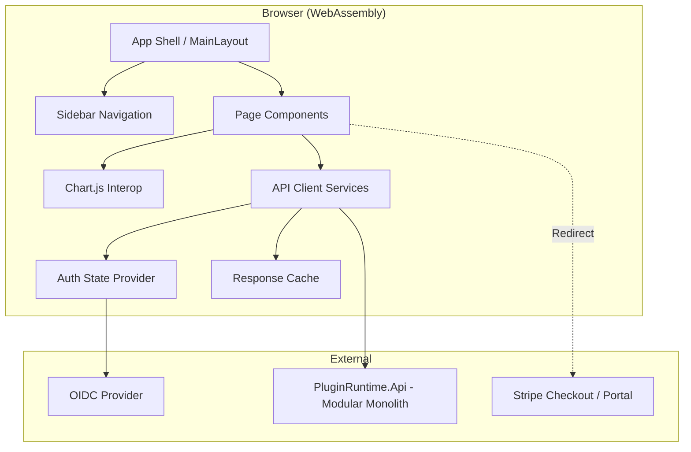
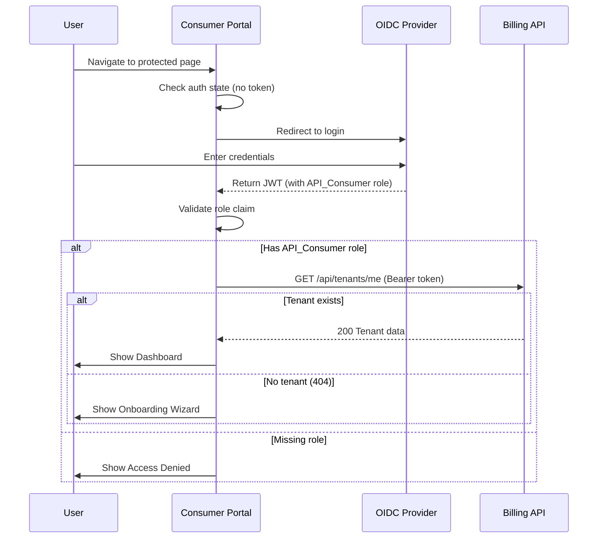
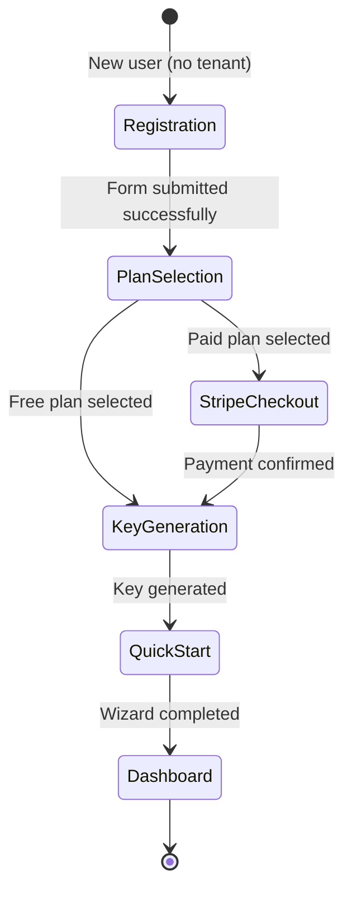

# Design Document: API Consumer Portal

## Overview

The API Consumer Portal is a Blazor WebAssembly Standalone application (.NET 10) that serves as the self-service frontend for API Consumers — paying customers who integrate with the Plugin Runtime platform's Public API Gateway. The portal communicates exclusively with PluginRuntime.Api (the modular monolith backend) via typed HttpClient services and authenticates users via OIDC/JWT Bearer tokens (API_Consumer role).

The portal enables consumers to register, complete onboarding, manage API keys, monitor usage analytics, select/upgrade plans, subscribe to plugin packages, handle billing, access documentation, and contact support — all through a clean, mobile-responsive interface built with MudBlazor.

### Key Design Decisions

| Decision | Choice | Rationale |
|----------|--------|-----------|
| Hosting model | Blazor WebAssembly Standalone | Decoupled from API; CDN-hostable; no server dependency for UI rendering |
| UI framework | MudBlazor | Consistency with Marketplace Portal; rich component library; WCAG-friendly; sidebar layout out-of-box |
| Auth model | OIDC via `Microsoft.AspNetCore.Components.WebAssembly.Authentication` | Standard .NET WASM auth; silent refresh; shared OIDC provider with Marketplace Portal (different role) |
| API communication | Typed HttpClient services with `AuthorizationMessageHandler` | Type safety; testability; consistent error handling; correlation ID injection |
| State management | Cascading parameters + scoped services | Simplicity; avoids third-party state stores; sufficient for page-level state |
| Charts | Chart.js via Blazor interop wrapper | Lightweight; responsive; accessible with ARIA annotations; widely supported |
| Payments | Stripe Checkout/Portal redirect | No PCI scope in our app; Stripe handles sensitive payment data |
| Navigation | MudBlazor sidebar (`MudNavMenu`) | Clean left-nav pattern; collapsible on mobile; badge support for notifications |

### Design Goals

- **5-minute onboarding**: Registration to first API call in under 5 minutes via guided wizard
- **Consumer-focused UX**: Simple interface for small website developers (not power users)
- **Mobile-responsive**: Sidebar collapses to hamburger below 960px
- **Accessible**: WCAG 2.1 AA compliance for all interactive components
- **Performant**: Initial shell loads within 3 seconds on 4G; lazy-loaded pages

## Architecture

### High-Level Architecture



### Layered Architecture

```
┌──────────────────────────────────────────────────────────────┐
│  Presentation Layer (Pages + Components + Layout)             │
│  - Razor pages, MudBlazor components, Chart.js interop       │
│  - No direct HTTP calls                                      │
├──────────────────────────────────────────────────────────────┤
│  Application Layer (Services + State + Validation)            │
│  - Typed service interfaces and implementations              │
│  - Client-side validation, state management                  │
│  - Response caching logic                                    │
├──────────────────────────────────────────────────────────────┤
│  Infrastructure Layer (HttpClients + Auth + Storage)          │
│  - HttpClient configuration, AuthorizationMessageHandler     │
│  - OIDC integration, token management                        │
│  - LocalStorage/SessionStorage access                        │
└──────────────────────────────────────────────────────────────┘
```

### Authentication Flow



### Onboarding Flow



### Project Structure

```
src/
└── ConsumerPortal/
    └── PluginRuntime.ConsumerPortal/
        ├── wwwroot/
        │   ├── index.html
        │   ├── css/
        │   └── js/
        │       └── chartInterop.js          → Chart.js interop functions
        ├── Layout/
        │   ├── MainLayout.razor             → App shell with sidebar
        │   ├── SidebarNavMenu.razor         → Persistent sidebar navigation
        │   └── AuthLayout.razor             → Layout for unauthenticated pages
        ├── Pages/
        │   ├── Dashboard.razor
        │   ├── Onboarding/
        │   │   ├── OnboardingWizard.razor
        │   │   ├── RegistrationStep.razor
        │   │   ├── PlanSelectionStep.razor
        │   │   ├── KeyGenerationStep.razor
        │   │   └── QuickStartStep.razor
        │   ├── ApiKeys.razor
        │   ├── UsageAnalytics.razor
        │   ├── Plans.razor
        │   ├── Billing.razor
        │   ├── InvoiceDetail.razor
        │   ├── Documentation.razor
        │   ├── Settings.razor
        │   ├── Support.razor
        │   └── AccessDenied.razor
        ├── Components/
        │   ├── QuotaUsageBar.razor
        │   ├── PlanComparisonCard.razor
        │   ├── ApiKeyRow.razor
        │   ├── UsageChart.razor
        │   ├── InvoiceListItem.razor
        │   ├── FaqAccordion.razor
        │   ├── SupportForm.razor
        │   ├── CodeBlock.razor
        │   ├── CopyButton.razor
        │   ├── LoadingSection.razor
        │   ├── ErrorBanner.razor
        │   └── NotificationBadge.razor
        ├── Services/
        │   ├── ITenantService.cs
        │   ├── TenantService.cs
        │   ├── IPlanService.cs
        │   ├── PlanService.cs
        │   ├── IApiKeyService.cs
        │   ├── ApiKeyService.cs
        │   ├── IUsageService.cs
        │   ├── UsageService.cs
        │   ├── IInvoiceService.cs
        │   ├── InvoiceService.cs
        │   ├── ISupportService.cs
        │   └── SupportService.cs
        ├── Models/
        │   ├── DTOs/                        → Response models from Billing API
        │   ├── Requests/                    → Request models sent to Billing API
        │   └── ViewModels/                  → UI-specific view models
        ├── State/
        │   ├── TenantState.cs               → Current tenant context
        │   └── NotificationState.cs         → Quota/billing alerts
        ├── Auth/
        │   ├── ApiAuthorizationMessageHandler.cs
        │   ├── RoleRequirement.cs
        │   └── ConsumerAuthStateProvider.cs
        ├── Interop/
        │   └── ChartInterop.cs              → JS interop for Chart.js
        ├── Caching/
        │   └── ResponseCacheService.cs      → 60-second staleness cache
        └── Program.cs                       → DI registration, app bootstrap
```

## Components and Interfaces

### Service Interfaces (Application Layer)

```csharp
/// Tenant registration and profile management
public interface ITenantService
{
    Task<TenantDto?> GetCurrentTenantAsync(CancellationToken ct = default);
    Task<TenantRegistrationResult> RegisterAsync(
        TenantRegistrationRequest request, CancellationToken ct = default);
    Task<TenantDto> UpdateProfileAsync(
        UpdateProfileRequest request, CancellationToken ct = default);
    Task UpdateNotificationPreferencesAsync(
        NotificationPreferencesRequest request, CancellationToken ct = default);
}

/// Plan listing and plan changes
public interface IPlanService
{
    Task<IReadOnlyList<PlanDto>> GetAllPlansAsync(CancellationToken ct = default);
    Task<PlanChangeResult> ChangePlanAsync(
        PlanChangeRequest request, CancellationToken ct = default);
    Task<string> GetStripeCheckoutUrlAsync(
        Guid planId, CancellationToken ct = default);
}

/// API key lifecycle management
public interface IApiKeyService
{
    Task<IReadOnlyList<ApiKeyListDto>> GetKeysAsync(CancellationToken ct = default);
    Task<ApiKeyGenerationResult> GenerateKeyAsync(
        GenerateKeyRequest request, CancellationToken ct = default);
    Task<ApiKeyGenerationResult> RotateKeyAsync(
        Guid keyId, CancellationToken ct = default);
    Task RevokeKeyAsync(Guid keyId, CancellationToken ct = default);
}

/// Usage analytics data retrieval
public interface IUsageService
{
    Task<IReadOnlyList<UsageAggregateDto>> GetDailyUsageAsync(
        DateOnly startDate, DateOnly endDate, CancellationToken ct = default);
    Task<UsageSummaryDto> GetUsageSummaryAsync(
        DateOnly startDate, DateOnly endDate, CancellationToken ct = default);
    Task<DashboardUsageDto> GetDashboardUsageAsync(CancellationToken ct = default);
}

/// Invoice listing and download
public interface IInvoiceService
{
    Task<PaginatedResult<InvoiceDto>> GetInvoicesAsync(
        int page = 1, int pageSize = 10, CancellationToken ct = default);
    Task<InvoiceDetailDto> GetInvoiceDetailAsync(
        Guid invoiceId, CancellationToken ct = default);
    Task<Stream> DownloadInvoicePdfAsync(
        Guid invoiceId, CancellationToken ct = default);
    Task<BillingSummaryDto> GetBillingSummaryAsync(CancellationToken ct = default);
}

/// Support ticket submission
public interface ISupportService
{
    Task<SupportTicketResult> SubmitTicketAsync(
        SupportTicketRequest request, CancellationToken ct = default);
}
```

### Authentication Infrastructure

```csharp
/// Attaches Bearer token and correlation ID to all outgoing requests.
/// Handles 401 (re-auth) and 429 (rate limit) responses.
public class ApiAuthorizationMessageHandler : DelegatingHandler
{
    private readonly IAccessTokenProvider _tokenProvider;

    protected override async Task<HttpResponseMessage> SendAsync(
        HttpRequestMessage request, CancellationToken ct)
    {
        // 1. Attach Bearer token
        var tokenResult = await _tokenProvider.RequestAccessToken();
        if (tokenResult.TryGetToken(out var token))
        {
            request.Headers.Authorization =
                new AuthenticationHeaderValue("Bearer", token.Value);
        }

        // 2. Attach correlation ID
        request.Headers.Add("X-Correlation-Id", Guid.NewGuid().ToString());

        // 3. Send request
        var response = await base.SendAsync(request, ct);

        // 4. Handle 401 → trigger re-authentication
        // 5. Handle 429 → extract Retry-After, surface to UI

        return response;
    }
}
```

### Retry Policy (Infrastructure)

```csharp
/// Configured via Microsoft.Extensions.Http.Resilience (Polly v8)
/// Retries transient failures (502, 503, 504) with exponential backoff.
/// Max 3 attempts: 1s, 2s, 4s delays.
services.AddHttpClient<IBillingApiClient>("BillingApi")
    .AddStandardResilienceHandler(options =>
    {
        options.Retry.MaxRetryAttempts = 3;
        options.Retry.BackoffType = DelayBackoffType.Exponential;
        options.Retry.UseJitter = true;
        options.Retry.ShouldHandle = args =>
            args.Outcome.Result?.StatusCode is
                HttpStatusCode.BadGateway or
                HttpStatusCode.ServiceUnavailable or
                HttpStatusCode.GatewayTimeout
            ? PredicateResult.True
            : PredicateResult.False;
    });
```

### Chart.js Interop

```csharp
/// JS interop wrapper for Chart.js rendering in Blazor
public class ChartInterop : IAsyncDisposable
{
    private readonly IJSRuntime _js;

    public async Task RenderLineChartAsync(
        string canvasId,
        ChartDataset[] datasets,
        string[] labels,
        ChartOptions? options = null)
    {
        await _js.InvokeVoidAsync("chartInterop.renderLineChart",
            canvasId, datasets, labels, options);
    }

    public async Task UpdateChartDataAsync(
        string canvasId,
        ChartDataset[] datasets,
        string[] labels)
    {
        await _js.InvokeVoidAsync("chartInterop.updateData",
            canvasId, datasets, labels);
    }

    public async Task DestroyChartAsync(string canvasId)
    {
        await _js.InvokeVoidAsync("chartInterop.destroy", canvasId);
    }

    public async ValueTask DisposeAsync()
    {
        // Cleanup all chart instances
    }
}

public record ChartDataset(
    string Label,
    double[] Data,
    string? BorderColor = null,
    string? BackgroundColor = null,
    bool Fill = false);

public record ChartOptions(
    bool Responsive = true,
    string? YAxisLabel = null,
    double? ReferenceLineValue = null,
    string? ReferenceLineLabel = null);
```

### Response Cache Service

```csharp
/// Caches API responses with a 60-second staleness threshold.
/// Returns cached data immediately and refreshes in background if stale.
public class ResponseCacheService
{
    private readonly ConcurrentDictionary<string, CacheEntry> _cache = new();
    private static readonly TimeSpan StalenessThreshold = TimeSpan.FromSeconds(60);

    public async Task<T?> GetOrFetchAsync<T>(
        string key,
        Func<CancellationToken, Task<T>> fetchFunc,
        CancellationToken ct = default)
    {
        if (_cache.TryGetValue(key, out var entry) && !entry.IsStale)
            return (T)entry.Value;

        var result = await fetchFunc(ct);
        _cache[key] = new CacheEntry(result!, DateTime.UtcNow);
        return result;
    }

    public void Invalidate(string key) => _cache.TryRemove(key, out _);

    private record CacheEntry(object Value, DateTime FetchedAt)
    {
        public bool IsStale => DateTime.UtcNow - FetchedAt > StalenessThreshold;
    }
}
```

### Shared Components

| Component | Purpose |
|-----------|---------|
| `QuotaUsageBar` | Horizontal progress bar showing daily quota consumption (warning state at 80%) |
| `PlanComparisonCard` | Displays plan details with price, limits, features; highlights current plan |
| `ApiKeyRow` | Table row showing key prefix/suffix, status badge, dates, action buttons |
| `UsageChart` | Chart.js line chart wrapper with tooltip and reference line support |
| `InvoiceListItem` | Invoice row with period, amounts, status badge, download button |
| `FaqAccordion` | Expandable Q&A entries using MudExpansionPanels |
| `SupportForm` | Contact form with subject, category, priority, message fields |
| `CodeBlock` | Syntax-highlighted code block with copy button |
| `CopyButton` | Clipboard copy with visual + ARIA confirmation feedback |
| `LoadingSection` | Skeleton placeholder or spinner for loading states |
| `ErrorBanner` | Dismissible error notification with retry action |
| `NotificationBadge` | Badge overlay for sidebar nav items (quota warnings) |

### Page Components

| Page | Route | Description |
|------|-------|-------------|
| `Dashboard` | `/` | Overview: plan info, usage stats, quota bar, active keys, recent activity |
| `OnboardingWizard` | `/onboarding` | Multi-step wizard: register → plan → key → quick start |
| `ApiKeys` | `/api-keys` | List, generate, rotate, revoke API keys |
| `UsageAnalytics` | `/usage` | Charts: daily requests, success rate, avg response time; date range picker |
| `Plans` | `/plans` | Plan comparison grid, upgrade/downgrade with Stripe redirect |
| `Billing` | `/billing` | Current period summary, invoice history, payment management link |
| `InvoiceDetail` | `/billing/invoices/{id}` | Invoice breakdown with daily overage details |
| `Documentation` | `/docs` | Sidebar-navigated docs: quick start, auth, endpoints, examples, SDKs, errors |
| `Settings` | `/settings` | Profile editing, notification preferences, password link |
| `Support` | `/support` | FAQ accordion, contact form, status page link |
| `AccessDenied` | `/access-denied` | Shown when token lacks API_Consumer role |

## Data Models

### Client-Side DTOs (Responses from Billing API)

```csharp
// Tenant
public record TenantDto(
    Guid TenantId,
    string Name,
    string ContactEmail,
    string? CompanyName,
    string Status,
    PlanSummaryDto CurrentPlan,
    DateTime CreatedAt);

public record PlanSummaryDto(
    Guid PlanId,
    string Name,
    int? RateLimit,
    int? DailyQuota);

// Plans
public record PlanDto(
    Guid PlanId,
    string Name,
    int? RateLimit,
    int? DailyQuota,
    decimal MonthlyPrice,
    decimal? OverageRatePer1k,
    string? FeaturesJson);

// API Keys
public record ApiKeyListDto(
    Guid KeyId,
    string? Name,
    string KeyPrefix,
    string KeySuffix,
    string Status,
    DateTime CreatedAt,
    DateTime? ExpiresAt,
    DateTime? LastUsedAt);

public record ApiKeyGenerationResult(
    Guid KeyId,
    string PlaintextKey,
    DateTime CreatedAt,
    DateTime? ExpiresAt);

// Usage
public record UsageAggregateDto(
    DateOnly Date,
    long TotalRequests,
    long SuccessfulRequests,
    long FailedRequests,
    double AvgDurationMs);

public record UsageSummaryDto(
    long TotalRequests,
    double AvgDailyRequests,
    long TotalSuccessful,
    long TotalFailed,
    double AvgResponseTimeMs);

public record DashboardUsageDto(
    long CurrentPeriodTotal,
    long CurrentPeriodSuccessful,
    long CurrentPeriodFailed,
    double QuotaUsagePercent,
    IReadOnlyList<RecentActivityDto> RecentActivity);

public record RecentActivityDto(
    DateOnly Date,
    long TotalRequests,
    double SuccessRate);

// Invoices
public record InvoiceDto(
    Guid InvoiceId,
    DateOnly BillingPeriodStart,
    DateOnly BillingPeriodEnd,
    decimal BaseAmount,
    decimal OverageAmount,
    decimal TotalAmount,
    string Status,
    DateTime CreatedAt);

public record InvoiceDetailDto(
    Guid InvoiceId,
    DateOnly BillingPeriodStart,
    DateOnly BillingPeriodEnd,
    decimal BaseAmount,
    decimal OverageAmount,
    decimal TotalAmount,
    string Status,
    IReadOnlyList<DailyOverageDto> DailyBreakdown);

public record DailyOverageDto(
    DateOnly Date,
    long TotalRequests,
    int DailyQuota,
    long OverageRequests,
    decimal OverageCharge);

public record BillingSummaryDto(
    DateOnly PeriodStart,
    DateOnly PeriodEnd,
    decimal CurrentBaseCharge,
    decimal EstimatedOverage,
    DateOnly NextInvoiceDate);

// Plan Changes
public record PlanChangeResult(
    bool Success,
    string? EffectiveDate,
    decimal? ProratedAmount,
    string? StripeCheckoutUrl);

// Registration
public record TenantRegistrationResult(
    Guid TenantId,
    string Status);

// Support
public record SupportTicketResult(
    string TicketReference,
    string Status);

// Pagination
public record PaginatedResult<T>(
    IReadOnlyList<T> Items,
    int Total,
    int Page,
    int PageSize);

// Standard API error model (mirrors Billing API)
public record ApiErrorResponse(
    ApiError Error);

public record ApiError(
    string Code,
    string Category,
    string Message,
    string TraceId,
    DateTime Timestamp);
```

### Request Models (Sent to Billing API)

```csharp
public record TenantRegistrationRequest(
    string TenantName,
    string ContactEmail,
    string? CompanyName);

public record UpdateProfileRequest(
    string TenantName,
    string ContactEmail,
    string? CompanyName);

public record NotificationPreferencesRequest(
    bool UsageAlerts,
    bool BillingNotifications,
    bool KeyExpirationReminders);

public record PlanChangeRequest(
    Guid NewPlanId);

public record GenerateKeyRequest(
    string? Name,
    int? ExpirationDays);

public record SupportTicketRequest(
    string Subject,
    string Category,
    string Priority,
    string Message);
```

### View Models (UI-specific state)

```csharp
public record DashboardViewModel(
    string PlanName,
    int? RateLimit,
    int? DailyQuota,
    long TotalRequests,
    long SuccessfulRequests,
    long FailedRequests,
    double QuotaUsagePercent,
    int ActiveKeyCount,
    int ExpiringKeyCount,
    IReadOnlyList<RecentActivityDto> RecentActivity,
    bool ShowQuotaWarning);

public record OnboardingState(
    int CurrentStep,
    TenantRegistrationRequest? Registration,
    Guid? SelectedPlanId,
    ApiKeyGenerationResult? GeneratedKey);
```


## Correctness Properties

*A property is a characteristic or behavior that should hold true across all valid executions of a system — essentially, a formal statement about what the system should do. Properties serve as the bridge between human-readable specifications and machine-verifiable correctness guarantees.*

### Property 1: Authenticated Request Headers

*For any* HTTP request made through the API client while the user is authenticated, the request SHALL include both a valid Bearer token in the Authorization header AND a unique X-Correlation-Id header (valid GUID format).

**Validates: Requirements 1.4, 12.6**

### Property 2: Role-Based Access Control

*For any* JWT token returned from the OIDC provider, if the token does NOT contain the API_Consumer role claim, the portal SHALL deny access and display the access denied page; if the token DOES contain the role, the portal SHALL establish an authenticated session.

**Validates: Requirements 1.2, 1.3**

### Property 3: Route Protection

*For any* navigation request to a protected route while the user is not authenticated, the portal SHALL redirect to the OIDC login page. Only login and public documentation routes SHALL be accessible without authentication.

**Validates: Requirements 1.1, 11.3**

### Property 4: Tenant Name Validation

*For any* string input as tenant name, the registration form SHALL accept it if and only if its trimmed length is between 1 and 200 characters (inclusive). Empty strings, whitespace-only strings, and strings exceeding 200 characters SHALL be rejected with a validation error.

**Validates: Requirements 2.2**

### Property 5: API Key Display Completeness

*For any* ApiKeyGenerationResult, the key generation display SHALL render the plaintext key value, a copy-to-clipboard button, and a warning message that the key cannot be retrieved again.

**Validates: Requirements 2.7, 5.3**

### Property 6: Validation Error Field Mapping

*For any* API validation error response containing field-level errors, the portal SHALL map each error to its corresponding form field and display the error message adjacent to that field, preserving the current form state.

**Validates: Requirements 2.10, 9.3**

### Property 7: Dashboard Metrics Rendering

*For any* DashboardViewModel containing plan info and usage data, the dashboard SHALL render: plan name, rate limit, daily quota, total requests, successful requests, failed requests, and quota usage percentage bar.

**Validates: Requirements 3.1, 3.2, 3.3**

### Property 8: API Key Count Computation

*For any* list of API keys with various statuses and expiration dates, the dashboard SHALL correctly compute the count of keys with status "active" AND the count of active keys whose expiration date is within 7 days of the current date.

**Validates: Requirements 3.4, 5.8**

### Property 9: Recent Activity Truncation

*For any* list of activity entries (of any length), the dashboard SHALL display exactly the 5 most recent entries (by date descending), each showing date, total requests, and success rate. If fewer than 5 entries exist, all are displayed.

**Validates: Requirements 3.5**

### Property 10: Quota Warning Threshold

*For any* quota usage percentage value, the portal SHALL display a warning indicator on the dashboard AND a notification badge on the Dashboard navigation item if and only if the percentage exceeds 80%.

**Validates: Requirements 3.6, 11.7**

### Property 11: Plan Comparison Rendering

*For any* list of PlanDto objects and a current plan ID, the plan selection page SHALL render each plan with its name, rate limit, daily quota, monthly price, overage rate, and features, AND visually distinguish the user's current plan from the others.

**Validates: Requirements 4.1, 4.2**

### Property 12: Key List Rendering Completeness

*For any* list of ApiKeyListDto objects, the key management page SHALL render each key showing: key prefix, masked key suffix, status, creation date, expiration date (if set), and last used date (if available).

**Validates: Requirements 5.1**

### Property 13: Usage Chart Data Correctness

*For any* list of UsageAggregateDto objects, the usage analytics charts SHALL correctly plot: (a) total_requests per day for the daily requests chart, (b) (successful_requests / total_requests × 100) per day for the success rate chart, and (c) avg_duration_ms per day for the response time chart.

**Validates: Requirements 6.1, 6.2, 6.3**

### Property 14: Date Range Validation

*For any* pair of start and end dates selected for usage analytics, the portal SHALL accept the range if and only if the difference is at most 90 days and end date is not before start date.

**Validates: Requirements 6.4**

### Property 15: Usage Summary Computation

*For any* list of UsageAggregateDto objects over a selected period, the summary statistics SHALL correctly compute: total requests (sum of daily totals), average daily requests (total / number of days), total successful (sum), total failed (sum), and average response time (weighted average of daily avg_duration_ms).

**Validates: Requirements 6.5**

### Property 16: Chart Reference Line

*For any* plan with a non-null daily quota, the daily requests chart SHALL include a horizontal reference line positioned at the quota value with an appropriate label.

**Validates: Requirements 6.7**

### Property 17: Billing Summary Rendering

*For any* BillingSummaryDto, the billing page SHALL render: period start date, period end date, current accumulated charges, and next invoice date.

**Validates: Requirements 7.1**

### Property 18: Invoice List Rendering

*For any* list of InvoiceDto objects, the billing page SHALL render each invoice showing: billing period, base amount, overage amount, total amount, and payment status.

**Validates: Requirements 7.2**

### Property 19: Invoice Detail Breakdown

*For any* InvoiceDetailDto with daily breakdown entries, the invoice detail page SHALL render each day's entry showing: date, total requests, daily quota, overage requests, and overage charge.

**Validates: Requirements 7.3**

### Property 20: Failed Invoice Warning

*For any* set of invoices displayed on the billing page or dashboard, if any invoice has status "failed", the portal SHALL display a warning banner with a link to manage the payment method.

**Validates: Requirements 7.7**

### Property 21: Error Notification Display

*For any* API error response conforming to the standard ApiError format, the portal SHALL display a dismissible notification containing the error code and human-readable message.

**Validates: Requirements 12.2**

### Property 22: Rate Limit Handling

*For any* HTTP 429 response with a Retry-After header value, the portal SHALL display a rate limit message indicating the wait duration AND disable the triggering action until the Retry-After period elapses.

**Validates: Requirements 12.5**

### Property 23: Transient Failure Retry

*For any* sequence of transient HTTP failures (502, 503, 504), the API client SHALL retry up to 3 times with exponential backoff delays before surfacing the error to the user.

**Validates: Requirements 12.7**

### Property 24: Navigation Header Context

*For any* authenticated tenant, the navigation header SHALL display the tenant name and a badge indicating the current plan name.

**Validates: Requirements 11.2**

### Property 25: Response Cache Staleness

*For any* cached API response, the cache SHALL return the cached value without a network request if the entry is less than 60 seconds old. If the entry is 60 seconds or older, the cache SHALL fetch fresh data from the API.

**Validates: Requirements 13.7**

### Property 26: Copy-to-Clipboard Accessible Feedback

*For any* copy-to-clipboard action triggered in the portal, the system SHALL provide both a visual confirmation indicator AND an aria-live announcement for screen readers.

**Validates: Requirements 13.6**

### Property 27: ARIA Labels for Charts

*For any* chart rendered in the portal, the chart container SHALL include appropriate ARIA labels describing the chart type and data context, enabling screen reader users to understand the chart purpose.

**Validates: Requirements 13.5**

## Error Handling

### Error Categories and User-Facing Behavior

| Error Source | Detection | User Feedback | Recovery |
|---|---|---|---|
| OIDC provider unreachable | HTTP timeout / DNS failure | Banner: "Authentication temporarily unavailable" | Retry button |
| API 4xx (Validation) | Response status 400 | Field-level error messages from API response | Fix input and retry |
| API 4xx (Not Found) | Response status 404 | Context-appropriate message (e.g., "Tenant not found") | Navigate to appropriate page |
| API 4xx (Forbidden) | Response status 403 | "You don't have permission for this action" | Contact support link |
| API 5xx (Server Error) | Response status 500+ | "Something went wrong. Reference: {traceId}" | Retry button |
| API 429 (Rate Limit) | Response status + Retry-After | "Rate limited — try again in X seconds" | Disable action; countdown |
| Network unreachable | `HttpRequestException` | "Cannot connect to server" | Retry button with backoff |
| Token expired (refresh fails) | 401 after silent refresh | Redirect to login | Re-authenticate via OIDC |
| Stripe redirect failure | Return URL with error param | "Payment setup failed" | Retry payment flow |
| Duplicate email (TM-REG-001) | Specific error code | "An account already exists for this email" | Login instead |
| Max keys reached (TM-KEY-001) | Specific error code | "Key limit reached for your plan" | Upgrade plan link |
| Same plan selected (TM-CHANGE-001) | Specific error code | "You're already on this plan" | Dismiss |

### Error Response Handling Pipeline

```csharp
/// All service methods follow this result pattern for consistent error handling
public sealed record ApiResult<T>
{
    public bool IsSuccess { get; init; }
    public T? Value { get; init; }
    public ApiError? Error { get; init; }
    public bool IsRateLimited { get; init; }
    public TimeSpan? RetryAfter { get; init; }
    public bool IsNetworkError { get; init; }

    public static ApiResult<T> Success(T value) => new() { IsSuccess = true, Value = value };
    public static ApiResult<T> FromApiError(ApiError error) => new() { Error = error };
    public static ApiResult<T> RateLimited(TimeSpan retryAfter) =>
        new() { IsRateLimited = true, RetryAfter = retryAfter };
    public static ApiResult<T> NetworkError() => new() { IsNetworkError = true };
}
```

### Resilience Patterns

- **Retry with exponential backoff**: Transient failures (502, 503, 504) get up to 3 retries (1s, 2s, 4s with jitter) via Polly v8 / Microsoft.Extensions.Http.Resilience.
- **Timeout**: All API requests have a 15-second timeout.
- **Rate limit respect**: 429 responses disable the triggering action for the Retry-After duration.
- **Graceful degradation**: Dashboard shows partial data with error indicators for failed sections. Individual section failures don't block the entire page.
- **Token refresh**: Silent token refresh attempted before expiry (5-minute window). If refresh fails, user is redirected to login gracefully.

## Testing Strategy

### Unit Tests (bUnit + xUnit)

Unit tests cover specific examples, edge cases, and component rendering:

- **Component rendering tests**: Verify each page/component renders correctly with mock data (bUnit).
- **Service layer tests**: Mock `HttpClient` via `MockHttpMessageHandler`; verify correct API calls and response mapping.
- **Onboarding wizard state tests**: Verify step transitions and state management.
- **Error handling tests**: Each error category (4xx, 5xx, 429, network) produces correct user feedback.
- **Form validation tests**: Boundary values for tenant name (0, 1, 200, 201 chars), email format, expiration range.
- **Chart data mapping tests**: Verify correct transformation from DTOs to Chart.js datasets.

### Property-Based Tests (FsCheck + xUnit)

Property-based testing applies to the pure logic and rendering completeness of this feature:

- **Library**: [FsCheck](https://fscheck.github.io/FsCheck/) — standard .NET PBT library with xUnit integration
- **Minimum iterations**: 100 per property
- **Tag format**: `Feature: api-consumer-portal, Property {N}: {title}`

| Property | What's Generated | What's Verified |
|----------|-----------------|-----------------|
| 1: Request Headers | Random HTTP requests (methods, paths) | Bearer + X-Correlation-Id present |
| 2: Role-Based Access | Random JWT payloads with/without API_Consumer role | Session established or denied appropriately |
| 3: Route Protection | Random route paths | Protected routes redirect; public routes accessible |
| 4: Tenant Name Validation | Random strings (0–500 chars, whitespace, Unicode) | 1–200 trimmed chars accepted; others rejected |
| 5: API Key Display | Random ApiKeyGenerationResult instances | Plaintext, copy button, warning all present |
| 6: Validation Error Mapping | Random field-error sets | Each error maps to correct field |
| 7: Dashboard Metrics | Random DashboardViewModel instances | All required metrics rendered |
| 8: Key Count Computation | Random key lists with various statuses/dates | Correct active + expiring counts |
| 9: Activity Truncation | Random-length activity lists | Max 5 shown, most recent first |
| 10: Quota Warning | Random percentage values (0–150) | Warning iff > 80% |
| 11: Plan Comparison | Random plan lists + current plan ID | All fields rendered; current highlighted |
| 12: Key List Rendering | Random ApiKeyListDto lists | All fields present per key |
| 13: Usage Chart Data | Random UsageAggregateDto lists | Correct daily values plotted |
| 14: Date Range Validation | Random date pairs | Valid iff ≤ 90 days and end ≥ start |
| 15: Usage Summary | Random aggregate lists | Correct totals and averages |
| 16: Chart Reference Line | Random plans with/without quotas | Line present iff quota non-null |
| 17: Billing Summary | Random BillingSummaryDto | All fields rendered |
| 18: Invoice List | Random InvoiceDto lists | All fields per invoice |
| 19: Invoice Detail | Random InvoiceDetailDto with breakdown | All breakdown fields |
| 20: Failed Invoice Warning | Random invoice sets with various statuses | Warning iff any "failed" |
| 21: Error Notification | Random ApiError instances | Code + message displayed |
| 22: Rate Limit Handling | Random Retry-After values | Message shown; action disabled |
| 23: Transient Retry | Random transient failure sequences | Max 3 retries with backoff |
| 24: Nav Header | Random TenantDto instances | Name + plan badge shown |
| 25: Cache Staleness | Random timestamps relative to now | Fresh entries from cache; stale triggers fetch |
| 26: Copy Feedback | Random copy actions | Visual + aria-live confirmation |
| 27: Chart ARIA | Random chart datasets | ARIA labels present on containers |

### Integration Tests

- **OIDC flow**: End-to-end authentication with test identity provider (Duende IdentityServer or similar in test mode).
- **API communication**: Real HTTP calls to a test instance of PluginRuntime.Api.
- **Onboarding flow**: Full wizard completion from registration through key generation.
- **Stripe integration**: Checkout redirect and return flow with Stripe test mode.
- **Invoice download**: PDF retrieval and browser download initiation.

### Accessibility Testing

- **Automated**: axe-core integration in CI to catch WCAG 2.1 AA violations.
- **Keyboard navigation audit**: All interactive elements (including chart controls) navigable via keyboard.
- **Screen reader testing**: Manual testing with NVDA/VoiceOver for ARIA labels, announcements, and dynamic content.
- Note: Full WCAG compliance validation requires manual testing with assistive technologies and expert accessibility review.

### Performance Testing

- **Lighthouse CI**: Enforce < 3s initial load on simulated 4G connection.
- **Bundle analysis**: Monitor WASM download size; enforce lazy loading for non-critical pages (all pages except Dashboard).
- **Cache effectiveness**: Verify 60-second cache reduces redundant network requests on dashboard.
