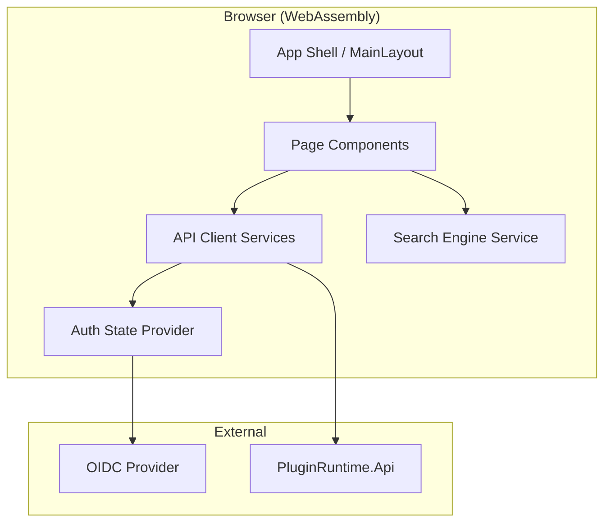

# Design Document: Marketplace Portal

## Overview

The Plugin Marketplace Portal is a Blazor WebAssembly Standalone application that provides the developer-facing frontend for the Plugin Runtime ecosystem. It enables plugin developers to browse, search, upload, and manage extensions through a modern SPA that communicates with the existing `PluginRuntime.Api` backend.

The portal is distinct from the existing `PluginRuntime.Admin` (Blazor Server) which serves platform administrators. The Marketplace Portal targets plugin developers and is publicly accessible (with authenticated sections), while the Admin Portal is internal-only.

### Key Design Decisions

| Decision | Choice | Rationale |
|----------|--------|-----------|
| Hosting model | Blazor WebAssembly Standalone | Decoupled from API; can be CDN-hosted; no server dependency for UI rendering |
| UI framework | MudBlazor | Consistency with existing Admin Portal; rich component library; WCAG-friendly |
| Auth model | OIDC with MSAL/oidc-client via `Microsoft.AspNetCore.Components.WebAssembly.Authentication` | Standard .NET WASM auth; silent refresh; integrates with existing JWT Bearer API |
| API communication | Typed HttpClient services | Type safety; testability; consistent error handling; correlationId injection |
| State management | Cascading parameters + scoped services | Simplicity; avoids third-party state stores; adequate for page-level state |
| Client-side search | Debounced filtering on pre-fetched page data | Responsive UX within paginated API responses |

## Architecture



### Layered Architecture

```
┌─────────────────────────────────────────────────────┐
│  Presentation Layer (Pages + Shared Components)      │
├─────────────────────────────────────────────────────┤
│  Application Layer (Services + State)                │
├─────────────────────────────────────────────────────┤
│  Infrastructure Layer (HttpClients + Auth + Storage) │
└─────────────────────────────────────────────────────┘
```

1. **Presentation Layer**: Razor pages, MudBlazor components, layout components. No direct HTTP calls.
2. **Application Layer**: Typed service interfaces and implementations. Business logic for search filtering, permission grouping, upload validation.
3. **Infrastructure Layer**: `HttpClient` configuration, `AuthorizationMessageHandler`, local storage access, OIDC integration.

### Project Structure

```
src/
└── Marketplace/
    └── PluginRuntime.Marketplace/
        ├── wwwroot/                          → Static assets, index.html
        ├── Layout/                           → MainLayout, NavMenu
        ├── Pages/                            → Razor page components
        │   ├── Home.razor
        │   ├── Browse.razor
        │   ├── ExtensionDetail.razor
        │   ├── PublisherProfile.razor
        │   ├── MyPlugins.razor
        │   ├── Upload.razor
        │   ├── Subscriptions.razor
        │   ├── Settings.razor
        │   └── Documentation.razor
        ├── Components/                       → Shared reusable components
        │   ├── ExtensionCard.razor
        │   ├── PermissionBreakdown.razor
        │   ├── SearchBar.razor
        │   ├── PaginationControls.razor
        │   └── LoadingIndicator.razor
        ├── Services/                         → Typed API clients
        │   ├── IExtensionService.cs
        │   ├── ExtensionService.cs
        │   ├── ISubscriptionService.cs
        │   ├── SubscriptionService.cs
        │   ├── IProfileService.cs
        │   ├── ProfileService.cs
        │   ├── IUploadService.cs
        │   └── UploadService.cs
        ├── Models/                           → Client-side DTOs
        ├── Auth/                             → OIDC configuration, handlers
        ├── Search/                           → Client-side search/filter engine
        └── Program.cs                        → DI registration, app bootstrap
```

## Components and Interfaces

### Service Interfaces

```csharp
public interface IExtensionService
{
    Task<PaginatedResult<ExtensionSummaryDto>> GetExtensionsAsync(
        ExtensionQuery query, CancellationToken ct = default);
    Task<ExtensionDetailDto> GetExtensionDetailAsync(
        string extensionId, CancellationToken ct = default);
    Task<IReadOnlyList<ExtensionSummaryDto>> GetFeaturedExtensionsAsync(
        CancellationToken ct = default);
    Task<EcosystemStatsDto> GetEcosystemStatsAsync(
        CancellationToken ct = default);
    Task<IReadOnlyList<ExtensionSummaryDto>> GetMyExtensionsAsync(
        CancellationToken ct = default);
    Task<IReadOnlyList<VersionHistoryDto>> GetVersionHistoryAsync(
        string extensionId, CancellationToken ct = default);
}

public interface ISubscriptionService
{
    Task<SubscriptionResponseDto> RequestSubscriptionAsync(
        string targetExtensionId, SubscriptionRequestDto request, CancellationToken ct = default);
    Task<IReadOnlyList<SubscriptionDto>> GetOutgoingRequestsAsync(
        CancellationToken ct = default);
    Task<IReadOnlyList<SubscriptionDto>> GetIncomingRequestsAsync(
        string extensionId, CancellationToken ct = default);
    Task DecideSubscriptionAsync(
        string extensionId, string subscriptionId, SubscriptionDecisionDto decision, CancellationToken ct = default);
}

public interface IUploadService
{
    Task<ManifestPreviewDto> ParseManifestAsync(
        Stream zipStream, CancellationToken ct = default);
    Task<UploadResultDto> UploadPluginAsync(
        StreamContent fileContent, CancellationToken ct = default);
}

public interface IProfileService
{
    Task<PublisherProfileDto> GetPublisherProfileAsync(
        string publisherId, CancellationToken ct = default);
    Task<UserProfileDto> GetCurrentUserProfileAsync(
        CancellationToken ct = default);
    Task UpdateProfileAsync(
        UpdateProfileDto profile, CancellationToken ct = default);
    Task<ApiKeyDto> GenerateApiKeyAsync(
        string keyName, CancellationToken ct = default);
    Task RevokeApiKeyAsync(
        string keyId, CancellationToken ct = default);
    Task<IReadOnlyList<ApiKeyListDto>> GetApiKeysAsync(
        CancellationToken ct = default);
}
```

### Search Engine (Client-Side)

```csharp
public interface ISearchEngine
{
    SearchResult<ExtensionSummaryDto> Filter(
        IReadOnlyList<ExtensionSummaryDto> extensions,
        SearchCriteria criteria);
}

public record SearchCriteria(
    string? SearchTerm,
    string? Category,
    string? RiskLevel,
    string? CapabilityType,
    int Page = 1,
    int PageSize = 20);

public record SearchResult<T>(
    IReadOnlyList<T> Items,
    int TotalCount,
    int Page,
    int PageSize);
```

### Shared Components

| Component | Purpose |
|-----------|---------|
| `ExtensionCard` | Displays extension summary (name, author, category, version, risk badge) |
| `PermissionBreakdown` | Groups permissions by risk level with color-coded badges |
| `SearchBar` | Debounced text input with filter dropdowns |
| `PaginationControls` | Page navigation with total count display |
| `LoadingIndicator` | Skeleton/spinner shown during API calls |
| `ErrorDisplay` | Renders structured API errors with retry button |
| `UploadDropZone` | Drag-and-drop file upload area with validation |

### Authentication Handler

```csharp
public class ApiAuthorizationMessageHandler : DelegatingHandler
{
    protected override async Task<HttpResponseMessage> SendAsync(
        HttpRequestMessage request, CancellationToken ct)
    {
        // Attach Bearer token from auth state
        // Attach X-Correlation-Id header (Guid.NewGuid())
        // Handle 401 → trigger re-authentication
        // Handle 429 → extract Retry-After, surface to UI
        return await base.SendAsync(request, ct);
    }
}
```

## Data Models

### Client-Side DTOs

```csharp
public record ExtensionSummaryDto(
    string ExtensionId,
    string Name,
    string Description,
    string Author,
    string AuthorId,
    string Category,
    string LatestVersion,
    string RiskLevel,
    string Visibility,
    DateTime CreatedAt);

public record ExtensionDetailDto(
    string ExtensionId,
    string Name,
    string Description,
    string Author,
    string AuthorId,
    string Category,
    string Visibility,
    string LatestVersion,
    string? ReadmeContent,
    IReadOnlyList<VersionHistoryDto> Versions,
    PermissionBreakdownDto Permissions);

public record VersionHistoryDto(
    string PluginVersionId,
    string Version,
    string Status,
    DateTime CreatedAt);

public record PermissionBreakdownDto(
    int TotalPermissions,
    IReadOnlyList<PermissionGroupDto> Groups);

public record PermissionGroupDto(
    string RiskLevel,
    IReadOnlyList<PermissionItemDto> Permissions);

public record PermissionItemDto(
    string Scope,
    string RiskLevel,
    string Justification,
    string? MappedCapability);

public record SubscriptionDto(
    string SubscriptionId,
    string ExtensionId,
    string ExtensionName,
    string RequestingExtensionId,
    string RequestingExtensionName,
    string Status,
    string Reason,
    string? ExpectedUsage,
    DateTime RequestDate,
    string? Conditions,
    DateTime? ExpiresAt);

public record SubscriptionRequestDto(
    string RequestedBy,
    string Reason,
    ExpectedUsageDto? ExpectedUsage);

public record ExpectedUsageDto(
    int CallsPerDay,
    int PeakConcurrency);

public record SubscriptionDecisionDto(
    string Decision,
    string? Conditions,
    DateTime? ExpiresAt,
    string? Reason);

public record SubscriptionResponseDto(
    string SubscriptionId,
    string Status);

public record UploadResultDto(
    string PluginVersionId,
    string Status,
    string Message);

public record ManifestPreviewDto(
    string ExtensionId,
    string Version,
    IReadOnlyList<string> Permissions,
    IReadOnlyList<string> Capabilities,
    PermissionBreakdownDto PermissionBreakdown);

public record PublisherProfileDto(
    string PublisherId,
    string Name,
    string? Description,
    DateTime JoinDate,
    IReadOnlyList<ExtensionSummaryDto> Extensions);

public record UserProfileDto(
    string DisplayName,
    string Email,
    string? PublisherDescription);

public record UpdateProfileDto(
    string DisplayName,
    string? PublisherDescription);

public record ApiKeyDto(
    string KeyId,
    string Name,
    string KeyValue,
    DateTime CreatedAt);

public record ApiKeyListDto(
    string KeyId,
    string Name,
    DateTime CreatedAt,
    DateTime? LastUsedAt);

public record EcosystemStatsDto(
    int TotalExtensions,
    int TotalPublishers,
    int TotalSubscriptions);

public record PaginatedResult<T>(
    IReadOnlyList<T> Items,
    int Total,
    int Page,
    int PageSize);

public record ExtensionQuery(
    string? SearchTerm = null,
    string? Category = null,
    string? RiskLevel = null,
    string? CapabilityType = null,
    int Page = 1,
    int PageSize = 20);

// Standard API error model (mirrors backend)
public record ApiErrorResponse(
    ApiError Error);

public record ApiError(
    string Code,
    string Category,
    string Message,
    string TraceId,
    DateTime Timestamp);
```

## Correctness Properties

*A property is a characteristic or behavior that should hold true across all valid executions of a system — essentially, a formal statement about what the system should do. Properties serve as the bridge between human-readable specifications and machine-verifiable correctness guarantees.*

### Property 1: API Client Request Headers

*For any* HTTP request made through the API client while the user is authenticated, the request SHALL include both a valid Bearer token in the Authorization header and a unique X-Correlation-Id header.

**Validates: Requirements 1.3, 12.6**

### Property 2: Search Filter Correctness

*For any* set of extensions and any combination of search criteria (text term, category, risk level, capability type), all items in the filtered result set SHALL match every active filter criterion — text matches against name/description/extension_id, category matches exactly, risk level matches exactly, and capability is declared.

**Validates: Requirements 3.2, 3.3, 3.4, 3.5**

### Property 3: Pagination Invariant

*For any* result set of extensions, each page SHALL contain at most 20 items, and the total item count across all pages SHALL equal the total number of items matching the active filters.

**Validates: Requirements 3.6**

### Property 4: Extension Card Rendering Completeness

*For any* extension summary data, the rendered extension card SHALL contain the extension name, author, category, version, risk level indicator, and short description.

**Validates: Requirements 2.3, 3.8**

### Property 5: Permission Breakdown Grouping

*For any* set of declared permissions, the Permission Breakdown component SHALL group all permissions by their risk level, and each permission entry SHALL display its scope, mapped capability, risk level, and justification text.

**Validates: Requirements 4.4, 7.6**

### Property 6: File Type Validation

*For any* file selected for upload whose name does not end with `.plugin.zip`, the Upload Wizard SHALL reject the file and display a validation error.

**Validates: Requirements 7.4**

### Property 7: Manifest Parsing Extraction

*For any* valid `.plugin.zip` archive containing a well-formed `manifest.json`, parsing the archive SHALL extract and display the extension_id, version, permissions list, and capabilities list matching the values in the original manifest.

**Validates: Requirements 7.5**

### Property 8: Error Response Display Completeness

*For any* API error response conforming to the standard error format, the error display component SHALL render the error code, category, and human-readable message.

**Validates: Requirements 12.2**

### Property 9: Version History Display

*For any* extension with one or more published versions, the version history list SHALL display each version's version number, status, and creation date.

**Validates: Requirements 4.3**

## Error Handling

### Error Categories and User-Facing Behavior

| Error Source | Detection | User Feedback | Recovery |
|---|---|---|---|
| OIDC provider unreachable | HTTP timeout / DNS failure | Banner: "Authentication unavailable" | Retry button; fall back to anonymous browsing |
| API 4xx (Validation, NotFound) | Response status code | Inline error with code + message from API | Fix input and retry |
| API 5xx (Server Error) | Response status code | "Something went wrong" with trace ID | Retry button |
| API 429 (Rate Limit) | Response status + Retry-After header | "Rate limited — try again in X seconds" | Disable action; countdown timer |
| Network unreachable | `HttpRequestException` | "Cannot connect to server" | Retry button with exponential backoff |
| Upload file invalid | Client-side validation | Inline validation error near the drop zone | Select different file |
| Manifest parse failure | Client-side zip parsing | "Manifest missing or malformed" | Re-package and retry |
| Token expired (silent refresh fails) | 401 from API after refresh attempt | Redirect to login | Re-authenticate via OIDC |

### Error Response Handling Pipeline

```csharp
// All service methods follow this pattern:
public async Task<Result<T>> SafeCallAsync<T>(Func<Task<T>> apiCall, CancellationToken ct)
{
    try
    {
        var response = await apiCall();
        return Result<T>.Success(response);
    }
    catch (ApiException ex) when (ex.StatusCode == 429)
    {
        return Result<T>.RateLimited(ex.RetryAfter);
    }
    catch (ApiException ex)
    {
        return Result<T>.ApiError(ex.Error);
    }
    catch (HttpRequestException)
    {
        return Result<T>.NetworkError();
    }
}
```

### Resilience Patterns

- **Retry with backoff**: Network errors and 5xx responses get up to 3 retries with exponential backoff (1s, 2s, 4s).
- **Circuit breaker**: If the API fails 5 consecutive times, enter open state for 30 seconds before retrying.
- **Timeout**: All API requests have a 15-second timeout.
- **Graceful degradation**: Public pages (landing, browse, detail, docs) remain accessible without authentication. Only protected actions (upload, subscriptions, settings) require login.

## Testing Strategy

### Unit Tests

Unit tests cover specific examples, edge cases, and component behavior:

- **Component rendering tests** (bUnit): Verify each page/component renders correctly with mock data.
- **Service layer tests**: Mock `HttpClient` via `MockHttpMessageHandler`, verify correct API calls and response mapping.
- **Search engine tests**: Verify filter logic with concrete examples (empty results, single match, all match).
- **Upload validation tests**: Invalid file types, missing manifests, corrupted zips.
- **Error handling tests**: Each error category produces correct user feedback.

### Property-Based Tests

Property-based testing applies to the pure logic components of this feature:

- **Library**: [FsCheck](https://fscheck.github.io/FsCheck/) (the standard .NET PBT library, integrates with xUnit)
- **Minimum iterations**: 100 per property
- **Tag format**: `Feature: marketplace-portal, Property {N}: {title}`

Properties 1–9 defined above are each implemented as a single property-based test:

| Property | What's Generated | What's Verified |
|----------|-----------------|-----------------|
| 1: API Client Headers | Random HTTP requests (various methods, paths) | Bearer + Correlation-Id present |
| 2: Search Filter Correctness | Random extension lists + random filter criteria | All results match all active filters |
| 3: Pagination Invariant | Random-length extension lists (0–200 items) | Pages ≤ 20 items; total consistent |
| 4: Extension Card Rendering | Random ExtensionSummaryDto instances | All required fields in rendered output |
| 5: Permission Breakdown | Random permission sets with varied risk levels | Correct grouping; all fields present |
| 6: File Validation | Random filenames (with/without .plugin.zip) | Non-.plugin.zip always rejected |
| 7: Manifest Parsing | Random valid manifests packaged in zips | Extracted fields match source |
| 8: Error Response Display | Random ApiError instances | Code, category, message all rendered |
| 9: Version History | Random version lists | Each version shows number, status, date |

### Integration Tests

- **OIDC flow**: End-to-end auth with test identity provider.
- **API communication**: Real HTTP calls to a test instance of PluginRuntime.Api.
- **Upload flow**: Full upload wizard with actual file submission.
- **Subscription workflow**: Request → Approve/Reject cycle.

### Accessibility Testing

- **Automated**: axe-core integration in CI to catch WCAG 2.1 AA violations.
- **Manual**: Keyboard navigation audit, screen reader testing with NVDA/VoiceOver.
- Note: Full WCAG compliance requires manual testing with assistive technologies and expert accessibility review.

### Performance Testing

- **Lighthouse CI**: Enforce < 3s initial load on simulated 4G.
- **Bundle analysis**: Monitor WASM download size; enforce lazy loading for non-critical pages.

