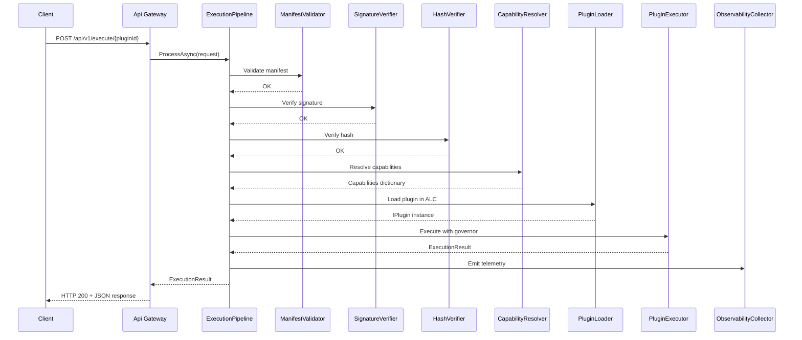
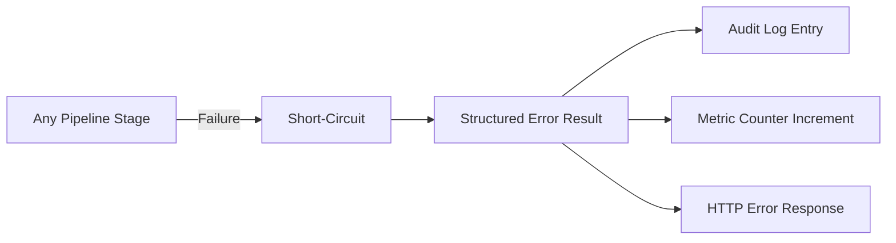

# Design Document: Plugin Runtime Implementation

## Overview

This design covers the full implementation of the Metadata-Driven Secure Plugin Runtime on .NET 10, translating the existing architecture documentation (100% complete) into a working codebase (currently 0%). The system is a Zero-Trust runtime that dynamically loads, validates, and executes untrusted plugin DLLs governed by signed manifests and capability-based access control.

The implementation follows a layered architecture with strict dependency inversion: SDK (no deps) → Core (no external deps) → Capabilities.Abstractions → Security/Runtime → Infrastructure → Api/Admin. Each layer has a single responsibility and communicates through interfaces defined in Core.

Key design decisions:
- **AssemblyLoadContext** for plugin isolation (Phase 1, not a security boundary)
- **Staged pipeline** for execution (7 sequential stages, fail-closed)
- **Capability proxy pattern** for all infrastructure access (deny-by-default)
- **OpenTelemetry** for distributed tracing across pipeline stages
- **EF Core** with PostgreSQL for persistence, Redis for caching

## Architecture

```mermaid
graph TB
    subgraph "API Layer"
        API[PluginRuntime.Api<br/>ASP.NET Core]
        Admin[PluginRuntime.Admin<br/>Blazor Server]
    end

    subgraph "Core Layer"
        Runtime[PluginRuntime.Runtime<br/>Execution Engine]
        Security[PluginRuntime.Security<br/>Validation & Crypto]
        Core[PluginRuntime.Core<br/>Domain & Interfaces]
    end

    subgraph "Capability Layer"
        CapAbs[Capabilities.Abstractions]
        CapDB[Capabilities.Database]
        CapNet[Capabilities.Network]
        CapStore[Capabilities.Storage]
        CapCache[Capabilities.Cache]
        CapExt[Capabilities.Extension]
    end

    subgraph "Infrastructure Layer"
        Infra[PluginRuntime.Infrastructure<br/>EF Core + Redis + Storage]
        KV[PluginRuntime.Infrastructure.KeyVault<br/>KMS/HSM]
    end

    subgraph "SDK"
        SDK[PluginRuntime.Sdk<br/>IPlugin + PluginContext]
    end

    API --> Runtime
    API --> Security
    Admin --> API
    Runtime --> Core
    Runtime --> CapAbs
    Security --> Core
    Infra --> Core
    CapAbs --> Core
    CapDB --> CapAbs
    CapNet --> CapAbs
    CapStore --> CapAbs
    CapCache --> CapAbs
    CapExt --> CapAbs
```

### Execution Pipeline Flow



### Dependency Flow Rule

```
SDK (zero dependencies — published as NuGet)
  ↑
Core (zero external NuGet — domain only)
  ↑
Capabilities.Abstractions (depends on Core)
  ↑
Security (depends on Core)
  ↑
Runtime (depends on Core + Capabilities.Abstractions)
  ↑
Infrastructure (depends on Core)
  ↑
Api (depends on all projects — composition root)
```

## Components and Interfaces

### 1. PluginRuntime.Sdk

The SDK is the only package plugin developers reference. Zero dependencies.

```csharp
public interface IPlugin
{
    Task<PluginResult> ExecuteAsync(PluginContext context, CancellationToken cancellationToken);
}

public record PluginContext
{
    public string ExecutionId { get; init; } = "";
    public string PluginId { get; init; } = "";
    public string Version { get; init; } = "";
    public JsonElement Input { get; init; }
    public IReadOnlyDictionary<string, ICapability> Capabilities { get; init; }
        = new Dictionary<string, ICapability>();
    public string? CorrelationId { get; init; }
}

public record PluginResult
{
    public bool Success { get; init; }
    public JsonElement? Data { get; init; }
    public string? ErrorCode { get; init; }
    public string? ErrorMessage { get; init; }
}
```

### 2. PluginRuntime.Core

Domain entities, interfaces, value objects. No external dependencies.

**Key Interfaces:**

```csharp
public interface IExecutionPipeline
{
    Task<ExecutionResult> ProcessAsync(ExecutionRequest request, CancellationToken cancellationToken);
}

public interface IPluginExecutor
{
    Task<ExecutionResult> ExecuteAsync(ExecutionRequest request, CancellationToken cancellationToken);
}

public interface IManifestValidator
{
    Task<ValidationResult> ValidateAsync(Manifest manifest, CancellationToken cancellationToken);
}

public interface ISignatureVerifier
{
    Task<VerificationResult> VerifyAsync(Manifest manifest, CancellationToken cancellationToken);
}

public interface IHashVerifier
{
    Task<VerificationResult> VerifyAsync(byte[] dllBytes, string expectedHash, CancellationToken cancellationToken);
}

public interface IPluginLoader
{
    Task<IPlugin> LoadAsync(PluginVersion version, Manifest manifest, CancellationToken cancellationToken);
    Task UnloadAsync(string pluginId, string version);
}

public interface ICapabilityResolver
{
    IReadOnlyDictionary<string, ICapability> Resolve(Manifest manifest, ExecutionContext executionContext);
}

public interface IExecutionGovernor
{
    Task<T> ExecuteWithLimitsAsync<T>(
        Func<CancellationToken, Task<T>> action,
        ResourceLimits limits,
        CancellationToken cancellationToken);
}

public interface IRevocationChecker
{
    Task<bool> IsRevokedAsync(Guid versionId, CancellationToken cancellationToken);
}
```

**Domain Entities:**

```csharp
public class Plugin
{
    public Guid PluginId { get; init; }
    public string Name { get; init; } = "";
    public string DisplayName { get; init; } = "";
    public string? Description { get; init; }
    public Guid OwnerId { get; init; }
    public PluginStatus Status { get; init; }
    public DateTime CreatedAt { get; init; }
    public DateTime UpdatedAt { get; init; }
    public DateTime? DeletedAt { get; init; }
}

public class PluginVersion
{
    public Guid VersionId { get; init; }
    public Guid PluginId { get; init; }
    public string Version { get; init; } = "";
    public string StorageUri { get; init; } = "";
    public string Sha256 { get; init; } = "";
    public string EntryPoint { get; init; } = "";
    public string EntryClass { get; init; } = "";
    public PluginVersionStatus Status { get; init; }
    public Guid? ApprovedBy { get; init; }
    public DateTime? ApprovedAt { get; init; }
    public DateTime CreatedAt { get; init; }
}

public class Manifest
{
    public Guid ManifestId { get; init; }
    public Guid VersionId { get; init; }
    public string ManifestVersion { get; init; } = "1.0";
    public string TargetCoreVersion { get; init; } = "";
    public JsonElement Permissions { get; init; }
    public JsonElement Capabilities { get; init; }
    public int ExecutionTimeoutMs { get; init; } = 5000;
    public int MaxMemoryMb { get; init; } = 256;
    public int MaxCpuMs { get; init; } = 2000;
    public bool AllowParallel { get; init; }
    public string Signature { get; init; } = "";
    public string SignatureAlgorithm { get; init; } = "RSA-SHA256";
    public string PublicKeyId { get; init; } = "";
    public DateTime IssuedAt { get; init; }
    public DateTime ExpiresAt { get; init; }
    public DateTime CreatedAt { get; init; }
}

public class Execution
{
    public Guid ExecutionId { get; init; }
    public Guid PluginId { get; init; }
    public Guid VersionId { get; init; }
    public string TraceId { get; init; } = "";
    public string? CorrelationId { get; init; }
    public string? TenantId { get; init; }
    public string? UserId { get; init; }
    public ExecutionStatus Status { get; init; }
    public string? ErrorCode { get; init; }
    public string? ErrorMessage { get; init; }
    public DateTime StartTime { get; init; }
    public DateTime? EndTime { get; init; }
    public int? DurationMs { get; init; }
    public string? NodeId { get; init; }
}
```

**Value Objects:**

```csharp
public record ResourceLimits
{
    public int TimeoutMs { get; init; }
    public int MaxMemoryMb { get; init; }
    public int MaxCpuMs { get; init; }
}

public record ValidationResult(bool IsValid, IReadOnlyList<ValidationError> Errors);
public record ValidationError(string Field, string Code, string Message);
public record VerificationResult(bool IsValid, string? ErrorCode, string? ErrorMessage);
```

**Enums:**

```csharp
public enum PluginStatus { Active, Suspended, Archived }
public enum PluginVersionStatus { Draft, Scanning, Approved, Rejected, Revoked, Archived }
public enum ExecutionStatus { Running, Completed, Failed, Cancelled, Timeout }
public enum ActorType { User, System, Service }
public enum AuditResult { Success, Failure, Denied }
public enum Visibility { Private, Public, Subscription }
public enum ApprovalDecision { Approved, ApprovedWithConditions, Rejected, NeedsInfo }
public enum RiskLevel { Low, Medium, High, Critical }
public enum SignatureAlgorithm { RsaSha256, EcdsaSha256 }
public enum SubscriptionStatus { Requested, Approved, Rejected, Revoked, Expired }
```

### 3. PluginRuntime.Security

```csharp
// ManifestValidator — validates schema, required fields, expiration, version compat
public class ManifestValidator : IManifestValidator
{
    // Checks: all required fields present, types valid, expires_at > now,
    // target_core_version compatible, signature_algorithm known
}

// SignatureVerifier — validates RSA-SHA256 or ECDSA-SHA256 signatures
public class SignatureVerifier : ISignatureVerifier
{
    // Loads public key by public_key_id from IKeyProvider
    // Verifies signature over canonical manifest content
}

// HashVerifier — computes SHA-256 of DLL bytes and compares
public class HashVerifier : IHashVerifier
{
    // SHA256.HashData(dllBytes) == expected hash
}

// RevocationChecker — checks revocation status with Redis cache
public class RevocationChecker : IRevocationChecker
{
    // Check Redis cache first, then DB fallback
    // Expired revocations (expires_at < now) do NOT block
}

public interface IKeyProvider
{
    Task<byte[]> GetPublicKeyAsync(string keyId, CancellationToken cancellationToken);
}
```

### 4. PluginRuntime.Runtime

```csharp
// ExecutionPipeline — orchestrates 7 stages in fixed order
public class ExecutionPipeline : IExecutionPipeline
{
    // Stage 1: ManifestValidator
    // Stage 2: SignatureVerifier
    // Stage 3: HashVerifier
    // Stage 4: CapabilityResolver
    // Stage 5: PluginLoader
    // Stage 6: PluginExecutor (via ExecutionGovernor)
    // Stage 7: ObservabilityCollector
    // Any stage failure → short-circuit, return structured error
}

// PluginLoader — manages ALC lifecycle
public class PluginLoader : IPluginLoader
{
    // Creates collectible AssemblyLoadContext per plugin
    // Resolves entry point class implementing IPlugin
    // Tracks loaded ALCs for unload/hot-reload
}

// ExecutionGovernor — enforces resource limits via cooperative CancellationToken
public class ExecutionGovernor : IExecutionGovernor
{
    // CancellationToken serves as the enforcement mechanism that plugins must observe cooperatively
    // CancellationTokenSource with timeout (cancels token when TimeoutMs expires)
    // Memory monitoring via GC callbacks or polling (cancels token when MaxMemoryMb exceeded)
    // Cooperative CPU cancellation (cancels token when MaxCpuMs exceeded)
}

// HotReloadManager — orchestrates version transitions
public class HotReloadManager
{
    // Stop new requests to old version
    // Drain active executions (max 30s)
    // Force-cancel if drain timeout exceeded
    // Unload old ALC
    // Load new version + warm-up
    // Resume traffic
}
```

### 5. Capability Implementations

Each capability follows the same pattern:
1. Validate the plugin has permission (from resolved capabilities)
2. Namespace all access to `{pluginId}`
3. Enforce size/rate limits
4. Propagate CancellationToken
5. Log access attempts

```csharp
// DatabaseCapability
public class DatabaseCapability : IDatabaseCapability
{
    // Rejects non-parameterized SQL (string interpolation detection)
    // Prefixes table references with plugin namespace
    // Uses connection pooling transparently
}

// NetworkCapability
public class NetworkCapability : INetworkCapability
{
    // Validates URL against manifest's allowed_domains
    // Enforces 10 MB max response size
    // Proxies via HttpClient with timeout from NetworkRequest.TimeoutMs
}

// StorageCapability
public class StorageCapability : IStorageCapability
{
    // Scopes keys to {pluginId}/{key}
    // Rejects path traversal (../, ..\)
    // Enforces 50 MB per-object, configurable total quota
}

// CacheCapability
public class CacheCapability : ICacheCapability
{
    // Namespaces keys as {pluginId}:{key}
    // Enforces max 10000 keys per plugin (configurable)
    // Enforces 1 MB max value size after serialization
    // Uses System.Text.Json for serialization
}

// ExtensionCapability
public class ExtensionCapability : IExtensionCapability
{
    // Verifies in priority order:
    //   1. extension:invoke:{targetId} permission (CapabilityDeniedException if denied)
    //   2. Target exists and Active (ExtensionNotFoundException if not found)
    //   3. Visibility check (AccessDeniedException if access denied)
    // If multiple checks fail, return error for highest-priority failed check
    // Enforces call depth limit (default 3)
    // Detects circular invocation via call stack
    // Cascades timeout: min(target timeout, caller remaining)
    // Enforces per-caller rate limit from invocation_policy
    // Validates input against allowed_input_schema
}
```

### 6. PluginRuntime.Infrastructure

```csharp
// EF Core DbContext with all 13 tables
public class PluginRuntimeDbContext : DbContext
{
    // 13 DbSets mapping to database-schema.md
    // JSONB columns: HasColumnType("jsonb")
    // Enum columns: ValueConverter for string mapping
    // Soft-delete: HasQueryFilter(p => p.DeletedAt == null) on plugins
    // Audit: SaveChanges override to prevent UPDATE/DELETE on audit_logs
}

// Repository pattern — one interface per entity in Core, implementation in Infrastructure
public interface IPluginRepository { /* CRUD + query methods */ }
public interface IExecutionRepository { /* CRUD + query methods */ }
public interface IAuditLogRepository { /* Insert-only */ }
// ... 13 total repositories

// Redis cache wrapper
public class RedisCacheService : ICacheService
{
    // Configurable TTL (default 300s, range 10-86400s)
    // Used for: revocation lists, plugin metadata, capability resolution
}

// Object storage client
public class ObjectStorageService : IObjectStorageService
{
    // Stores plugin ZIP/DLL at {plugin_id}/{version_id}/
    // 50 MB max per object
    // Service identity write-only access
}
```

### 7. PluginRuntime.Api

```csharp
// Controllers
public class ExecuteController : ControllerBase
{
    // POST /api/v1/execute/{pluginId} → delegates to IExecutionPipeline
}

public class PluginsController : ControllerBase
{
    // GET /api/v1/plugins
    // GET /api/v1/plugins/{pluginId}
    // POST /api/v1/plugins/upload (multipart, max 50 MB)
    // POST /api/v1/plugins/{pluginId}/reload
    // POST /api/v1/plugins/{pluginId}/revoke
}

public class ApprovalsController : ControllerBase
{
    // GET /api/v1/approvals?status=Pending
    // POST /api/v1/approvals/{versionId}/approve
    // POST /api/v1/approvals/{versionId}/reject
    // GET /api/v1/approvals/{versionId}/permissions
}

public class ExtensionsController : ControllerBase
{
    // POST /api/v1/extensions/{targetId}/subscribe
    // GET /api/v1/extensions/{extensionId}/subscriptions
    // POST /api/v1/extensions/{extensionId}/subscriptions/{id}/decide
    // POST /api/v1/extensions/{extensionId}/subscriptions/{id}/revoke
}

// Middleware
public class JwtAuthenticationMiddleware { /* Bearer token validation */ }
public class RateLimitingMiddleware { /* Per-endpoint rate limiting, 429 + Retry-After */ }
public class ErrorHandlingMiddleware { /* Standardized error format */ }
public class RequestValidationMiddleware { /* Body size limit 1 MB, JSON validation */ }
```

### 8. PluginRuntime.Admin

```csharp
// Blazor Server with MudBlazor
// Pages: Dashboard, Extensions, Approvals, Monitoring, Audit, Marketplace
// Real-time updates via SignalR
// Typed HttpClient to PluginRuntime.Api with Bearer JWT
// Auto-reconnect on SignalR disconnect (5s intervals, max 10 attempts)
```

## Data Models

### Entity-Relationship Diagram

```mermaid
erDiagram
    plugins ||--o{ plugin_versions : has
    plugin_versions ||--|| manifests : has
    plugin_versions ||--o{ revocations : may_have
    plugin_versions ||--o{ approvals : reviewed_by
    plugin_versions ||--o{ permission_reviews : reviewed_by
    plugins ||--o| extension_registry : registers
    extension_registry ||--o{ extension_subscriptions : target
    extension_registry ||--o{ declarative_configs : has
    plugins ||--o{ executions : produces

    plugins {
        uuid plugin_id PK
        varchar name UK
        varchar display_name
        text description
        uuid owner_id
        varchar status
        timestamptz created_at
        timestamptz updated_at
        timestamptz deleted_at
    }

    plugin_versions {
        uuid version_id PK
        uuid plugin_id FK
        varchar version
        varchar storage_uri
        varchar sha256
        varchar entry_point
        varchar entry_class
        varchar status
        uuid approved_by
        timestamptz approved_at
        timestamptz created_at
    }

    manifests {
        uuid manifest_id PK
        uuid version_id FK_UK
        varchar manifest_version
        varchar target_core_version
        jsonb permissions
        jsonb capabilities
        int execution_timeout_ms
        int max_memory_mb
        int max_cpu_ms
        boolean allow_parallel
        text signature
        varchar signature_algorithm
        varchar public_key_id
        timestamptz issued_at
        timestamptz expires_at
        timestamptz created_at
    }

    executions {
        uuid execution_id PK
        uuid plugin_id
        uuid version_id
        varchar trace_id
        varchar correlation_id
        varchar tenant_id
        varchar user_id
        varchar status
        varchar error_code
        text error_message
        timestamptz start_time
        timestamptz end_time
        int duration_ms
        varchar node_id
    }

    audit_logs {
        uuid audit_id PK
        timestamptz timestamp
        varchar actor_id
        varchar actor_type
        varchar action
        varchar resource_type
        varchar resource_id
        varchar ip_address
        varchar result
        jsonb metadata
    }

    revocations {
        uuid revocation_id PK
        uuid version_id FK
        text reason
        uuid revoked_by
        timestamptz revoked_at
        timestamptz expires_at
    }
}
```

### Key Data Invariants

1. **audit_logs** is append-only — no UPDATE or DELETE at application level
2. **plugin_versions** has unique constraint on (plugin_id, version)
3. **manifests** has unique constraint on version_id (1:1 with plugin_versions)
4. **extension_subscriptions** has unique constraint on (source_extension_id, target_extension_id)
5. **plugins** uses soft-delete with HasQueryFilter excluding deleted_at != null
6. All JSONB columns store structured data (permissions, capabilities, metadata, etc.)
7. All enum columns stored as strings via ValueConverter

## Correctness Properties

The system defines formal correctness invariants verified through Property-Based Testing (PBT). Each property is tested over at least 100 randomized inputs using FsCheck.

### Property 1: Fail-Closed Execution

Any validation failure (manifest, signature, hash, revocation) results in immediate execution rejection. No partial execution occurs. Applies to Security and Runtime modules.

**Validates: Requirements 2.5, 3.2, 10.6**

### Property 2: Deny-by-Default Capability Access

Any capability request not explicitly declared in the manifest is denied. No implicit permissions exist. Applies to the Capability Layer.

**Validates: Requirements 4.5, 10.6**

### Property 3: Signature Integrity

Any modification to manifest content (even a single byte) invalidates the digital signature. Applies to the Security module.

**Validates: Requirements 2.3, 2.7**

### Property 4: Hash Integrity

Any modification to DLL bytes produces a SHA-256 mismatch and rejects execution. Applies to the Security module.

**Validates: Requirements 2.2, 2.7**

### Property 5: Revocation Enforcement

Any plugin version with an active (non-expired) revocation record is always rejected. Applies to the Security module.

**Validates: Requirements 2.4, 2.7**

### Property 6: Namespace Isolation

No plugin execution can read or write another plugin's namespaced resources (storage keys, cache keys, database schema). Applies to all Capability implementations.

**Validates: Requirements 4.8, 10.3**

### Property 7: ALC Isolation

No plugin's AssemblyLoadContext shares mutable state with another plugin's ALC. Applies to the Runtime module.

**Validates: Requirements 3.3, 10.3**

### Property 8: Privilege Non-Escalation

When extension A invokes extension B, B executes with B's own permissions — never inherits A's elevated permissions. Applies to Inter-Extension communication.

**Validates: Requirements 8.9**

### Property 9: Audit Immutability

No audit log entry can be modified or deleted after creation. INSERT is the only permitted operation. Applies to the Infrastructure module.

**Validates: Requirements 6.3, 10.6**

### Property 10: Manifest Immutability

A signed manifest cannot be altered without invalidating its signature. Applies to the Security module.

**Validates: Requirements 2.3, 2.7**

### Property 11: Expiration Enforcement

Any manifest with expires_at < now always fails validation. Applies to the Security module.

**Validates: Requirements 2.1, 2.7**

### Property 12: Subscription Expiration

Any subscription with expires_at < now is treated as inactive (access denied). Applies to Inter-Extension communication.

**Validates: Requirements 8.5**

### Property 13: Timeout Enforcement

Plugin execution is terminated (CancellationToken cancelled) within 100ms of ResourceLimits.TimeoutMs expiring. Applies to the Runtime module.

**Validates: Requirements 3.5, 3.7**

### Property 14: Memory Enforcement

Plugin execution is terminated within 1 second of exceeding ResourceLimits.MaxMemoryMb. Applies to the Runtime module.

**Validates: Requirements 3.6**

### Property 15: Path Traversal Blocking

Any storage key containing `../` or `..\` is always rejected. Applies to the StorageCapability.

**Validates: Requirements 4.3, 4.8**

## Error Handling

### Structured Error Format

All errors returned by the system use a standardized envelope:

```json
{
  "error": {
    "code": "MANIFEST_EXPIRED",
    "category": "Security",
    "message": "Manifest has expired (expires_at: 2025-01-01T00:00:00Z)",
    "traceId": "abc123-def456",
    "timestamp": "2026-07-07T10:30:00Z"
  }
}
```

### Error Categories and HTTP Mapping

| Category | HTTP Status | When |
|----------|-------------|------|
| Validation | 400 | Malformed request, missing fields, invalid JSON, body > 1 MB |
| Security | 403 | Manifest invalid, signature failed, hash mismatch, capability denied, revoked |
| NotFound | 404 | Plugin/extension/subscription not found |
| Execution | 500 | Plugin threw unhandled exception, pipeline internal error |
| Timeout | 504 | Plugin exceeded ResourceLimits.TimeoutMs |
| ResourceLimit | 429 | Rate limit exceeded, memory limit exceeded |

### Error Propagation Through Pipeline



**Pipeline error rules:**
1. Any stage failure stops the pipeline immediately (fail-closed)
2. The error result includes: failing stage name, error code, TraceId
3. Subsequent stages are never executed after a failure
4. Every security failure produces an immutable audit_logs entry
5. Every failure increments the appropriate metric counter

### Error Priority in Extension Invocation

When `IExtensionCapability.InvokeAsync` performs multiple checks, errors follow a strict priority:

1. **Permission** (highest) → `CapabilityDeniedException` — caller lacks `extension:invoke:{targetId}`
2. **Existence** → `ExtensionNotFoundException` — target extension not found or not Active
3. **Visibility** (lowest) → `AccessDeniedException` — visibility rules not satisfied

If multiple checks fail simultaneously, only the highest-priority error is returned.

### Infrastructure Failure Handling

| Service | Timeout | Behavior |
|---------|---------|----------|
| PostgreSQL | 5 seconds | Fail closed, log connectivity failure, return structured error |
| Redis | 5 seconds | Fail closed, log connectivity failure, return structured error |
| Object Storage | 5 seconds | Fail closed, log connectivity failure, return structured error |
| OpenTelemetry Collector | N/A | Continue processing, buffer telemetry (configurable limit; 0 = drop) |

### Telemetry Resilience

- When OpenTelemetry collector is unavailable, request processing continues without blocking
- Telemetry buffering is configurable (minimum: 0)
- Buffer limit of 0 disables buffering entirely — telemetry data is dropped when collectors are unavailable
- This ensures observability failures never impact plugin execution latency

## Testing Strategy

### Test Pyramid

```
         ╱╲
        ╱  ╲         Integration Tests (PluginRuntime.IntegrationTests)
       ╱    ╲         - End-to-end flow, concurrent isolation, security hardening
      ╱──────╲
     ╱        ╲       Property-Based Tests (FsCheck, per module .Tests)
    ╱          ╲       - Correctness invariants over 100+ randomized inputs
   ╱────────────╲
  ╱              ╲     Unit Tests (per module .Tests)
 ╱                ╲     - Component behavior, edge cases, error paths
╱──────────────────╲
```

### Test Framework Stack

| Tool | Purpose |
|------|---------|
| xUnit | Test runner and assertions |
| FluentAssertions | Readable assertion syntax |
| NSubstitute | Interface mocking |
| FsCheck + FsCheck.Xunit | Property-based testing with randomized inputs |
| Testcontainers | PostgreSQL and Redis for integration tests |
| WebApplicationFactory | In-memory API hosting for integration tests |
| bUnit | Blazor component testing |

### Property-Based Testing Approach

Each correctness property (P1–P15) is encoded as an FsCheck property:

```csharp
[Property(MaxTest = 100)]
public Property FailClosed_AnyInvalidManifest_RejectsExecution(Manifest manifest)
{
    // Arbitrarily tamper one field
    var tampered = TamperRandomField(manifest);
    var result = _validator.ValidateAsync(tampered, CancellationToken.None).Result;
    return (!result.IsValid).ToProperty();
}
```

**PBT conventions:**
- Minimum 100 test cases per property (`MaxTest = 100`)
- Custom `Arbitrary<T>` generators for domain types (Manifest, Plugin, etc.)
- Shrinking enabled to find minimal failing examples
- Properties grouped by module in dedicated `*Properties.cs` files

### Unit Test Conventions

- One test class per production class
- Test naming: `MethodName_Scenario_ExpectedBehavior`
- AAA pattern (Arrange, Act, Assert)
- All async tests use `CancellationToken.None` unless testing cancellation
- Mock external dependencies via NSubstitute

### Integration Test Approach

- **Testcontainers** spin up PostgreSQL and Redis per test run
- **WebApplicationFactory** hosts the API in-process
- End-to-end tests traverse the full pipeline (upload → scan → approve → execute)
- Concurrent isolation tests run 10+ plugins in parallel
- Performance tests verify P95 latency under 500 concurrent requests

### Test Coverage by Requirement

| Requirement | Unit Tests | PBT | Integration |
|-------------|-----------|-----|-------------|
| R1: Foundation | Entity creation/validation | — | Build verification |
| R2: Security | Validator/Verifier behavior | P1, P3, P4, P5, P11 | Security rejection flow |
| R3: Runtime | Pipeline stages, Governor | P13, P14 | Full execution flow |
| R4: Capabilities | Namespace, limits, traversal | P2, P6, P15 | Concurrent isolation |
| R5: API | Controller routing, auth, errors | — | 401/403/429/400/404 |
| R6: Infrastructure | Repository CRUD, audit | P9 | Migration + CRUD |
| R7: Observability | Spans, metrics, logging | — | /health /ready checks |
| R8: Inter-Extension | Visibility, depth, cascade | P8, P12 | Subscription workflow |
| R9: Admin Portal | Component rendering | — | SignalR connection |
| R10: Hardening | — | P1–P15 (combined) | Full E2E + load |

