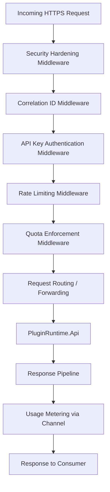
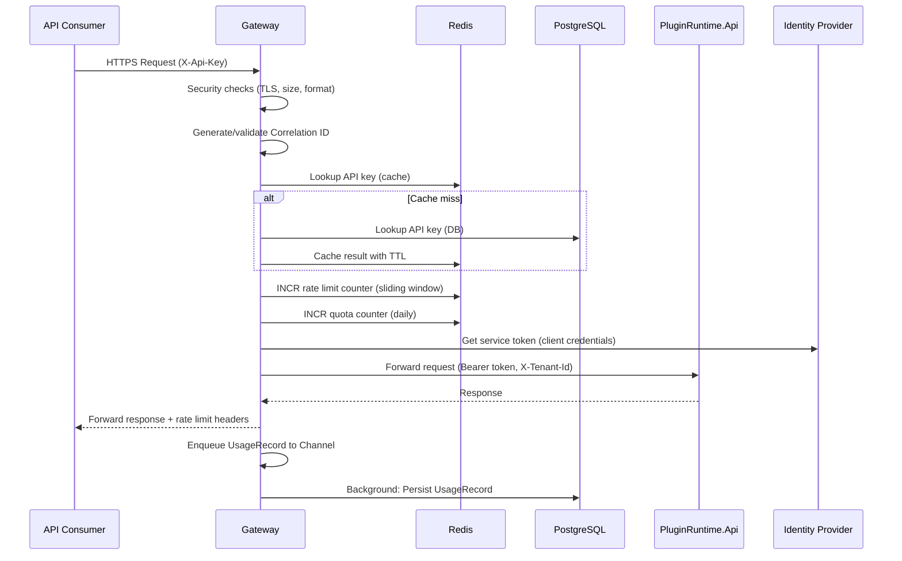
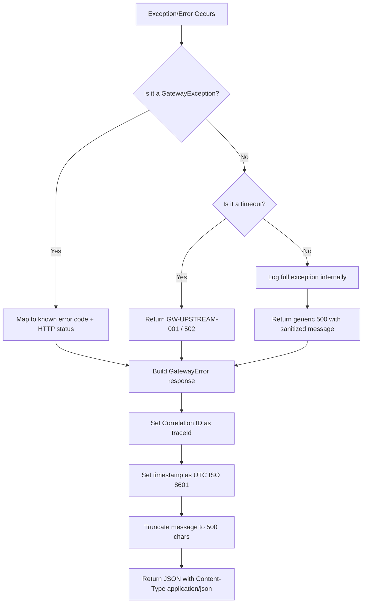

# Design Document: Public API Gateway

## Overview

The Public API Gateway is a stateless ASP.NET Core (.NET 10) reverse-proxy application that serves as the single public entry point for API Consumers to access the Plugin Runtime platform. It sits in front of the internal `PluginRuntime.Api` and enforces authentication, rate limiting, quota enforcement, and usage metering before forwarding requests upstream.

**Key Design Decisions:**

1. **Middleware Pipeline Architecture** — Each cross-cutting concern (auth, rate limiting, quota, correlation, metering) is implemented as a discrete ASP.NET Core middleware, composed into an ordered pipeline. This enables independent testing and clear separation of responsibilities.

2. **Fail-Closed by Default** — If any middleware cannot determine whether a request is allowed (e.g., Redis unavailable for rate limiting), the request is rejected. The only exception is API key cache miss, which falls back to PostgreSQL.

3. **Stateless Gateway** — All state lives in Redis (counters, caches) or PostgreSQL (tenants, keys, usage). Any Gateway instance can serve any request. Horizontal scaling is trivial.

4. **Async Metering** — Usage records are captured asynchronously via a background channel so that metering failures never block request processing.

5. **Zero-Trust Forwarding** — The Gateway strips the consumer's API key before forwarding and replaces it with a short-lived OAuth 2.0 client credentials token for service-to-service auth.

### Architecture Context

```
┌──────────────┐        ┌─────────────────────┐        ┌──────────────────┐
│ API Consumer │──HTTPS──│  Public API Gateway  │──mTLS──│ PluginRuntime.Api│
└──────────────┘        └─────────────────────┘        └──────────────────┘
                                  │
                    ┌─────────────┼─────────────┐
                    │             │             │
               ┌────▼────┐  ┌────▼────┐  ┌────▼─────┐
               │  Redis   │  │PostgreSQL│  │  IdP     │
               │(counters,│  │(tenants, │  │(OAuth2.0)│
               │ cache)   │  │ usage)   │  └──────────┘
               └──────────┘  └──────────┘
```

---

## Architecture

### High-Level Architecture

The Gateway is a single ASP.NET Core project (`PublicApiGateway`) that processes requests through an ordered middleware pipeline. It does NOT contain business logic — it only authenticates, authorizes, meters, and forwards.



### Middleware Pipeline Order

The order is critical. Each middleware short-circuits on failure:

| Order | Middleware | Failure Response |
|-------|-----------|-----------------|
| 1 | Security Hardening | 400/413/421/429/431 |
| 2 | Correlation ID | Never fails |
| 3 | API Key Authentication | 401/403 |
| 4 | Rate Limiting | 429/503 |
| 5 | Quota Enforcement | 429/503 |
| 6 | Request Forwarding | 502 |
| 7 | Usage Metering (post) | Never blocks response |

### Low-Level Design

#### Middleware Pipeline Registration

```csharp
// Program.cs - Middleware order
app.UseMiddleware<SecurityHardeningMiddleware>();
app.UseMiddleware<CorrelationIdMiddleware>();
app.UseMiddleware<ApiKeyAuthenticationMiddleware>();
app.UseMiddleware<RateLimitingMiddleware>();
app.UseMiddleware<QuotaEnforcementMiddleware>();
app.UseMiddleware<RequestForwardingMiddleware>();
// UsageMetering is triggered post-response via Channel<T>
```

#### Request Flow Sequence



---

## Components and Interfaces

### Project Structure

```
src/
├── PublicApiGateway/
│   ├── Program.cs
│   ├── Middleware/
│   │   ├── SecurityHardeningMiddleware.cs
│   │   ├── CorrelationIdMiddleware.cs
│   │   ├── ApiKeyAuthenticationMiddleware.cs
│   │   ├── RateLimitingMiddleware.cs
│   │   ├── QuotaEnforcementMiddleware.cs
│   │   └── RequestForwardingMiddleware.cs
│   ├── Services/
│   │   ├── IApiKeyService.cs / ApiKeyService.cs
│   │   ├── IRateLimitService.cs / RateLimitService.cs
│   │   ├── IQuotaService.cs / QuotaService.cs
│   │   ├── IUsageMeteringService.cs / UsageMeteringService.cs
│   │   ├── ITokenService.cs / TokenService.cs
│   │   └── IIpBlockingService.cs / IpBlockingService.cs
│   ├── Models/
│   │   ├── TenantContext.cs
│   │   ├── ApiKeyInfo.cs
│   │   ├── PlanLimits.cs
│   │   ├── UsageRecord.cs
│   │   ├── GatewayError.cs
│   │   └── RateLimitResult.cs
│   ├── Configuration/
│   │   ├── GatewayOptions.cs
│   │   ├── RedisOptions.cs
│   │   └── UpstreamOptions.cs
│   ├── BackgroundServices/
│   │   └── UsageMeteringBackgroundService.cs
│   ├── Health/
│   │   ├── RedisHealthCheck.cs
│   │   ├── PostgresHealthCheck.cs
│   │   └── UpstreamHealthCheck.cs
│   └── Extensions/
│       ├── ServiceCollectionExtensions.cs
│       └── HttpContextExtensions.cs
└── PublicApiGateway.Tests/
    ├── Middleware/
    ├── Services/
    └── Properties/
```

### Service Interfaces

```csharp
/// Resolves and validates API keys, returns tenant context
public interface IApiKeyService
{
    Task<ApiKeyValidationResult> ValidateAsync(
        string apiKey, CancellationToken ct);
    
    Task InvalidateCacheAsync(
        string apiKey, CancellationToken ct);
}

/// Sliding window rate limiting against Redis
public interface IRateLimitService
{
    Task<RateLimitResult> CheckAsync(
        string tenantId, PlanLimits limits, CancellationToken ct);
}

/// Daily quota enforcement with atomic increments
public interface IQuotaService
{
    Task<QuotaResult> IncrementAndCheckAsync(
        string tenantId, PlanLimits limits, CancellationToken ct);
}

/// Async usage metering with dead-letter support
public interface IUsageMeteringService
{
    void Enqueue(UsageRecord record);
}

/// Service-to-service token acquisition (OAuth 2.0 client credentials)
public interface ITokenService
{
    Task<string> GetServiceTokenAsync(CancellationToken ct);
}

/// IP-based brute-force blocking
public interface IIpBlockingService
{
    Task<bool> IsBlockedAsync(string ipAddress, CancellationToken ct);
    Task RecordFailedAttemptAsync(string ipAddress, CancellationToken ct);
}
```

### Middleware Contracts

Each middleware follows the standard ASP.NET Core pattern:

```csharp
public class ApiKeyAuthenticationMiddleware
{
    private readonly RequestDelegate _next;
    
    public ApiKeyAuthenticationMiddleware(RequestDelegate next) { _next = next; }
    
    public async Task InvokeAsync(
        HttpContext context,
        IApiKeyService apiKeyService,
        IIpBlockingService ipBlockingService)
    {
        // 1. Check IP block list
        // 2. Extract X-Api-Key header
        // 3. Validate format (regex: ^[a-zA-Z0-9\-_]{32,128}$)
        // 4. Validate against cache/DB
        // 5. Set TenantContext on HttpContext.Items
        // 6. Call _next(context)
    }
}
```

---

## Data Models

### Domain Models

```csharp
/// Represents a validated API key with its associated tenant and plan
public sealed record ApiKeyInfo(
    Guid KeyId,
    string KeyHash,
    Guid TenantId,
    string TenantName,
    PlanType Plan,
    ApiKeyStatus Status,
    DateTime ExpiresAt);

/// Current tenant context for the request (set by auth middleware)
public sealed record TenantContext(
    Guid TenantId,
    string TenantName,
    PlanType Plan,
    PlanLimits Limits);

/// Plan limits resolved from the tenant's subscription tier
public sealed record PlanLimits(
    int? RateLimitPerDay,        // null = unlimited (Enterprise)
    int? DailyQuota,             // null = unlimited
    int MaxRequestBodyBytes,
    TimeSpan UpstreamTimeout);

/// Enum for plan tiers
public enum PlanType { Free, Pro, Enterprise }

/// Enum for API key status
public enum ApiKeyStatus { Active, Expired, Revoked }

/// Result of rate limit check
public sealed record RateLimitResult(
    bool IsAllowed,
    int Limit,
    int Remaining,
    long ResetAtUnixSeconds);

/// Result of quota check
public sealed record QuotaResult(
    bool IsAllowed,
    int Used,
    int Limit,
    int RetryAfterSeconds);

/// A usage record for metering
public sealed record UsageRecord(
    Guid TenantId,
    Guid ApiKeyId,
    DateTime Timestamp,       // UTC, ISO 8601, millisecond precision
    string HttpMethod,
    string RequestPath,       // truncated to 2048 chars
    int ResponseStatusCode,
    int DurationMs,
    string CorrelationId);

/// Standard Gateway error response body
public sealed record GatewayError(
    string Code,
    string Category,
    string Message,
    string TraceId,
    string Timestamp);
```

### Database Tables (Gateway-Specific)

```sql
-- Tenants table (managed by Tenant Management system, read by Gateway)
CREATE TABLE tenants (
    tenant_id       UUID            PRIMARY KEY DEFAULT gen_random_uuid(),
    name            VARCHAR(200)    NOT NULL,
    plan            VARCHAR(50)     NOT NULL DEFAULT 'Free',
    status          VARCHAR(50)     NOT NULL DEFAULT 'Active',
    daily_quota     INT             NOT NULL DEFAULT 1000,
    rate_limit      INT             NOT NULL DEFAULT 100,
    created_at      TIMESTAMPTZ     NOT NULL DEFAULT NOW(),
    updated_at      TIMESTAMPTZ     NOT NULL DEFAULT NOW()
);

-- API keys table
CREATE TABLE api_keys (
    key_id          UUID            PRIMARY KEY DEFAULT gen_random_uuid(),
    tenant_id       UUID            NOT NULL REFERENCES tenants(tenant_id),
    key_hash        VARCHAR(128)    NOT NULL UNIQUE,
    key_prefix      VARCHAR(8)      NOT NULL,  -- first 8 chars for identification
    key_suffix      VARCHAR(4)      NOT NULL,  -- last 4 chars for masked logging
    status          VARCHAR(50)     NOT NULL DEFAULT 'Active',
    expires_at      TIMESTAMPTZ,
    created_at      TIMESTAMPTZ     NOT NULL DEFAULT NOW(),
    revoked_at      TIMESTAMPTZ
);

CREATE INDEX idx_api_keys_hash ON api_keys(key_hash);
CREATE INDEX idx_api_keys_tenant ON api_keys(tenant_id);

-- Usage records table (append-only)
CREATE TABLE usage_records (
    record_id       UUID            PRIMARY KEY DEFAULT gen_random_uuid(),
    tenant_id       UUID            NOT NULL,
    api_key_id      UUID            NOT NULL,
    timestamp       TIMESTAMPTZ     NOT NULL,
    http_method     VARCHAR(10)     NOT NULL,
    request_path    VARCHAR(2048)   NOT NULL,
    status_code     INT             NOT NULL,
    duration_ms     INT             NOT NULL,
    correlation_id  VARCHAR(128)    NOT NULL,
    created_at      TIMESTAMPTZ     NOT NULL DEFAULT NOW()
);

CREATE INDEX idx_usage_tenant_timestamp ON usage_records(tenant_id, timestamp DESC);
CREATE INDEX idx_usage_timestamp ON usage_records(timestamp DESC);
```

### Redis Key Patterns

| Purpose | Key Pattern | TTL | Value |
|---------|------------|-----|-------|
| API Key Cache | `gw:apikey:{sha256_hash}` | 300s (configurable) | JSON: ApiKeyInfo |
| Rate Limit (Sliding Window) | `gw:ratelimit:{tenant_id}:{window_id}` | 24h + buffer | Sorted Set (timestamp → request_id) |
| Quota Counter | `gw:quota:{tenant_id}:{yyyy-MM-dd}` | 25h (auto-expire after day) | Integer (atomic counter) |
| IP Block | `gw:ipblock:{ip_address}` | 300s (5 min block) | Integer (attempt count) |
| IP Attempts | `gw:ipattempts:{ip_address}` | 60s | Integer (failed count in window) |
| Service Token Cache | `gw:servicetoken` | Token expiry - 60s buffer | String (Bearer token) |

### Configuration Model

```csharp
public sealed class GatewayOptions
{
    public int ApiKeyCacheTtlSeconds { get; init; } = 300;
    public int MaxRequestBodyBytes { get; init; } = 10_485_760; // 10 MB
    public int MaxHeaderSizeBytes { get; init; } = 8_192;       // 8 KB
    public int UsageBufferCapacity { get; init; } = 10_000;
    public int UsageRetryMaxAttempts { get; init; } = 3;
    public int UsageRetryBaseDelayMs { get; init; } = 1_000;
    public int IpBlockThreshold { get; init; } = 10;
    public int IpBlockWindowSeconds { get; init; } = 60;
    public int IpBlockDurationSeconds { get; init; } = 300;
    public string ApiKeyFormatPattern { get; init; } = @"^[a-zA-Z0-9\-_]{32,128}$";
}

public sealed class UpstreamOptions
{
    public string BaseUrl { get; init; } = null!;
    public int TimeoutSeconds { get; init; } = 30;
    public int MaxTimeoutSeconds { get; init; } = 300;
    public string ClientId { get; init; } = null!;
    public string ClientSecret { get; init; } = null!;
    public string TokenEndpoint { get; init; } = null!;
}
```

### Algorithms

#### Sliding Window Rate Limiting

The Gateway uses a **sorted set sliding window** algorithm in Redis for per-tenant rate limiting:

```
Algorithm: SlidingWindowRateLimit(tenantId, limit, windowSize=24h)
──────────────────────────────────────────────────────────────────
1. key ← "gw:ratelimit:{tenantId}"
2. now ← current UTC timestamp in milliseconds
3. windowStart ← now - windowSize (in ms)
4. MULTI (Redis pipeline):
   a. ZREMRANGEBYSCORE key 0 windowStart     // prune expired entries
   b. ZCARD key                               // count remaining entries
   c. ZADD key now requestId                  // add current request
   d. EXPIRE key (windowSize + 60s buffer)    // ensure key expiry
5. count ← result of step 4b
6. IF count >= limit:
      ZREM key requestId                      // rollback the add
      RETURN rejected(limit, 0, oldest_entry_expiry)
   ELSE:
      remaining ← limit - count - 1
      resetAt ← oldest entry score + windowSize
      RETURN allowed(limit, remaining, resetAt)
```

**Rationale:** Sorted sets with timestamp scores provide O(log N) operations and exact sliding window semantics. The prune-count-add pipeline runs atomically, preventing race conditions between concurrent requests.

#### Quota Enforcement (Daily Counter)

```
Algorithm: QuotaCheck(tenantId, dailyLimit)
────────────────────────────────────────────
1. key ← "gw:quota:{tenantId}:{UTC today as yyyy-MM-dd}"
2. newCount ← INCR key
3. IF newCount == 1:
      EXPIRE key 90000  // 25 hours (covers timezone edge + buffer)
4. IF newCount > dailyLimit:
      RETURN rejected(retryAfter = seconds_until_next_utc_midnight)
   ELSE:
      RETURN allowed(used=newCount, limit=dailyLimit)
```

**Rationale:** Redis INCR is atomic, so concurrent requests from the same tenant produce consistent counts across all Gateway instances. The date-based key naturally resets at UTC day boundary.

#### IP Brute-Force Detection

```
Algorithm: IpBruteForceCheck(ipAddress)
────────────────────────────────────────
1. blockKey ← "gw:ipblock:{ipAddress}"
2. IF EXISTS blockKey:
      RETURN blocked(retryAfter = TTL of blockKey)
3. attemptKey ← "gw:ipattempts:{ipAddress}"
4. count ← INCR attemptKey
5. IF count == 1:
      EXPIRE attemptKey 60   // 60-second sliding window
6. IF count > 10:
      SET blockKey 1 EX 300  // block for 5 minutes
      DEL attemptKey
      RETURN blocked(retryAfter = 300)
7. RETURN allowed
```

#### Exponential Backoff (Usage Metering Retry)

```
Algorithm: RetryWithBackoff(record, baseDelay=1s, maxAttempts=3)
────────────────────────────────────────────────────────────────
1. FOR attempt = 1 to maxAttempts:
      delay ← baseDelay × 2^(attempt-1)   // 1s, 2s, 4s
      TRY:
         persist(record)
         RETURN success
      CATCH:
         IF attempt < maxAttempts:
            await Task.Delay(delay)
         ELSE:
            writeToDeadLetterLog(record)
            emitAlert(record.TenantId, "metering_persistence_failed")
            RETURN failed
```

---

## Correctness Properties

*A property is a characteristic or behavior that should hold true across all valid executions of a system — essentially, a formal statement about what the system should do. Properties serve as the bridge between human-readable specifications and machine-verifiable correctness guarantees.*

### Property 1: API key validation resolves correct tenant and plan

*For any* valid API key that exists in the data store with status Active and a non-expired expiration date, calling `ValidateAsync` SHALL return the exact Tenant ID, Tenant Name, and Plan type associated with that key.

**Validates: Requirements 1.1, 1.6**

### Property 2: Invalid API keys are always rejected

*For any* API key string that does not exist in the data store, or that exists with status Expired, calling `ValidateAsync` SHALL return a failure result indicating HTTP 401 with error code "GW-AUTH-002".

**Validates: Requirements 1.3**

### Property 3: Sliding window rate limiting enforces plan-specific thresholds

*For any* tenant with a given plan (Free: 100, Pro: 10,000, Enterprise: unlimited), and *for any* sequence of N timestamped requests within a 24-hour rolling window, the rate limiter SHALL allow exactly min(N, limit) requests and reject all subsequent requests. For Enterprise tenants, no requests are ever rejected due to rate limiting.

**Validates: Requirements 2.1, 2.2, 2.3, 2.6**

### Property 4: Rate limit headers are mathematically consistent

*For any* rate limit check result where limit L and current count C are known, the response headers SHALL satisfy: `X-RateLimit-Limit == L`, `X-RateLimit-Remaining == max(0, L - C)`, and `X-RateLimit-Reset` is a Unix timestamp in the future that equals the expiry time of the oldest request in the window plus the window size.

**Validates: Requirements 2.7**

### Property 5: Quota enforcement rejects at daily limit boundary

*For any* tenant with daily quota limit Q, and *for any* current day counter value C, `IncrementAndCheckAsync` SHALL allow the request if and only if C < Q (i.e., reject when C >= Q). The counter increments atomically such that concurrent calls never produce a count exceeding Q + (number of concurrent calls - 1).

**Validates: Requirements 3.1, 3.4**

### Property 6: Retry-After calculation correctness

*For any* UTC timestamp T during a day, the `Retry-After` header value SHALL equal the number of whole seconds from T to the next 00:00:00 UTC, i.e., `ceiling((nextMidnight - T).TotalSeconds)`. This value is always in the range [1, 86400].

**Validates: Requirements 3.2**

### Property 7: Usage record completeness

*For any* completed HTTP request (success or failure) with a resolved tenant context, the emitted `UsageRecord` SHALL contain all of: Tenant ID matching the authenticated tenant, API Key ID matching the key used, timestamp in UTC with millisecond precision, the original HTTP method, request path truncated to at most 2048 characters, the actual response status code, duration in milliseconds as a non-negative integer, and the Correlation ID assigned to the request.

**Validates: Requirements 4.1**

### Property 8: Usage buffer is non-blocking with FIFO eviction

*For any* state of the usage metering buffer (0 to 10,000 records), enqueuing a new `UsageRecord` SHALL never block the calling request pipeline. When the buffer is at capacity (10,000), adding a new record SHALL evict the oldest record (FIFO order) and the buffer size SHALL remain at 10,000.

**Validates: Requirements 4.5, 4.7**

### Property 9: Request forwarding preserves content and strips sensitive headers

*For any* authenticated request with HTTP method M, path P, query string Q, body B, and arbitrary headers H, the forwarded request to PluginRuntime_Api SHALL have method M, path P, query Q, body B, all original headers from H except: `X-Api-Key`, `Connection`, `Keep-Alive`, `Transfer-Encoding`, `Upgrade`. Additionally, the forwarded request SHALL include `X-Tenant-Id` matching the authenticated tenant and `X-Correlation-Id` matching the assigned correlation ID.

**Validates: Requirements 5.1, 5.3, 5.4**

### Property 10: Response forwarding preserves upstream response

*For any* response from PluginRuntime_Api with status code S, headers H, and body B, the Gateway SHALL forward to the API Consumer a response with the same status code S, all headers from H, and body B (with Gateway-added headers like rate limit and correlation ID appended).

**Validates: Requirements 5.5**

### Property 11: Correlation ID validation and passthrough

*For any* string S where `1 <= len(S) <= 128` and all characters are printable ASCII (codes 33–126), the Gateway SHALL use S as the Correlation ID without modification. *For any* string S that is empty, exceeds 128 characters, or contains any character outside codes 33–126, the Gateway SHALL discard S and generate a new UUID v4 as the Correlation ID.

**Validates: Requirements 6.2, 6.3**

### Property 12: Correlation ID always present in response

*For any* HTTP response from the Gateway (success or error, any status code), the `X-Correlation-Id` response header SHALL be present and contain a non-empty string that is either the validated input correlation ID or a generated UUID v4.

**Validates: Requirements 6.6**

### Property 13: Error response schema conformance

*For any* Gateway-originated error response, the body SHALL be valid JSON conforming to the schema `{ "error": { "code": string, "category": string, "message": string, "traceId": string, "timestamp": string } }` where: `category` equals "Gateway", `code` starts with "GW-", `traceId` equals the request's Correlation ID, `timestamp` is in ISO 8601 UTC format with seconds precision (pattern: `yyyy-MM-ddTHH:mm:ssZ`), `message` length is at most 500 characters, and Content-Type is `application/json`.

**Validates: Requirements 7.1, 7.2, 7.6, 7.7, 7.8**

### Property 14: No internal details leak in error responses

*For any* internal exception or error condition (including stack traces, file paths, connection strings, infrastructure hostnames, or internal IP addresses), the error response body returned to the API Consumer SHALL NOT contain any of these values. Only sanitized, pre-defined error messages are returned.

**Validates: Requirements 7.5**

### Property 15: Non-conforming upstream errors are wrapped

*For any* response from PluginRuntime_Api that either is not valid JSON or does not contain the required `error.code`, `error.category`, `error.message`, `error.traceId`, and `error.timestamp` fields, the Gateway SHALL return a Gateway-originated error with code "GW-UPSTREAM-002" and category "Gateway".

**Validates: Requirements 7.4**

### Property 16: API key format validation

*For any* string S, if S matches the regex `^[a-zA-Z0-9\-_]{32,128}$` then format validation passes and a database lookup MAY proceed. If S does not match, format validation SHALL reject the request with HTTP 400 and error code "GW-SEC-005" without performing any database lookup.

**Validates: Requirements 9.2, 9.3**

### Property 17: Request size limit enforcement

*For any* request with body size B bytes and total header size H bytes: if B exceeds the configured maximum (default 10 MB), the Gateway SHALL reject with HTTP 413 and "GW-SEC-001"; if H exceeds the configured maximum (default 8 KB), the Gateway SHALL reject with HTTP 431 and "GW-SEC-002". These checks occur before any authentication or routing logic.

**Validates: Requirements 9.4, 9.5**

### Property 18: IP brute-force blocking at threshold

*For any* IP address and *for any* sequence of consecutive failed authentication attempts with timestamps, if more than 10 failures occur from that IP within any 60-second window, the Gateway SHALL block that IP for 5 minutes, returning HTTP 429 with error code "GW-SEC-003" for all subsequent requests during the block period.

**Validates: Requirements 9.6**

### Property 19: API key masking in logs

*For any* API key value that appears in any log output, it SHALL be masked showing only the last 4 characters with the prefix replaced by asterisks (e.g., a 40-character key becomes "****" + last 4 characters). The full key value SHALL never appear in any log entry.

**Validates: Requirements 9.7**

---

## Error Handling

### Error Response Strategy

All errors follow a **fail-closed** approach: if the Gateway cannot determine whether to allow a request, it rejects. The only exception is the API key cache miss fallback to PostgreSQL (Requirement 1.8).

### Gateway Error Codes

| Code | HTTP Status | Trigger Condition |
|------|-------------|-------------------|
| GW-AUTH-001 | 401 | Missing `X-Api-Key` header |
| GW-AUTH-002 | 401 | Invalid or expired API key |
| GW-AUTH-003 | 403 | Revoked API key |
| GW-RATE-001 | 429 | Rate limit exceeded |
| GW-RATE-002 | 503 | Redis unreachable during rate limit check |
| GW-QUOTA-001 | 429 | Daily quota exhausted |
| GW-QUOTA-002 | 503 | Quota store unavailable |
| GW-UPSTREAM-001 | 502 | PluginRuntime_Api unreachable or 5xx |
| GW-UPSTREAM-002 | 502 | Upstream response not valid JSON or non-conforming |
| GW-SEC-001 | 413 | Request body exceeds max size |
| GW-SEC-002 | 431 | Request headers exceed max size |
| GW-SEC-003 | 429 | IP temporarily blocked (brute-force) |
| GW-SEC-004 | 421 | Plain HTTP (non-TLS) request |
| GW-SEC-005 | 400 | API key format validation failed |

### Error Handling Flow



### Exception Types

```csharp
/// Base exception for all Gateway errors
public abstract class GatewayException : Exception
{
    public string ErrorCode { get; }
    public string Category { get; } = "Gateway";
    public int HttpStatusCode { get; }
    
    protected GatewayException(string errorCode, int httpStatusCode, string message)
        : base(message)
    {
        ErrorCode = errorCode;
        HttpStatusCode = httpStatusCode;
    }
}

public sealed class AuthenticationRequiredException : GatewayException
{
    public AuthenticationRequiredException(string code, string message)
        : base(code, 401, message) { }
}

public sealed class AccessDeniedException : GatewayException
{
    public AccessDeniedException(string message)
        : base("GW-AUTH-003", 403, message) { }
}

public sealed class RateLimitExceededException : GatewayException
{
    public int RetryAfterSeconds { get; }
    public RateLimitExceededException(int retryAfter)
        : base("GW-RATE-001", 429, "Rate limit exceeded")
    {
        RetryAfterSeconds = retryAfter;
    }
}

public sealed class QuotaExceededException : GatewayException
{
    public int RetryAfterSeconds { get; }
    public QuotaExceededException(int retryAfter)
        : base("GW-QUOTA-001", 429, "Daily quota exhausted")
    {
        RetryAfterSeconds = retryAfter;
    }
}

public sealed class ServiceUnavailableException : GatewayException
{
    public ServiceUnavailableException(string code, string message)
        : base(code, 503, message) { }
}

public sealed class UpstreamException : GatewayException
{
    public UpstreamException(string code, string message)
        : base(code, 502, message) { }
}

public sealed class SecurityViolationException : GatewayException
{
    public SecurityViolationException(string code, int statusCode, string message)
        : base(code, statusCode, message) { }
}
```

### Resilience Patterns

| Scenario | Behavior | Rationale |
|----------|----------|-----------|
| Redis unavailable (auth cache) | Fallback to PostgreSQL | Auth must work; DB is the source of truth |
| Redis unavailable (rate limit) | Reject with 503 | Fail-closed; cannot verify rate limit |
| Redis unavailable (quota) | Reject with 503 | Fail-closed; cannot verify quota |
| PostgreSQL unavailable (auth) | Reject with 503 | Cannot authenticate without key store |
| PostgreSQL unavailable (metering) | Buffer in memory, retry | Non-critical path; never blocks requests |
| PluginRuntime_Api timeout | Return 502 | Consumer must know upstream failed |
| IdP unavailable (token) | Return 503 | Cannot forward without service token |

### Dead-Letter Handling

When usage metering persistence fails after all retry attempts:

1. Failed records written to local dead-letter log file (structured JSON, one record per line)
2. Alert event emitted with: count of lost records, affected Tenant IDs, timestamp
3. Dead-letter file is rotated daily and retained for 7 days for manual recovery
4. Monitoring dashboard tracks dead-letter growth rate

---

## Testing Strategy

### Dual Testing Approach

The Public API Gateway requires both **property-based tests** and **example-based unit tests** for comprehensive coverage:

- **Property-based tests**: Validate universal behaviors (rate limiting algorithms, format validation, header propagation, error schema conformance) across thousands of generated inputs
- **Unit tests**: Cover specific scenarios (missing header → 401, revoked key → 403), integration points, and edge cases
- **Integration tests**: Verify Redis/PostgreSQL interactions, health checks, and end-to-end request flow

### Property-Based Testing Configuration

- **Library**: [FsCheck](https://fscheck.github.io/FsCheck/) with xUnit integration (`FsCheck.Xunit`)
- **Minimum iterations**: 100 per property test
- **Tag format**: `Feature: public-api-gateway, Property {N}: {title}`
- Each correctness property maps to exactly one property-based test

### Test Project Structure

```
tests/
├── PublicApiGateway.Tests/
│   ├── Properties/                          # Property-based tests
│   │   ├── ApiKeyValidationProperties.cs    # Properties 1, 2, 16
│   │   ├── RateLimitingProperties.cs        # Properties 3, 4
│   │   ├── QuotaEnforcementProperties.cs    # Properties 5, 6
│   │   ├── UsageMeteringProperties.cs       # Properties 7, 8
│   │   ├── RequestForwardingProperties.cs   # Properties 9, 10
│   │   ├── CorrelationIdProperties.cs       # Properties 11, 12
│   │   ├── ErrorResponseProperties.cs       # Properties 13, 14, 15
│   │   ├── SecurityHardeningProperties.cs   # Properties 17, 18, 19
│   │   └── Generators/                      # Custom FsCheck generators
│   │       ├── ApiKeyGenerators.cs
│   │       ├── HttpRequestGenerators.cs
│   │       ├── TenantGenerators.cs
│   │       └── CorrelationIdGenerators.cs
│   ├── Unit/                                # Example-based unit tests
│   │   ├── Middleware/
│   │   │   ├── SecurityHardeningMiddlewareTests.cs
│   │   │   ├── CorrelationIdMiddlewareTests.cs
│   │   │   ├── ApiKeyAuthenticationMiddlewareTests.cs
│   │   │   ├── RateLimitingMiddlewareTests.cs
│   │   │   ├── QuotaEnforcementMiddlewareTests.cs
│   │   │   └── RequestForwardingMiddlewareTests.cs
│   │   └── Services/
│   │       ├── ApiKeyServiceTests.cs
│   │       ├── RateLimitServiceTests.cs
│   │       ├── QuotaServiceTests.cs
│   │       ├── UsageMeteringServiceTests.cs
│   │       ├── TokenServiceTests.cs
│   │       └── IpBlockingServiceTests.cs
│   └── Integration/                         # Integration tests (Testcontainers)
│       ├── RedisIntegrationTests.cs
│       ├── PostgresIntegrationTests.cs
│       ├── HealthCheckIntegrationTests.cs
│       └── EndToEndGatewayTests.cs
```

### Custom Generators (FsCheck)

Key generators needed for property tests:

| Generator | Produces | Used By |
|-----------|----------|---------|
| `ValidApiKey` | Strings matching `^[a-zA-Z0-9\-_]{32,128}$` | Properties 1, 2, 16 |
| `InvalidApiKey` | Strings NOT matching the pattern (too short, special chars, etc.) | Properties 2, 16 |
| `PrintableAsciiString` | Strings of 1-128 chars, codes 33-126 | Property 11 |
| `InvalidCorrelationId` | Empty, >128 chars, or containing non-printable chars | Property 11 |
| `ArbitraryHttpRequest` | Random method, path, query, headers, body | Properties 9, 10 |
| `TimestampInDay` | Random UTC DateTime within current day | Property 6 |
| `PlanWithLimits` | Random PlanType with corresponding limits | Properties 3, 5 |
| `GatewayErrorScenario` | Random internal exceptions with stack traces | Properties 13, 14 |
| `UpstreamResponse` | Random response bodies (valid/invalid JSON) | Properties 10, 15 |

### Integration Testing

- **Testcontainers** for Redis and PostgreSQL (real instances, not mocks)
- Health check tests verify actual dependency connections
- End-to-end tests use `WebApplicationFactory<Program>` with a mock PluginRuntime_Api (WireMock)
- Rate limiting integration tests verify Redis sorted set behavior under concurrency

### What Is NOT Property-Tested

| Concern | Test Approach | Reason |
|---------|---------------|--------|
| Redis connection handling | Integration test | External service behavior |
| PostgreSQL persistence | Integration test | I/O, not logic |
| Health check endpoints | Example-based | Specific scenarios (all healthy vs unhealthy) |
| OpenTelemetry spans | Integration test | External collector interaction |
| TLS enforcement | Smoke test | Configuration, not logic |
| OAuth token acquisition | Integration test with mock IdP | External service |
| Background service lifecycle | Unit test | Specific startup/shutdown scenarios |

