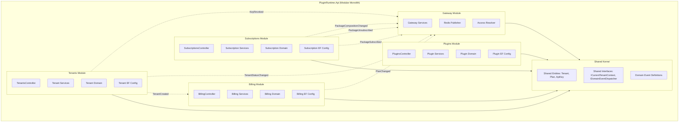
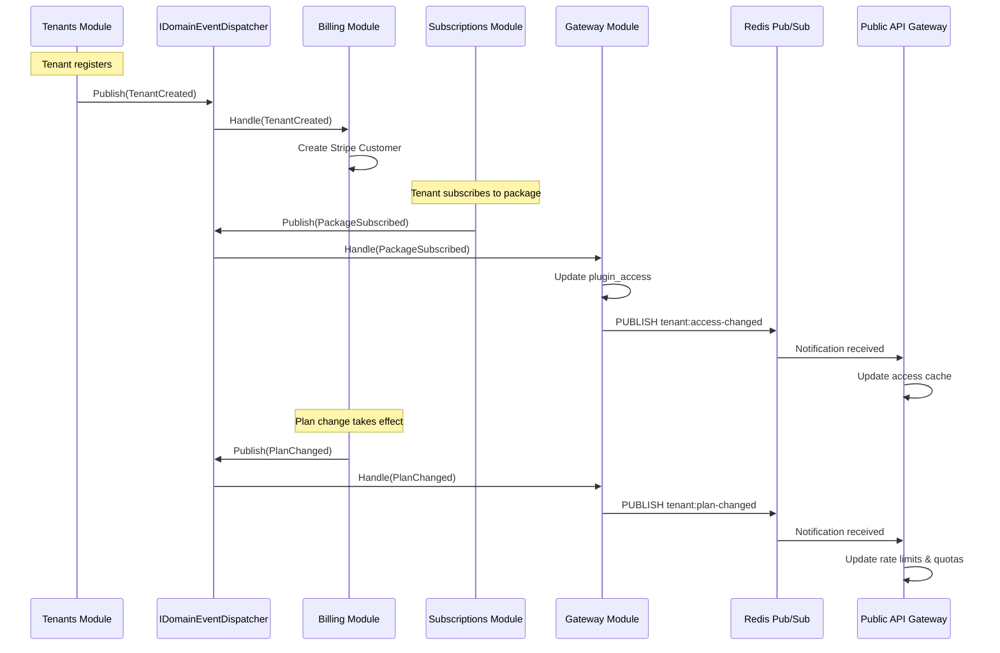

# Design Document: Unified API Architecture (Modular Monolith)

## Overview

The Unified API Architecture restructures PluginRuntime.Api into a **Modular Monolith** — a single deployable ASP.NET Core application (.NET 10) hosting five internal modules: Plugins, Tenants, Billing, Subscriptions, and Gateway. Previously separate services (Tenant Management & Billing) merge INTO PluginRuntime.Api as modules with clear boundaries, communicating exclusively through domain events and a shared kernel.

**Key Design Decisions:**

1. **Modular Monolith over Microservices** — All modules share a single process, single database, and single deployment unit. This eliminates network overhead between modules while maintaining logical isolation through domain boundaries and compile-time dependency rules.

2. **Domain Event Bus (In-Process)** — Inter-module communication uses an in-process event dispatcher (IDomainEventDispatcher). No direct service-to-service calls between modules. Events are dispatched synchronously within the same transaction scope or asynchronously for non-critical side effects.

3. **Single EF Core DbContext with Module Configurations** — One DbContext manages all tables. Each module registers its own IEntityTypeConfiguration implementations, keeping entity mapping knowledge within the module while sharing a unified migration history.

4. **Shared Kernel for Cross-Cutting Concerns** — Entities used by multiple modules (Tenant, Plan, ApiKey) live in a Shared directory. Modules depend on the Shared Kernel but never on each other directly.

5. **Unified Plan System** — ONE set of plans (Free/Pro/Enterprise/Internal) applies to ALL tenant types. This replaces per-portal billing logic with a single subscription tier model.

6. **Plugin Package Subscription Model** — Tenants subscribe to curated plugin groups for additional monthly fees. Access is resolved at the Gateway level via a materialized plugin_access structure.

7. **Redis Pub/Sub for External Gateway Sync** — The internal Gateway module publishes cache invalidation events to Redis channels, keeping the external Public API Gateway synchronized without tight coupling.

### Architecture Context

```
┌──────────────────┐   ┌──────────────────┐   ┌──────────────────┐
│ Marketplace      │   │ API Consumer     │   │ Admin Portal     │
│ Portal           │   │ Portal           │   │ (Platform_Admin) │
└──────────┬───────┘   └────────┬─────────┘   └────────┬─────────┘
           │                    │                       │
           └────────────────────┼───────────────────────┘
                                │  JWT Auth
                                ▼
┌───────────────────────────────────────────────────────────────────┐
│               PluginRuntime.Api (Modular Monolith)                │
│                                                                   │
│  ┌──────────┐ ┌──────────┐ ┌─────────┐ ┌──────────────┐ ┌─────┐│
│  │ Plugins  │ │ Tenants  │ │ Billing │ │Subscriptions │ │Gate-││
│  │ Module   │ │ Module   │ │ Module  │ │   Module     │ │way  ││
│  └────┬─────┘ └────┬─────┘ └────┬────┘ └──────┬───────┘ └──┬──┘│
│       │             │            │             │            │    │
│       └─────────────┼────────────┼─────────────┼────────────┘    │
│                     │   Shared Kernel (Events, Entities)  │      │
│                     └────────────────────────────────────────┘    │
└───────────────────────────────┬──────────────────────────────────┘
                                │
               ┌────────────────┼────────────────┐
               │                │                │
          ┌────▼────┐     ┌────▼────┐      ┌────▼────┐
          │PostgreSQL│     │  Redis  │      │  Stripe │
          │  (RW)   │     │(pub/sub)│      │   API   │
          └─────────┘     └────┬────┘      └─────────┘
                               │
                               ▼
                    ┌──────────────────┐
                    │Public API Gateway │
                    │  (subscriber)    │
                    └──────────────────┘
```

---

## Architecture

### High-Level Module Architecture



### Domain Event Flow



### Module Dependency Rules

| Module | May Depend On | Must NOT Depend On |
|--------|--------------|-------------------|
| Plugins | Shared Kernel | Tenants, Billing, Subscriptions, Gateway |
| Tenants | Shared Kernel | Plugins, Billing, Subscriptions, Gateway |
| Billing | Shared Kernel | Plugins, Tenants, Subscriptions, Gateway |
| Subscriptions | Shared Kernel | Plugins, Tenants, Billing, Gateway |
| Gateway | Shared Kernel | Plugins, Tenants, Billing, Subscriptions |
| Shared Kernel | Nothing | All modules |

### API Route Map

| Prefix | Module | Purpose |
|--------|--------|---------|
| `/api/plugins` | Plugins | Plugin CRUD, execution, manifests, capabilities |
| `/api/tenants` | Tenants | Registration, lifecycle, API keys |
| `/api/billing` | Billing | Plans, invoices, Stripe webhooks, usage |
| `/api/subscriptions` | Subscriptions | Plan changes, package subscriptions |
| `/api/admin` | Cross-module | Platform admin operations |
| `/health`, `/ready`, `/metrics` | Infrastructure | Health, readiness, Prometheus metrics |

---

## Components and Interfaces

### Solution Structure

```
src/PluginRuntime.Api/
├── Program.cs                          → Host builder, module registration
├── Shared/
│   ├── Entities/
│   │   ├── Tenant.cs
│   │   ├── Plan.cs
│   │   └── ApiKey.cs
│   ├── Interfaces/
│   │   ├── ICurrentTenantContext.cs
│   │   ├── IDomainEventDispatcher.cs
│   │   └── IDomainEventHandler.cs
│   ├── Events/
│   │   ├── TenantCreated.cs
│   │   ├── TenantStatusChanged.cs
│   │   ├── KeyRevoked.cs
│   │   ├── PlanChanged.cs
│   │   ├── PackageSubscribed.cs
│   │   ├── PackageUnsubscribed.cs
│   │   └── PackageCompositionChanged.cs
│   ├── ValueObjects/
│   │   ├── Email.cs
│   │   ├── Money.cs
│   │   └── KeyHash.cs
│   └── Infrastructure/
│       ├── DomainEventDispatcher.cs
│       ├── AppDbContext.cs
│       └── CurrentTenantContext.cs
├── Modules/
│   ├── Plugins/
│   │   ├── Domain/
│   │   ├── Services/
│   │   ├── Controllers/
│   │   │   └── PluginsController.cs
│   │   ├── Data/
│   │   │   └── PluginEntityConfiguration.cs
│   │   └── PluginsModuleExtensions.cs
│   ├── Tenants/
│   │   ├── Domain/
│   │   ├── Services/
│   │   │   ├── ITenantService.cs
│   │   │   ├── TenantService.cs
│   │   │   ├── IApiKeyService.cs
│   │   │   └── ApiKeyService.cs
│   │   ├── Controllers/
│   │   │   ├── TenantsController.cs
│   │   │   └── ApiKeysController.cs
│   │   ├── Data/
│   │   │   └── TenantEntityConfiguration.cs
│   │   ├── EventHandlers/
│   │   │   └── (none — publishes events, doesn't subscribe)
│   │   └── TenantsModuleExtensions.cs
│   ├── Billing/
│   │   ├── Domain/
│   │   │   ├── Invoice.cs
│   │   │   ├── UsageAggregate.cs
│   │   │   └── WebhookEvent.cs
│   │   ├── Services/
│   │   │   ├── IBillingService.cs
│   │   │   ├── BillingService.cs
│   │   │   ├── IStripeService.cs
│   │   │   ├── StripeService.cs
│   │   │   ├── IInvoiceService.cs
│   │   │   └── InvoiceService.cs
│   │   ├── Controllers/
│   │   │   ├── BillingController.cs
│   │   │   └── WebhooksController.cs
│   │   ├── Data/
│   │   │   └── BillingEntityConfiguration.cs
│   │   ├── BackgroundServices/
│   │   │   ├── UsageAggregationService.cs
│   │   │   └── InvoiceGenerationService.cs
│   │   ├── EventHandlers/
│   │   │   └── TenantCreatedHandler.cs
│   │   └── BillingModuleExtensions.cs
│   ├── Subscriptions/
│   │   ├── Domain/
│   │   │   ├── PluginPackage.cs
│   │   │   ├── PackageSubscription.cs
│   │   │   └── PluginAccess.cs
│   │   ├── Services/
│   │   │   ├── IPlanSubscriptionService.cs
│   │   │   ├── PlanSubscriptionService.cs
│   │   │   ├── IPackageSubscriptionService.cs
│   │   │   └── PackageSubscriptionService.cs
│   │   ├── Controllers/
│   │   │   ├── PlanSubscriptionController.cs
│   │   │   └── PackageSubscriptionController.cs
│   │   ├── Data/
│   │   │   └── SubscriptionEntityConfiguration.cs
│   │   ├── EventHandlers/
│   │   │   └── (none — publishes events)
│   │   └── SubscriptionsModuleExtensions.cs
│   └── Gateway/
│       ├── Services/
│       │   ├── IGatewayNotificationService.cs
│       │   ├── GatewayNotificationService.cs
│       │   ├── IPluginAccessResolver.cs
│       │   └── PluginAccessResolver.cs
│       ├── EventHandlers/
│       │   ├── PlanChangedHandler.cs
│       │   ├── TenantStatusChangedHandler.cs
│       │   ├── KeyRevokedHandler.cs
│       │   ├── PackageSubscribedHandler.cs
│       │   ├── PackageUnsubscribedHandler.cs
│       │   └── PackageCompositionChangedHandler.cs
│       ├── Data/
│       │   └── GatewayEntityConfiguration.cs
│       └── GatewayModuleExtensions.cs
├── Middleware/
│   ├── JwtAuthenticationMiddleware.cs
│   ├── TenantContextMiddleware.cs
│   └── GlobalExceptionMiddleware.cs
└── appsettings.json
```

### Module Registration Pattern

```csharp
// Program.cs
var builder = WebApplication.CreateBuilder(args);

// Shared infrastructure
builder.Services.AddSingleton<IDomainEventDispatcher, DomainEventDispatcher>();
builder.Services.AddDbContext<AppDbContext>(options =>
    options.UseNpgsql(builder.Configuration.GetConnectionString("Default")));
builder.Services.AddStackExchangeRedisCache(options =>
    options.Configuration = builder.Configuration.GetConnectionString("Redis"));

// Module registrations — each encapsulates its own DI
builder.Services.AddPluginsModule(builder.Configuration);
builder.Services.AddTenantsModule(builder.Configuration);
builder.Services.AddBillingModule(builder.Configuration);
builder.Services.AddSubscriptionsModule(builder.Configuration);
builder.Services.AddGatewayModule(builder.Configuration);

var app = builder.Build();

// Middleware pipeline
app.UseMiddleware<GlobalExceptionMiddleware>();
app.UseMiddleware<JwtAuthenticationMiddleware>();
app.UseMiddleware<TenantContextMiddleware>();

// Module endpoint mapping
app.MapPluginsEndpoints();
app.MapTenantsEndpoints();
app.MapBillingEndpoints();
app.MapSubscriptionsEndpoints();
app.MapAdminEndpoints();
app.MapHealthChecks("/health");
app.MapPrometheusMetrics("/metrics");

app.Run();
```

### Core Shared Interfaces

```csharp
/// Dispatches domain events to registered handlers within the same process
public interface IDomainEventDispatcher
{
    /// Dispatches event to all registered handlers. Handlers execute in-process.
    /// Transactional handlers run within the caller's DbContext transaction.
    /// Fire-and-forget handlers run after transaction commit.
    Task DispatchAsync<TEvent>(TEvent domainEvent, CancellationToken ct)
        where TEvent : IDomainEvent;
}

/// Marker interface for all domain events
public interface IDomainEvent
{
    Guid EventId { get; }
    DateTime OccurredAt { get; }
}

/// Handler for a specific domain event type
public interface IDomainEventHandler<in TEvent> where TEvent : IDomainEvent
{
    Task HandleAsync(TEvent domainEvent, CancellationToken ct);
}

/// Resolves the current tenant from the HTTP context
public interface ICurrentTenantContext
{
    Guid? TenantId { get; }
    string? TenantName { get; }
    Guid? PlanId { get; }
    bool IsInternal { get; }
    bool IsAdmin { get; }
}
```

### Domain Event Definitions

```csharp
public sealed record TenantCreated(
    Guid EventId,
    DateTime OccurredAt,
    Guid TenantId,
    string Name,
    string ContactEmail,
    bool IsInternal) : IDomainEvent;

public sealed record TenantStatusChanged(
    Guid EventId,
    DateTime OccurredAt,
    Guid TenantId,
    string PreviousStatus,
    string NewStatus,
    string ActorId,
    string Reason) : IDomainEvent;

public sealed record KeyRevoked(
    Guid EventId,
    DateTime OccurredAt,
    Guid TenantId,
    Guid KeyId,
    string KeyHash,
    long Version) : IDomainEvent;

public sealed record PlanChanged(
    Guid EventId,
    DateTime OccurredAt,
    Guid TenantId,
    Guid OldPlanId,
    Guid NewPlanId,
    int? NewRateLimit,
    int? NewDailyQuota,
    long Version) : IDomainEvent;

public sealed record PackageSubscribed(
    Guid EventId,
    DateTime OccurredAt,
    Guid TenantId,
    Guid PackageId,
    Guid SubscriptionId,
    IReadOnlyList<Guid> PluginIds) : IDomainEvent;

public sealed record PackageUnsubscribed(
    Guid EventId,
    DateTime OccurredAt,
    Guid TenantId,
    Guid PackageId,
    Guid SubscriptionId,
    IReadOnlyList<Guid> PluginIds) : IDomainEvent;

public sealed record PackageCompositionChanged(
    Guid EventId,
    DateTime OccurredAt,
    Guid PackageId,
    IReadOnlyList<Guid> AddedPluginIds,
    IReadOnlyList<Guid> RemovedPluginIds) : IDomainEvent;
```

### Domain Event Dispatcher Implementation

```csharp
/// In-process dispatcher using DI-resolved handlers.
/// Supports two dispatch modes:
///   - Transactional: handlers run inside caller's transaction (default)
///   - PostCommit: handlers run after SaveChangesAsync succeeds
public sealed class DomainEventDispatcher : IDomainEventDispatcher
{
    private readonly IServiceProvider _serviceProvider;
    private readonly ILogger<DomainEventDispatcher> _logger;

    public DomainEventDispatcher(
        IServiceProvider serviceProvider,
        ILogger<DomainEventDispatcher> logger)
    {
        _serviceProvider = serviceProvider;
        _logger = logger;
    }

    public async Task DispatchAsync<TEvent>(TEvent domainEvent, CancellationToken ct)
        where TEvent : IDomainEvent
    {
        using var scope = _serviceProvider.CreateScope();
        var handlers = scope.ServiceProvider
            .GetServices<IDomainEventHandler<TEvent>>();

        foreach (var handler in handlers)
        {
            try
            {
                await handler.HandleAsync(domainEvent, ct);
            }
            catch (Exception ex)
            {
                _logger.LogError(ex,
                    "Handler {Handler} failed for event {EventType} ({EventId})",
                    handler.GetType().Name,
                    typeof(TEvent).Name,
                    domainEvent.EventId);
                // Non-critical handlers: log and continue
                // Critical handlers should throw to abort transaction
            }
        }
    }
}
```

### Module Service Interfaces

#### Tenants Module

```csharp
public interface ITenantService
{
    Task<TenantDto> RegisterAsync(TenantRegistrationRequest request, CancellationToken ct);
    Task<TenantDto> RegisterInternalAsync(InternalTenantRequest request, CancellationToken ct);
    Task SuspendAsync(Guid tenantId, string actorId, string reason, CancellationToken ct);
    Task ReactivateAsync(Guid tenantId, string actorId, string reason, CancellationToken ct);
    Task<TenantDto?> GetByIdAsync(Guid tenantId, CancellationToken ct);
    Task<PagedResult<TenantDto>> ListAsync(TenantFilter filter, PaginationParams paging, CancellationToken ct);
}

public interface IApiKeyService
{
    Task<ApiKeyGenerationResult> GenerateAsync(Guid tenantId, CancellationToken ct);
    Task RevokeAsync(Guid tenantId, Guid keyId, CancellationToken ct);
    Task<IReadOnlyList<ApiKeyDto>> ListAsync(Guid tenantId, CancellationToken ct);
}
```

#### Billing Module

```csharp
public interface IBillingService
{
    Task CreateStripeCustomerAsync(Guid tenantId, string email, string name, CancellationToken ct);
    Task<InvoiceDto> GetCurrentInvoiceAsync(Guid tenantId, CancellationToken ct);
    Task<PagedResult<InvoiceDto>> ListInvoicesAsync(Guid tenantId, PaginationParams paging, CancellationToken ct);
}

public interface IStripeService
{
    Task<string> CreateCustomerAsync(string email, string name, CancellationToken ct);
    Task<string> CreateSubscriptionAsync(string customerId, string priceId, CancellationToken ct);
    Task UpdateSubscriptionAsync(string subscriptionId, string newPriceId, bool prorate, CancellationToken ct);
    Task CancelSubscriptionItemAsync(string subscriptionItemId, bool atPeriodEnd, CancellationToken ct);
    Task<string> AddSubscriptionItemAsync(string subscriptionId, string priceId, CancellationToken ct);
    bool VerifyWebhookSignature(string payload, string signatureHeader);
}
```

#### Subscriptions Module

```csharp
public interface IPlanSubscriptionService
{
    Task<PlanChangeResult> ChangePlanAsync(Guid tenantId, PlanChangeRequest request, CancellationToken ct);
    Task<CurrentSubscriptionDto> GetCurrentAsync(Guid tenantId, CancellationToken ct);
}

public interface IPackageSubscriptionService
{
    Task<PackageSubscriptionDto> SubscribeAsync(Guid tenantId, Guid packageId, CancellationToken ct);
    Task UnsubscribeAsync(Guid tenantId, Guid packageId, CancellationToken ct);
    Task<IReadOnlyList<PackageSubscriptionDto>> ListActiveAsync(Guid tenantId, CancellationToken ct);
}

public interface IPluginPackageService
{
    Task<PluginPackageDto> CreateAsync(CreatePackageRequest request, CancellationToken ct);
    Task<PluginPackageDto> UpdateAsync(Guid packageId, UpdatePackageRequest request, CancellationToken ct);
    Task DeactivateAsync(Guid packageId, CancellationToken ct);
    Task<PagedResult<PluginPackageDto>> ListActiveAsync(PaginationParams paging, CancellationToken ct);
}
```

#### Gateway Module

```csharp
public interface IGatewayNotificationService
{
    Task PublishPlanChangedAsync(PlanChanged evt, CancellationToken ct);
    Task PublishTenantStatusChangedAsync(TenantStatusChanged evt, CancellationToken ct);
    Task PublishKeyRevokedAsync(KeyRevoked evt, CancellationToken ct);
    Task PublishAccessChangedAsync(Guid tenantId, IReadOnlyList<Guid> pluginIds, long version, CancellationToken ct);
}

public interface IPluginAccessResolver
{
    Task<IReadOnlySet<Guid>> GetAccessiblePluginsAsync(Guid tenantId, CancellationToken ct);
    Task RecalculateAccessAsync(Guid tenantId, CancellationToken ct);
    Task RecalculateForPackageAsync(Guid packageId, CancellationToken ct);
}
```

### Access Resolution Algorithm

```
Algorithm: ResolvePluginAccess(tenantId)
─────────────────────────────────────────
Input: tenantId (UUID)
Output: Set<Guid> of plugin IDs the tenant can invoke

1. freePlugins ← SELECT plugin_id FROM plugins
                  WHERE is_publicly_accessible = true AND status = 'Active'

2. packagePlugins ← SELECT pp.plugin_id
                     FROM package_subscriptions ps
                     JOIN plugin_packages pkg ON ps.package_id = pkg.package_id
                     JOIN package_plugins pp ON pkg.package_id = pp.package_id
                     WHERE ps.tenant_id = tenantId
                       AND ps.status = 'active'
                       AND pkg.status = 'active'

3. accessiblePlugins ← freePlugins ∪ packagePlugins

4. UPSERT INTO plugin_access (tenant_id, plugin_ids, updated_at)
   VALUES (tenantId, accessiblePlugins, NOW())

5. RETURN accessiblePlugins
```

### Redis Pub/Sub Notification Algorithm

```
Algorithm: PublishNotificationWithRetry(channel, payload, maxRetries=3, interval=5s)
──────────────────────────────────────────────────────────────────────────────────────
Input: channel (string), payload (JSON), maxRetries (int), interval (TimeSpan)
Output: success/failed

1. payload.version ← tenant.Version  // monotonically increasing
2. FOR attempt = 1 TO maxRetries:
     TRY:
       redis.PublishAsync(channel, serialize(payload))
       LOG info: "Published to {channel} for tenant {tenantId} v{version}"
       RETURN success
     CATCH RedisConnectionException:
       IF attempt < maxRetries:
         await Task.Delay(interval)
       ELSE:
         LOG error: "Redis unavailable after {maxRetries} attempts"
         INSERT INTO failed_notifications (channel, payload, created_at, retry_count)
         EMIT metric: gateway_notification_failures_total++
         RETURN failed
```

### Plan Change Logic (Upgrade vs Downgrade)

```
Algorithm: ChangePlan(tenantId, newPlanId)
──────────────────────────────────────────
Input: tenantId, newPlanId
Output: PlanChangeResult

1. tenant ← LOAD tenant WHERE tenant_id = tenantId
2. currentPlan ← LOAD plan WHERE plan_id = tenant.plan_id
3. newPlan ← LOAD plan WHERE plan_id = newPlanId
4. IF newPlan.monthly_price > currentPlan.monthly_price:
     // UPGRADE: apply immediately with proration
     a. Stripe.UpdateSubscription(tenant.stripe_subscription_id, newPlan.stripe_price_id, prorate=true)
     b. UPDATE tenants SET plan_id = newPlanId, version = version + 1 WHERE tenant_id = tenantId
     c. DISPATCH PlanChanged(tenantId, currentPlan.id, newPlan.id, newPlan.rate_limit, newPlan.daily_quota, tenant.version)
     d. INSERT audit_log (...)
     e. RETURN PlanChangeResult { EffectiveAt = NOW, Type = "Upgrade" }
5. ELSE IF newPlan.monthly_price < currentPlan.monthly_price:
     // DOWNGRADE: schedule for next billing cycle
     a. Stripe.ScheduleDowngrade(tenant.stripe_subscription_id, newPlan.stripe_price_id, atPeriodEnd=true)
     b. UPDATE tenants SET pending_plan_id = newPlanId WHERE tenant_id = tenantId
     c. INSERT audit_log (...)
     d. RETURN PlanChangeResult { EffectiveAt = nextBillingDate, Type = "Downgrade" }
6. ELSE:
     RETURN PlanChangeResult { Type = "NoChange" }
```

---

## Data Models

### Shared Kernel Entities

```csharp
/// Core Tenant entity (Shared Kernel — used by all modules)
public sealed class Tenant
{
    public Guid TenantId { get; private set; }
    public string Name { get; private set; } = null!;
    public Email ContactEmail { get; private set; } = null!;
    public string? CompanyName { get; private set; }
    public TenantStatus Status { get; private set; }
    public Guid PlanId { get; private set; }
    public Guid? PendingPlanId { get; private set; }  // for scheduled downgrades
    public string? StripeCustomerId { get; private set; }
    public string? StripeSubscriptionId { get; private set; }
    public bool IsInternal { get; private set; }
    public long Version { get; private set; }  // monotonic counter for pub/sub ordering
    public DateTime CreatedAt { get; private set; }
    public DateTime UpdatedAt { get; private set; }

    // Domain methods
    public void AssignPlan(Guid planId) { PlanId = planId; Version++; UpdatedAt = DateTime.UtcNow; }
    public void Suspend() { Status = TenantStatus.Suspended; Version++; UpdatedAt = DateTime.UtcNow; }
    public void Reactivate() { Status = TenantStatus.Active; Version++; UpdatedAt = DateTime.UtcNow; }
}

public enum TenantStatus { Active, Suspended, Deleted }

/// Plan entity (Shared Kernel — defines quotas, limits, pricing)
public sealed class Plan
{
    public Guid PlanId { get; private set; }
    public string Name { get; private set; } = null!;        // Free, Pro, Enterprise, Internal
    public PlanType Type { get; private set; }
    public int? RateLimit { get; private set; }               // null = unlimited
    public int? DailyQuota { get; private set; }              // null = unlimited
    public int? MaxApiKeys { get; private set; }              // null = unlimited
    public int? MaxPluginsUpload { get; private set; }        // null = unlimited
    public int? MaxPackageSubscriptions { get; private set; } // null = unlimited
    public decimal MonthlyPrice { get; private set; }
    public decimal? OverageRatePer1k { get; private set; }
    public string? StripePriceId { get; private set; }
    public bool IsBillable { get; private set; }              // false for Internal plan
    public string? FeaturesJson { get; private set; }
    public DateTime CreatedAt { get; private set; }
}

public enum PlanType { Free, Pro, Enterprise, Internal }

/// API Key entity (Shared Kernel — used by Tenants and Gateway modules)
public sealed class ApiKey
{
    public Guid KeyId { get; private set; }
    public Guid TenantId { get; private set; }
    public string KeyHash { get; private set; } = null!;      // SHA-256
    public string KeyPrefix { get; private set; } = null!;    // first 8 chars
    public string KeySuffix { get; private set; } = null!;    // last 4 chars
    public ApiKeyStatus Status { get; private set; }
    public DateTime? ExpiresAt { get; private set; }
    public DateTime CreatedAt { get; private set; }
    public DateTime? RevokedAt { get; private set; }
}

public enum ApiKeyStatus { Active, Revoked, Expired }
```

### Subscriptions Module Entities

```csharp
/// A curated group of plugins available for subscription
public sealed class PluginPackage
{
    public Guid PackageId { get; private set; }
    public string Name { get; private set; } = null!;           // 1-200 characters
    public string? Description { get; private set; }            // up to 2000 characters
    public decimal MonthlyPrice { get; private set; }           // minimum $0.00
    public PackageStatus Status { get; private set; }           // Active, Inactive
    public string? StripePriceId { get; private set; }
    public DateTime CreatedAt { get; private set; }
    public DateTime UpdatedAt { get; private set; }

    // Navigation
    public IReadOnlyList<PackagePlugin> Plugins { get; private set; } = [];
}

public enum PackageStatus { Active, Inactive }

/// Join entity: which plugins belong to which package
public sealed class PackagePlugin
{
    public Guid PackageId { get; private set; }
    public Guid PluginId { get; private set; }
    public DateTime AddedAt { get; private set; }
}

/// A tenant's subscription to a plugin package
public sealed class PackageSubscription
{
    public Guid SubscriptionId { get; private set; }
    public Guid TenantId { get; private set; }
    public Guid PackageId { get; private set; }
    public SubscriptionStatus Status { get; private set; }     // Active, Cancelled, Expired
    public string? StripeSubscriptionItemId { get; private set; }
    public DateTime StartDate { get; private set; }
    public DateTime? EndDate { get; private set; }              // set when cancelled
    public DateTime CreatedAt { get; private set; }
    public DateTime UpdatedAt { get; private set; }
}

public enum SubscriptionStatus { Active, Cancelled, Expired }

/// Materialized access: maps tenant → accessible plugin set
public sealed class PluginAccess
{
    public Guid TenantId { get; private set; }
    public Guid PluginId { get; private set; }
    public AccessSource Source { get; private set; }  // Free or Package
    public Guid? PackageId { get; private set; }      // null if Source = Free
    public DateTime GrantedAt { get; private set; }
}

public enum AccessSource { Free, Package }
```

### Billing Module Entities

```csharp
/// Monthly invoice with plan + package line items
public sealed class Invoice
{
    public Guid InvoiceId { get; private set; }
    public Guid TenantId { get; private set; }
    public DateOnly BillingPeriodStart { get; private set; }
    public DateOnly BillingPeriodEnd { get; private set; }
    public decimal BaseAmount { get; private set; }             // plan price
    public decimal OverageAmount { get; private set; }          // usage overage
    public decimal PackageAmount { get; private set; }          // total package subscription fees
    public decimal TotalAmount { get; private set; }            // base + overage + packages
    public InvoiceStatus Status { get; private set; }
    public string? StripeInvoiceId { get; private set; }
    public DateTime CreatedAt { get; private set; }
}

public enum InvoiceStatus { Pending, Paid, Failed }

/// Daily usage aggregate for billing calculations
public sealed class UsageAggregate
{
    public Guid AggregateId { get; private set; }
    public Guid TenantId { get; private set; }
    public DateOnly Date { get; private set; }
    public long TotalRequests { get; private set; }
    public long SuccessfulRequests { get; private set; }
    public long FailedRequests { get; private set; }
    public double AvgDurationMs { get; private set; }
    public DateTime AggregatedAt { get; private set; }
}

/// Stripe webhook event for idempotent processing
public sealed class WebhookEvent
{
    public Guid EventId { get; private set; }
    public string StripeEventId { get; private set; } = null!;
    public string EventType { get; private set; } = null!;
    public string Payload { get; private set; } = null!;
    public WebhookStatus Status { get; private set; }
    public DateTime ReceivedAt { get; private set; }
    public DateTime? ProcessedAt { get; private set; }
}

public enum WebhookStatus { Processing, Processed, Failed }
```

### Database Schema (New Tables for Unified Architecture)

```sql
-- =====================================================
-- MODIFIED EXISTING TABLES
-- =====================================================

-- tenants table: extended with plan system + internal flag
ALTER TABLE tenants ADD COLUMN IF NOT EXISTS plan_id UUID REFERENCES plans(plan_id);
ALTER TABLE tenants ADD COLUMN IF NOT EXISTS pending_plan_id UUID REFERENCES plans(plan_id);
ALTER TABLE tenants ADD COLUMN IF NOT EXISTS contact_email VARCHAR(254) NOT NULL;
ALTER TABLE tenants ADD COLUMN IF NOT EXISTS company_name VARCHAR(200);
ALTER TABLE tenants ADD COLUMN IF NOT EXISTS stripe_customer_id VARCHAR(200);
ALTER TABLE tenants ADD COLUMN IF NOT EXISTS stripe_subscription_id VARCHAR(200);
ALTER TABLE tenants ADD COLUMN IF NOT EXISTS is_internal BOOLEAN NOT NULL DEFAULT FALSE;
ALTER TABLE tenants ADD COLUMN IF NOT EXISTS version BIGINT NOT NULL DEFAULT 0;

-- plans table: extended with package subscription limits
CREATE TABLE IF NOT EXISTS plans (
    plan_id                 UUID            PRIMARY KEY DEFAULT gen_random_uuid(),
    name                    VARCHAR(100)    NOT NULL UNIQUE,
    type                    VARCHAR(50)     NOT NULL DEFAULT 'Free',
    rate_limit              INT,            -- NULL = unlimited
    daily_quota             INT,            -- NULL = unlimited
    max_api_keys            INT,            -- NULL = unlimited
    max_plugins_upload      INT,            -- NULL = unlimited
    max_package_subscriptions INT,          -- NULL = unlimited
    monthly_price           DECIMAL(10,2)   NOT NULL DEFAULT 0,
    overage_rate_per_1k     DECIMAL(10,4),
    is_billable             BOOLEAN         NOT NULL DEFAULT TRUE,
    stripe_price_id         VARCHAR(200),
    features_json           JSONB,
    created_at              TIMESTAMPTZ     NOT NULL DEFAULT NOW(),
    updated_at              TIMESTAMPTZ     NOT NULL DEFAULT NOW()
);

-- Seed plans
INSERT INTO plans (name, type, rate_limit, daily_quota, max_api_keys, max_plugins_upload, max_package_subscriptions, monthly_price, is_billable)
VALUES
  ('Free',       'Free',       100,  100,  2,    3,    0,    0.00,   true),
  ('Pro',        'Pro',        10000, 10000, 10,   20,   5,    49.00,  true),
  ('Enterprise', 'Enterprise', NULL, NULL,  50,   NULL, NULL, 299.00, true),
  ('Internal',   'Internal',   NULL, NULL,  NULL, NULL, NULL, 0.00,   false);
```

```sql
-- =====================================================
-- NEW TABLES: Plugin Packages & Subscriptions
-- =====================================================

-- Plugin packages: curated groups of plugins
CREATE TABLE plugin_packages (
    package_id          UUID            PRIMARY KEY DEFAULT gen_random_uuid(),
    name                VARCHAR(200)    NOT NULL,
    description         VARCHAR(2000),
    monthly_price       DECIMAL(10,2)   NOT NULL DEFAULT 0.00,
    status              VARCHAR(50)     NOT NULL DEFAULT 'active',
    stripe_price_id     VARCHAR(200),
    created_at          TIMESTAMPTZ     NOT NULL DEFAULT NOW(),
    updated_at          TIMESTAMPTZ     NOT NULL DEFAULT NOW(),
    CONSTRAINT chk_package_price CHECK (monthly_price >= 0)
);

CREATE INDEX idx_packages_status ON plugin_packages(status);

-- Join table: plugins belonging to packages (many-to-many)
CREATE TABLE package_plugins (
    package_id          UUID            NOT NULL REFERENCES plugin_packages(package_id),
    plugin_id           UUID            NOT NULL REFERENCES plugins(plugin_id),
    added_at            TIMESTAMPTZ     NOT NULL DEFAULT NOW(),
    PRIMARY KEY (package_id, plugin_id)
);

CREATE INDEX idx_package_plugins_plugin ON package_plugins(plugin_id);

-- Tenant subscriptions to plugin packages
CREATE TABLE package_subscriptions (
    subscription_id     UUID            PRIMARY KEY DEFAULT gen_random_uuid(),
    tenant_id           UUID            NOT NULL REFERENCES tenants(tenant_id),
    package_id          UUID            NOT NULL REFERENCES plugin_packages(package_id),
    status              VARCHAR(50)     NOT NULL DEFAULT 'active',
    stripe_subscription_item_id VARCHAR(200),
    start_date          TIMESTAMPTZ     NOT NULL DEFAULT NOW(),
    end_date            TIMESTAMPTZ,
    created_at          TIMESTAMPTZ     NOT NULL DEFAULT NOW(),
    updated_at          TIMESTAMPTZ     NOT NULL DEFAULT NOW(),
    CONSTRAINT uq_tenant_package UNIQUE (tenant_id, package_id)
);

CREATE INDEX idx_pkg_sub_tenant ON package_subscriptions(tenant_id, status);
CREATE INDEX idx_pkg_sub_package ON package_subscriptions(package_id, status);

-- Materialized plugin access: tenant → plugin access set
CREATE TABLE plugin_access (
    tenant_id           UUID            NOT NULL REFERENCES tenants(tenant_id),
    plugin_id           UUID            NOT NULL REFERENCES plugins(plugin_id),
    source              VARCHAR(50)     NOT NULL DEFAULT 'free',  -- 'free' or 'package'
    package_id          UUID            REFERENCES plugin_packages(package_id),
    granted_at          TIMESTAMPTZ     NOT NULL DEFAULT NOW(),
    PRIMARY KEY (tenant_id, plugin_id)
);

CREATE INDEX idx_plugin_access_tenant ON plugin_access(tenant_id);
CREATE INDEX idx_plugin_access_plugin ON plugin_access(plugin_id);
CREATE INDEX idx_plugin_access_package ON plugin_access(package_id);

-- Add public accessibility flag to plugins
ALTER TABLE plugins ADD COLUMN IF NOT EXISTS is_publicly_accessible BOOLEAN NOT NULL DEFAULT FALSE;
```

### EF Core DbContext Configuration

```csharp
/// Single DbContext shared by all modules.
/// Each module registers IEntityTypeConfiguration<T> implementations.
public sealed class AppDbContext : DbContext
{
    public AppDbContext(DbContextOptions<AppDbContext> options) : base(options) { }

    // Shared Kernel
    public DbSet<Tenant> Tenants => Set<Tenant>();
    public DbSet<Plan> Plans => Set<Plan>();
    public DbSet<ApiKey> ApiKeys => Set<ApiKey>();

    // Subscriptions Module
    public DbSet<PluginPackage> PluginPackages => Set<PluginPackage>();
    public DbSet<PackagePlugin> PackagePlugins => Set<PackagePlugin>();
    public DbSet<PackageSubscription> PackageSubscriptions => Set<PackageSubscription>();
    public DbSet<PluginAccess> PluginAccessEntries => Set<PluginAccess>();

    // Billing Module
    public DbSet<Invoice> Invoices => Set<Invoice>();
    public DbSet<UsageAggregate> UsageAggregates => Set<UsageAggregate>();
    public DbSet<WebhookEvent> WebhookEvents => Set<WebhookEvent>();

    protected override void OnModelCreating(ModelBuilder modelBuilder)
    {
        // Load all IEntityTypeConfiguration from each module assembly
        modelBuilder.ApplyConfigurationsFromAssembly(typeof(AppDbContext).Assembly);
    }
}
```

### Redis Channel Definitions

| Channel | Published By | Subscribed By | Payload |
|---------|-------------|---------------|---------|
| `tenant:plan-changed` | Gateway Module | Public API Gateway | `{ tenantId, planId, rateLimit, dailyQuota, status, version }` |
| `tenant:key-revoked` | Gateway Module | Public API Gateway | `{ tenantId, keyId, keyHash, version }` |
| `tenant:status-changed` | Gateway Module | Public API Gateway | `{ tenantId, status, version }` |
| `tenant:access-changed` | Gateway Module | Public API Gateway | `{ tenantId, pluginIds[], version }` |

### Plan Configuration (Seed Data)

| Plan | rate_limit | daily_quota | max_api_keys | max_plugins_upload | max_package_subscriptions | price | billable |
|------|-----------|-------------|--------------|-------------------|--------------------------|-------|----------|
| Free | 100/day | 100 | 2 | 3 | 0 | $0/mo | yes |
| Pro | 10,000/day | 10,000 | 10 | 20 | 5 | $49/mo | yes |
| Enterprise | unlimited | unlimited | 50 | unlimited | unlimited | $299/mo | yes |
| Internal | unlimited | unlimited | unlimited | unlimited | unlimited | $0/mo | no |

---

## Correctness Properties

*A property is a characteristic or behavior that should hold true across all valid executions of a system — essentially, a formal statement about what the system should do. Properties serve as the bridge between human-readable specifications and machine-verifiable correctness guarantees.*

### Property 1: Domain event dispatch completeness

*For any* domain event dispatched via IDomainEventDispatcher, all registered IDomainEventHandler<TEvent> implementations for that event type SHALL receive the event with the exact payload that was dispatched, and no handlers for other event types SHALL be invoked.

**Validates: Requirements 1.3**

### Property 2: Tenant registration invariants

*For any* valid tenant registration request (name 1–200 chars, valid RFC 5322 email), the resulting Tenant record SHALL have status "Active", plan set to Free (the lowest tier), and a TenantCreated domain event SHALL be dispatched containing the tenant ID, name, and email.

**Validates: Requirements 3.2, 7.1**

### Property 3: Stripe customer creation rule

*For any* TenantCreated event, if `is_internal` is false, exactly one Stripe customer SHALL be created and the stripe_customer_id SHALL be persisted. If `is_internal` is true, no Stripe customer SHALL be created and stripe_customer_id SHALL remain null.

**Validates: Requirements 3.3, 6.2, 7.2**

### Property 4: Plan change atomicity and direction

*For any* plan change from plan A to plan B: if B.monthly_price > A.monthly_price (upgrade), the new plan's limits SHALL be applied immediately to all activities (rate_limit, daily_quota, max_api_keys, max_plugins_upload, max_package_subscriptions) within a single transaction. If B.monthly_price < A.monthly_price (downgrade), the current plan's limits SHALL remain active until the next billing period and the new plan SHALL be scheduled.

**Validates: Requirements 3.4, 8.2, 8.3**

### Property 5: API key limit enforcement

*For any* tenant with N active API keys and a plan allowing max M keys, generating a new key SHALL succeed if and only if N < M. When N >= M, the request SHALL be rejected with error code "UA-KEY-001". The generated key SHALL be exactly 64 characters, and the stored hash SHALL equal SHA-256(plaintext_key).

**Validates: Requirements 3.5, 7.4, 7.6**

### Property 6: Package subscription limit enforcement

*For any* tenant with N active package subscriptions and a plan allowing max M subscriptions, subscribing to a new package SHALL succeed if and only if N < M. When N >= M (including M = 0 for Free plan), the request SHALL be rejected with error code "UA-SUB-001" (at limit) or "UA-SUB-003" (Free plan specifically).

**Validates: Requirements 3.6, 5.3, 10.5**

### Property 7: Plugin package validation

*For any* plugin package creation or update request, if any plugin_id in the request does not exist in the plugins table or has a status other than "Active", the request SHALL be rejected with HTTP 400 and error code "UA-PKG-001". Only requests where ALL plugin IDs reference existing Active plugins SHALL succeed.

**Validates: Requirements 4.3**

### Property 8: Package deactivation preserves subscriptions

*For any* active plugin package with N active subscriptions (N >= 0), deactivating the package SHALL set its status to "inactive", preserve all N existing PackageSubscription records unchanged, and prevent new subscriptions. The existing subscriptions SHALL continue granting access until their next billing cycle.

**Validates: Requirements 4.4**

### Property 9: Active package listing filter

*For any* set of plugin packages with mixed statuses (active, inactive), the list-packages endpoint SHALL return only packages with status "active", and the total count SHALL equal the number of active packages in the database.

**Validates: Requirements 4.5**

### Property 10: Package subscription creates correct state

*For any* valid subscription request (tenant within limits, package exists and is active, no duplicate), the resulting PackageSubscription SHALL have the correct tenant_id, package_id, status "active", start_date equal to current UTC time, and a Stripe subscription item SHALL be created for the package's monthly_price.

**Validates: Requirements 5.1, 10.2**

### Property 11: Duplicate subscription prevention

*For any* tenant with an active subscription to package P, attempting to subscribe to P again SHALL be rejected with HTTP 409 and error code "UA-SUB-002".

**Validates: Requirements 5.4**

### Property 12: Plugin access resolution correctness

*For any* tenant T and plugin P, the access resolution SHALL grant T access to P if and only if: (a) P has `is_publicly_accessible = true`, OR (b) T has an active PackageSubscription to a package that contains P. The plugin_access table SHALL reflect exactly this union at all times.

**Validates: Requirements 5.6, 9.2, 11.6**

### Property 13: Package subscription cancellation

*For any* active PackageSubscription, cancellation SHALL set status to "cancelled", cancel the Stripe subscription item at period end, and dispatch a PackageUnsubscribed event containing the tenant_id, package_id, and all plugin IDs from the package.

**Validates: Requirements 5.5, 10.3**

### Property 14: Invoice consolidation correctness

*For any* billable tenant with plan price P, overage amount O (calculated from usage exceeding daily_quota), and N active package subscriptions with prices [p1, p2, ..., pN], the monthly invoice total SHALL equal P + O + Σ(pi). Each package subscription SHALL appear as a separate line item.

**Validates: Requirements 5.7, 8.1**

### Property 15: Internal tenant billing exemption

*For any* tenant assigned the Internal plan, the system SHALL NOT generate invoices, SHALL NOT calculate overage charges, SHALL enforce no rate limits (unlimited), and SHALL enforce no daily quotas (unlimited). The tenant's API usage SHALL still be recorded in usage_records for auditing.

**Validates: Requirements 6.3, 6.4, 6.6**

### Property 16: Internal tenant authorization

*For any* request to register or modify an Internal_Tenant, if the caller does not have Platform_Admin role, the request SHALL be rejected with HTTP 403 and error code "UA-INT-001".

**Validates: Requirements 6.7**

### Property 17: Tenant status change propagation

*For any* tenant status change (active → suspended, suspended → active), the system SHALL: (a) update the tenant status, (b) dispatch a TenantStatusChanged domain event, (c) the Gateway module SHALL publish a Redis notification on `tenant:status-changed`, and (d) an immutable audit log entry SHALL be created with tenant_id, previous status, new status, actor_id, timestamp, and reason.

**Validates: Requirements 7.3, 7.5, 7.7**

### Property 18: Usage aggregation correctness

*For any* set of usage_records for tenant T on date D, the daily UsageAggregate SHALL have: total_requests equal to the count of records, successful_requests equal to records with status_code in [200,299], failed_requests equal to records with status_code >= 400, and successful_requests + failed_requests <= total_requests.

**Validates: Requirements 8.5**

### Property 19: Webhook idempotent processing

*For any* Stripe webhook event with stripe_event_id E, processing the event a second time SHALL produce no state change and SHALL return HTTP 200. The webhook_events table SHALL contain exactly one record for E regardless of how many times it is received.

**Validates: Requirements 8.7**

### Property 20: Package composition change propagation

*For any* change to a package's plugin composition (adding or removing plugins), all tenants with active subscriptions to that package SHALL have their plugin_access recalculated, and a Redis notification SHALL be published for each affected tenant.

**Validates: Requirements 4.2, 9.3**

### Property 21: Monotonic version ordering

*For any* sequence of Redis pub/sub notifications for a given tenant, the version field SHALL be strictly monotonically increasing. The Public API Gateway SHALL discard any notification where the version is less than or equal to the last processed version for that tenant.

**Validates: Requirements 9.5**

### Property 22: Tenant data isolation

*For any* two distinct tenants A and B, tenant A accessing any resource (subscriptions, API keys, invoices, usage data) belonging to tenant B SHALL be rejected with HTTP 403 and error code "UA-AUTH-001".

**Validates: Requirements 12.3**

### Property 23: Redis notification payload compatibility

*For any* PlanChanged notification published to `tenant:plan-changed`, the payload SHALL be valid JSON containing: tenantId (UUID), planId (UUID), rateLimit (int or null), dailyQuota (int or null), status (string), and version (long). This format SHALL be backward-compatible with the existing Public API Gateway's subscription expectations.

**Validates: Requirements 11.2**

---

## Error Handling

### Error Code Registry

All error codes follow the pattern `UA-{MODULE}-{NUMBER}`:

| Code | HTTP | Module | Condition |
|------|------|--------|-----------|
| UA-PKG-001 | 400 | Subscriptions | Package contains invalid/inactive plugin ID |
| UA-SUB-001 | 403 | Subscriptions | Max package subscriptions reached |
| UA-SUB-002 | 409 | Subscriptions | Duplicate package subscription |
| UA-SUB-003 | 403 | Subscriptions | Free plan cannot subscribe to packages |
| UA-KEY-001 | 403 | Tenants | Max API keys reached |
| UA-INT-001 | 403 | Tenants | Non-admin attempting internal tenant operation |
| UA-AUTH-001 | 403 | Shared | Cross-tenant data access attempt |
| UA-BILL-001 | 502 | Billing | Stripe API error |
| UA-PLAN-001 | 400 | Subscriptions | Invalid plan change (same plan or invalid plan) |
| UA-PLAN-002 | 400 | Subscriptions | Cannot downgrade with active features exceeding new limits |

### Error Response Format

```json
{
  "error": {
    "code": "UA-SUB-001",
    "message": "Maximum package subscriptions reached for current plan",
    "traceId": "550e8400-e29b-41d4-a716-446655440000",
    "timestamp": "2024-12-01T10:30:00Z"
  }
}
```

### Error Handling Strategy

| Scenario | Behavior | Rationale |
|----------|----------|-----------|
| Validation failure | Return 400 with specific error code | Client can fix the request |
| Authorization failure | Return 403 with UA-AUTH-001 | Fail-closed, no information leak |
| Stripe API failure | Return 502 with UA-BILL-001, log details internally | Don't expose third-party internals |
| Redis pub/sub failure | Retry 3x, persist failed event, return success to caller | Non-critical path, eventual consistency |
| Database constraint violation | Return 409 for uniqueness, 400 for others | Let DB enforce invariants |
| Domain event handler failure (non-critical) | Log error, continue processing | Side effects shouldn't block primary operation |
| Domain event handler failure (critical) | Abort transaction, return 500 | Data consistency over availability |

### Exception Types

```csharp
/// Base exception for all Unified API business errors
public abstract class UnifiedApiException : Exception
{
    public string ErrorCode { get; }
    public int HttpStatusCode { get; }

    protected UnifiedApiException(string code, int statusCode, string message)
        : base(message)
    {
        ErrorCode = code;
        HttpStatusCode = statusCode;
    }
}

public sealed class PackageValidationException : UnifiedApiException
{
    public PackageValidationException(string message)
        : base("UA-PKG-001", 400, message) { }
}

public sealed class SubscriptionLimitException : UnifiedApiException
{
    public SubscriptionLimitException(string code, string message)
        : base(code, 403, message) { }
}

public sealed class DuplicateSubscriptionException : UnifiedApiException
{
    public DuplicateSubscriptionException()
        : base("UA-SUB-002", 409, "Already subscribed to this package") { }
}

public sealed class ApiKeyLimitException : UnifiedApiException
{
    public ApiKeyLimitException()
        : base("UA-KEY-001", 403, "Maximum API keys reached for current plan") { }
}

public sealed class TenantIsolationException : UnifiedApiException
{
    public TenantIsolationException()
        : base("UA-AUTH-001", 403, "Access denied") { }
}

public sealed class InternalTenantAuthException : UnifiedApiException
{
    public InternalTenantAuthException()
        : base("UA-INT-001", 403, "Platform admin role required") { }
}

public sealed class BillingProviderException : UnifiedApiException
{
    public BillingProviderException(string internalDetail)
        : base("UA-BILL-001", 502, "Billing provider error")
    {
        // internalDetail logged but never returned to client
    }
}
```

### Global Exception Middleware

```csharp
public sealed class GlobalExceptionMiddleware : IMiddleware
{
    private readonly ILogger<GlobalExceptionMiddleware> _logger;

    public async Task InvokeAsync(HttpContext context, RequestDelegate next)
    {
        try
        {
            await next(context);
        }
        catch (UnifiedApiException ex)
        {
            _logger.LogWarning(ex, "Business error {Code}: {Message}", ex.ErrorCode, ex.Message);
            await WriteErrorResponse(context, ex.HttpStatusCode, ex.ErrorCode, ex.Message);
        }
        catch (Exception ex)
        {
            _logger.LogError(ex, "Unhandled exception");
            await WriteErrorResponse(context, 500, "UA-INTERNAL", "An internal error occurred");
        }
    }
}
```

---

## Testing Strategy

### Dual Testing Approach

This feature uses both unit/integration tests and property-based tests for comprehensive coverage:

- **Unit tests**: Specific examples, edge cases, error conditions, integration points between modules
- **Property-based tests**: Universal properties that hold across all valid inputs (plan enforcement, access resolution, subscription logic, billing calculations)

### Property-Based Testing Configuration

- **Library**: [FsCheck](https://fscheck.github.io/FsCheck/) (mature .NET PBT library with xUnit integration)
- **Minimum iterations**: 100 per property test
- **Tag format**: `Feature: unified-api-architecture, Property {N}: {description}`
- **Location**: `tests/PluginRuntime.Api.Tests/Properties/`

### Test Organization

```
tests/
├── PluginRuntime.Api.Tests/
│   ├── Unit/
│   │   ├── Modules/
│   │   │   ├── Tenants/
│   │   │   │   ├── TenantServiceTests.cs
│   │   │   │   └── ApiKeyServiceTests.cs
│   │   │   ├── Billing/
│   │   │   │   ├── InvoiceServiceTests.cs
│   │   │   │   └── UsageAggregationTests.cs
│   │   │   ├── Subscriptions/
│   │   │   │   ├── PlanSubscriptionTests.cs
│   │   │   │   ├── PackageSubscriptionTests.cs
│   │   │   │   └── PluginPackageTests.cs
│   │   │   └── Gateway/
│   │   │       ├── NotificationServiceTests.cs
│   │   │       └── AccessResolverTests.cs
│   │   └── Shared/
│   │       ├── DomainEventDispatcherTests.cs
│   │       └── ValueObjectTests.cs
│   ├── Integration/
│   │   ├── ModuleRegistrationTests.cs
│   │   ├── DatabaseMigrationTests.cs
│   │   ├── RedisNotificationTests.cs
│   │   ├── StripeIntegrationTests.cs
│   │   └── EndToEndFlowTests.cs
│   └── Properties/
│       ├── TenantRegistrationProperties.cs
│       ├── PlanEnforcementProperties.cs
│       ├── SubscriptionLimitProperties.cs
│       ├── AccessResolutionProperties.cs
│       ├── InvoiceCalculationProperties.cs
│       ├── EventDispatchProperties.cs
│       └── Generators/
│           ├── TenantGenerators.cs
│           ├── PlanGenerators.cs
│           ├── PackageGenerators.cs
│           └── SubscriptionGenerators.cs
```

### Property Test Examples

Each property test maps to a correctness property from this design document:

```csharp
// Feature: unified-api-architecture, Property 12: Plugin access resolution correctness
[Property(MaxTest = 100)]
public Property AccessResolution_GrantsAccess_IfAndOnlyIf_PublicOrSubscribed()
{
    return Prop.ForAll(
        Arb.From<TenantWithSubscriptions>(),
        Arb.From<PluginWithAccessFlags>(),
        (tenant, plugin) =>
        {
            var accessSet = resolver.ResolveAccess(tenant);
            var hasAccess = accessSet.Contains(plugin.PluginId);

            var shouldHaveAccess = plugin.IsPubliclyAccessible
                || tenant.ActiveSubscriptions.Any(s =>
                    s.Package.PluginIds.Contains(plugin.PluginId));

            return hasAccess == shouldHaveAccess;
        });
}

// Feature: unified-api-architecture, Property 14: Invoice consolidation correctness
[Property(MaxTest = 100)]
public Property InvoiceTotal_Equals_BasePlusOveragePlusPackages()
{
    return Prop.ForAll(
        Arb.From<BillableTenantWithUsage>(),
        (scenario) =>
        {
            var invoice = billingService.GenerateInvoice(scenario);

            var expectedTotal = scenario.Plan.MonthlyPrice
                + scenario.CalculatedOverage
                + scenario.ActivePackages.Sum(p => p.MonthlyPrice);

            return invoice.TotalAmount == expectedTotal;
        });
}
```

### Custom Generators

```csharp
public static class TenantGenerators
{
    public static Arbitrary<Tenant> ValidTenant() =>
        (from name in Arb.Generate<NonEmptyString>()
            .Where(s => s.Get.Length <= 200)
         from email in GenEmail()
         from planType in Gen.Elements(PlanType.Free, PlanType.Pro, PlanType.Enterprise, PlanType.Internal)
         from isInternal in Gen.Constant(planType == PlanType.Internal)
         select new Tenant(name.Get, email, planType, isInternal))
        .ToArbitrary();

    private static Gen<string> GenEmail() =>
        from local in Gen.Elements("user", "test", "admin", "dev")
        from domain in Gen.Elements("example.com", "test.org", "company.io")
        select $"{local}@{domain}";
}

public static class PackageGenerators
{
    public static Arbitrary<PluginPackage> ValidPackage() =>
        (from name in Arb.Generate<NonEmptyString>()
            .Where(s => s.Get.Length <= 200)
         from price in Gen.Choose(0, 9999).Select(p => p / 100m)
         from pluginCount in Gen.Choose(1, 20)
         from pluginIds in Gen.ListOf(pluginCount, Arb.Generate<Guid>())
         select new PluginPackage(name.Get, price, pluginIds, PackageStatus.Active))
        .ToArbitrary();
}
```

### Unit Test Coverage Targets

| Module | Focus Areas | Key Scenarios |
|--------|-------------|---------------|
| Tenants | Registration validation, key generation, status transitions | Invalid email, duplicate name, key limit reached |
| Billing | Proration calculation, overage computation, webhook processing | Zero usage, max overage, duplicate webhook |
| Subscriptions | Limit enforcement, duplicate detection, package validation | At-limit subscription, inactive package, Free plan restriction |
| Gateway | Redis retry logic, access recalculation, version ordering | Redis down, package composition change, stale version |
| Shared | Event dispatch, value object validation | Multiple handlers, invalid email format |

### Integration Test Strategy

- Use `WebApplicationFactory<Program>` for full pipeline tests
- Use Testcontainers for PostgreSQL and Redis in CI
- Mock Stripe API via `WireMock.Net`
- Test module registration, middleware pipeline, and cross-module event flow end-to-end
