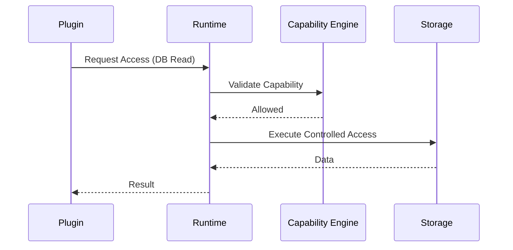

# 🔑 Capability Flow

```mermaid
sequenceDiagram

participant P as Plugin
participant R as Runtime
participant C as Capability Engine
participant S as Storage

P->>R: Request Access (DB Read)
R->>C: Validate Capability
C-->>R: Allowed

R->>S: Execute Controlled Access
S-->>R: Data
R-->>P: Result
```