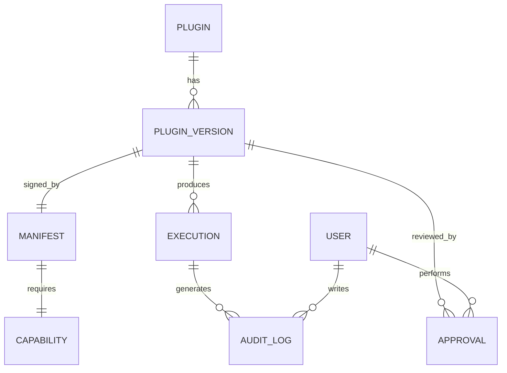

# 🗄 Data Model ERD

```mermaid
erDiagram

PLUGIN ||--o{ PLUGIN_VERSION : has
PLUGIN_VERSION ||--|| MANIFEST : signed_by
PLUGIN_VERSION ||--o{ EXECUTION : produces
PLUGIN_VERSION ||--o{ APPROVAL : reviewed_by

MANIFEST ||--|| CAPABILITY : requires
EXECUTION ||--o{ AUDIT_LOG : generates

USER ||--o{ APPROVAL : performs
USER ||--o{ AUDIT_LOG : writes
```