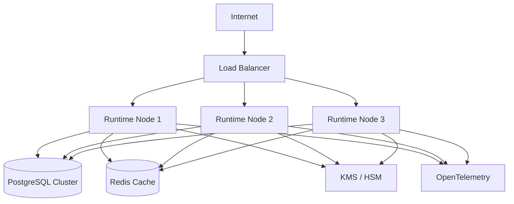

# 🚀 Deployment Architecture

```mermaid
flowchart TD

Internet --> LB[Load Balancer]

LB --> R1[Runtime Node 1]
LB --> R2[Runtime Node 2]
LB --> R3[Runtime Node 3]

R1 --> DB[(PostgreSQL Cluster)]
R2 --> DB
R3 --> DB

R1 --> Redis[(Redis Cache)]
R2 --> Redis
R3 --> Redis

R1 --> KMS[KMS / HSM]
R2 --> KMS
R3 --> KMS

R1 --> Obs[OpenTelemetry]
R2 --> Obs
R3 --> Obs
```