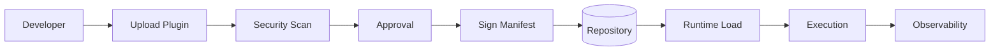

# 🔌 Plugin Lifecycle

```mermaid
flowchart LR

Dev[Developer] --> Upload[Upload Plugin]
Upload --> Scan[Security Scan]
Scan --> Approve[Approval]
Approve --> Sign[Sign Manifest]
Sign --> Repo[(Repository)]
Repo --> Runtime[Runtime Load]
Runtime --> Execute[Execution]
Execute --> Monitor[Observability]
```