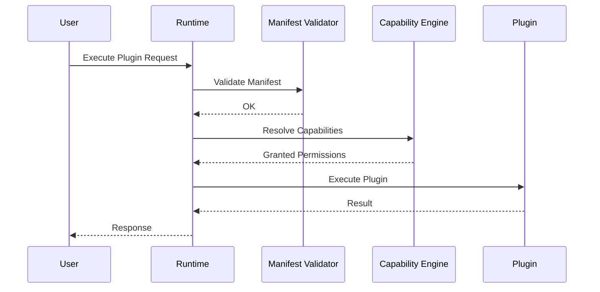

# ⚙️ Runtime Execution Flow

```mermaid
sequenceDiagram

participant U as User
participant R as Runtime
participant M as Manifest Validator
participant C as Capability Engine
participant P as Plugin

U->>R: Execute Plugin Request
R->>M: Validate Manifest
M-->>R: OK

R->>C: Resolve Capabilities
C-->>R: Granted Permissions

R->>P: Execute Plugin
P-->>R: Result

R-->>U: Response
```