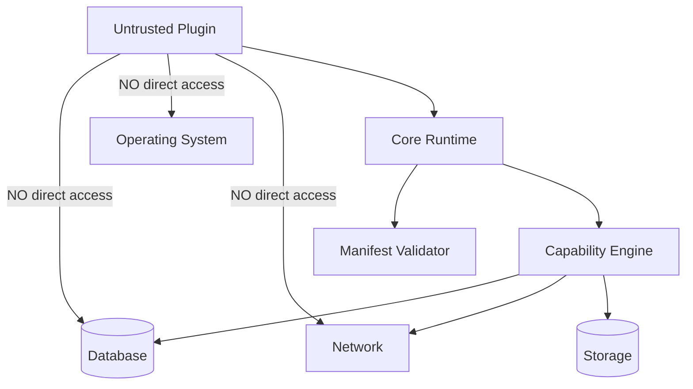

# 🔐 Security Boundaries

```mermaid
flowchart TD

Plugin[Untrusted Plugin]

Plugin -->|NO direct access| DB[(Database)]
Plugin -->|NO direct access| OS[Operating System]
Plugin -->|NO direct access| Network[Network]

Plugin --> Runtime[Core Runtime]

Runtime --> Validator[Manifest Validator]
Runtime --> Capability[Capability Engine]

Capability --> DB
Capability --> Network
Capability --> Storage[(Storage)]
```