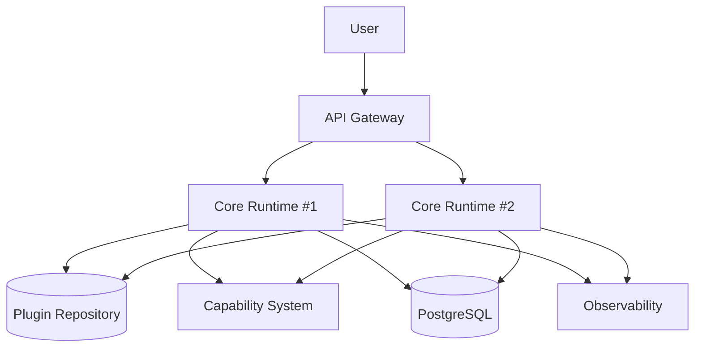

# 🏗 System Overview

```mermaid
flowchart TD

User --> API[API Gateway]

API --> Runtime1[Core Runtime #1]
API --> Runtime2[Core Runtime #2]

Runtime1 --> PluginRepo[(Plugin Repository)]
Runtime2 --> PluginRepo

Runtime1 --> Capability[Capability System]
Runtime2 --> Capability

Runtime1 --> DB[(PostgreSQL)]
Runtime2 --> DB

Runtime1 --> Logs[Observability]
Runtime2 --> Logs
```