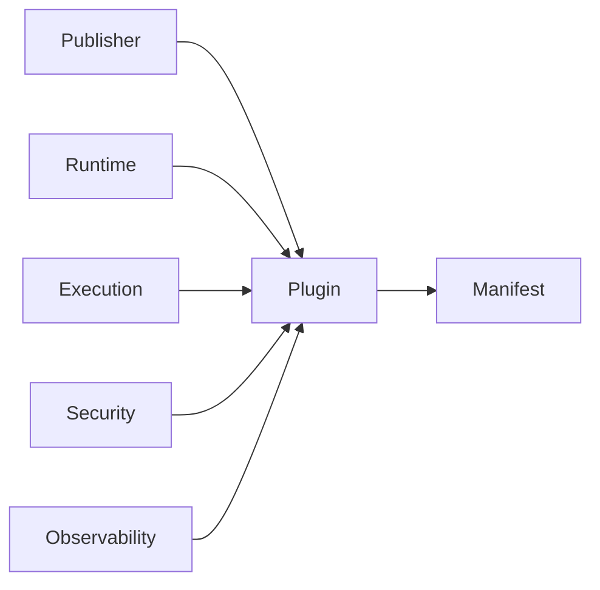

# DM-100 Plugin Domain

---

# Overview

The Plugin Domain defines the business concepts related to deployable extensions within the Metadata-Driven Secure Plugin Runtime.

A Plugin represents an independently deployable business capability that extends the functionality of the Runtime without modifying the platform itself.

The Plugin Domain focuses on **what a Plugin is**, **what responsibilities it owns**, and **how it participates in the platform**, independent of implementation technologies.

---

# Purpose

The Plugin Domain exists to:

- Encapsulate business functionality.
- Enable modular platform extensibility.
- Support independent development and deployment.
- Isolate business capabilities.
- Provide a stable extension model.

---

# Domain Scope

The Plugin Domain is responsible for:

- Defining deployable business extensions.
- Managing the business identity of plugins.
- Managing the lifecycle of plugins.
- Defining relationships with other domains.
- Publishing business events related to plugin lifecycle.

The Plugin Domain is not responsible for:

- Runtime hosting.
- Execution scheduling.
- Security enforcement.
- Metadata validation.
- Dependency resolution.
- Audit persistence.

Those responsibilities belong to other domains.

---

# Business Concept

A Plugin is an independently deployable business module.

A Plugin encapsulates a coherent set of business capabilities that can be installed, activated and removed without changing the Runtime.

A Plugin does not control its own execution.

All execution is coordinated by the Runtime.

A Plugin never communicates directly with infrastructure.

---

# Bounded Context

The Plugin Domain owns the business concepts related to plugins.

It collaborates with:

- Manifest Domain
- Runtime Domain
- Execution Domain
- Security Domain
- Observability Domain

It does not own concepts defined by those domains.

---

# Aggregate

## Aggregate Root

Plugin

The Plugin Aggregate represents a deployable business extension throughout its lifecycle.

---

# Entities

## Plugin

Represents a deployable business extension.

Responsibilities:

- Represent business functionality.
- Maintain business identity.
- Maintain lifecycle state.
- Participate in platform extension.

---

## Publisher

Represents the organization or individual responsible for publishing a Plugin.

Responsibilities:

- Own plugin publication.
- Maintain publisher identity.

---

# Value Objects

The Plugin Domain uses the following Value Objects:

| Value Object | Description |
|--------------|-------------|
| PluginId | Unique business identifier |
| PluginName | Human-readable name |
| PluginVersion | Semantic version |
| Description | Business description |
| Category | Plugin classification |

These Value Objects are immutable.

---

# Relationships

The Plugin Domain collaborates with other domains through published contracts.

| Related Domain | Relationship |
|----------------|-------------|
| Manifest Domain | Plugin is described by one Manifest |
| Runtime Domain | Plugin is hosted by the Runtime |
| Execution Domain | Plugin participates in Executions |
| Security Domain | Plugin is governed by security policies |
| Observability Domain | Plugin generates operational telemetry |

The Plugin Domain does not own these domains.

---

# Business Invariants

The following statements are always true.

- Every Plugin has a unique business identity.
- Every Plugin has exactly one current version.
- Every Plugin is published by one Publisher.
- Every Plugin is described by one Manifest.
- Every Plugin executes within one Runtime instance.
- A Plugin cannot execute unless accepted by the Runtime.
- Plugin business identity never changes after publication.

---

# Lifecycle

A Plugin progresses through the following business states.

```text
Draft
    ↓
Packaged
    ↓
Published
    ↓
Installed
    ↓
Validated
    ↓
Loaded
    ↓
Active
    ↓
Suspended
    ↓
Stopped
    ↓
Unloaded
    ↓
Retired
```

State transitions are coordinated by the Runtime.

---

# Domain Events

Typical business events include:

- PluginCreated
- PluginPackaged
- PluginPublished
- PluginInstalled
- PluginValidated
- PluginActivated
- PluginSuspended
- PluginStopped
- PluginUnloaded
- PluginRetired

These events may be consumed by other domains.

---

# Business Rules Mapping

| Business Rule | Description |
|---------------|-------------|
| BR-101 | Plugin Registration |
| BR-102 | Plugin Versioning |
| BR-103 | Plugin Validation |
| BR-104 | Plugin Lifecycle |
| BR-105 | Plugin Compatibility |
| BR-106 | Plugin Isolation |

---

# Domain Diagram



---

# Related Documents

- DM-000 Domain Overview
- DM-050 Shared Kernel
- DM-200 Manifest Domain
- DM-300 Runtime Domain
- FR-100 Plugin Lifecycle
- BR-100 Plugin Lifecycle
- UC-100 Plugin Lifecycle