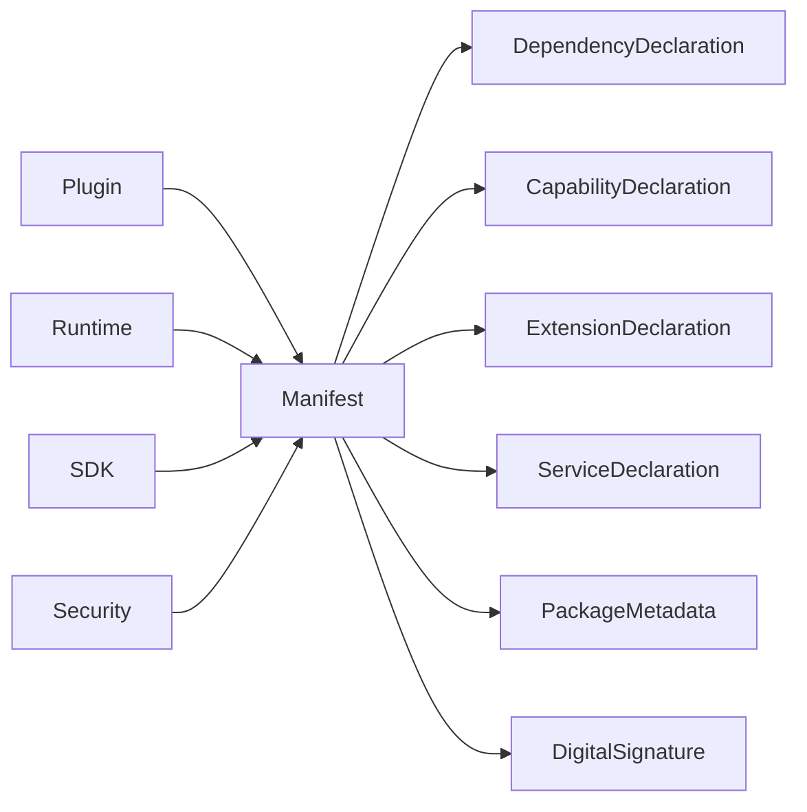

# DM-200 Manifest Domain

---

# Overview

The Manifest Domain defines the metadata contract that describes a Plugin to the Runtime.

A Manifest is the authoritative source of metadata used by the Runtime to understand, validate, integrate and govern a Plugin without executing its code.

The Manifest establishes a stable contract between Plugin publishers and the Runtime platform.

---

# Purpose

The Manifest Domain exists to:

- Describe Plugin metadata.
- Define Runtime compatibility.
- Declare integration contracts.
- Declare required capabilities.
- Describe service exposure.
- Enable deterministic plugin discovery.
- Support governance through immutable metadata.

---

# Domain Scope

The Manifest Domain is responsible for:

- Defining plugin metadata.
- Declaring plugin identity.
- Declaring compatibility requirements.
- Declaring dependencies.
- Declaring capabilities.
- Declaring extension points.
- Declaring exported services.
- Declaring package metadata.

The Manifest Domain is not responsible for:

- Executing plugins.
- Loading plugins.
- Resolving dependencies.
- Authorizing access.
- Scheduling execution.
- Monitoring runtime behavior.

Those responsibilities belong to other domains.

---

# Business Concept

A Manifest is a published metadata contract.

The Runtime shall understand a Plugin exclusively through its Manifest before any executable code is loaded.

A Manifest describes **what a Plugin is**, **what it requires**, **what it provides**, and **under which conditions it may operate**.

Once published, a Manifest is immutable.

Changes require publishing a new Plugin version with a new Manifest.

---

# Bounded Context

The Manifest Domain owns all business concepts related to published plugin metadata.

It collaborates with:

- Plugin Domain
- Runtime Domain
- Security Domain
- SDK Domain

The Manifest Domain does not own runtime behavior or execution.

---

# Aggregate

## Aggregate Root

Manifest

The Manifest Aggregate represents the complete published contract of a Plugin version.

---

# Entities

## Manifest

Represents the published metadata contract.

Responsibilities:

- Describe Plugin identity.
- Describe compatibility.
- Describe dependencies.
- Describe capabilities.
- Describe integration points.
- Describe exported services.

---

## Dependency Declaration

Represents a dependency on another Plugin or platform component.

Responsibilities:

- Identify required dependency.
- Define version constraints.
- Express dependency type.

---

## Extension Declaration

Represents an extension provided by the Plugin.

Responsibilities:

- Identify extension point.
- Describe extension implementation.

---

## Service Declaration

Represents a service exposed by the Plugin.

Responsibilities:

- Describe exported service.
- Define service contract.

---

# Value Objects

The Manifest Domain uses the following immutable Value Objects.

| Value Object | Description |
|--------------|-------------|
| ManifestVersion | Metadata schema version |
| PluginId | Plugin identity |
| PluginVersion | Plugin version |
| RuntimeVersion | Supported Runtime version |
| CapabilityReference | Required capability |
| DependencyReference | Dependency identifier |
| ServiceReference | Exported service |
| ExtensionReference | Extension identifier |
| PackageChecksum | Package integrity |
| DigitalSignature | Package authenticity |

---

# Relationships

The Manifest Domain collaborates with other domains through published contracts.

| Related Domain | Relationship |
|----------------|-------------|
| Plugin Domain | Manifest describes one Plugin |
| Runtime Domain | Runtime validates and consumes the Manifest |
| Security Domain | Manifest declares security requirements |
| SDK Domain | SDK creates and validates Manifests |

The Manifest never owns these domains.

---

# Business Invariants

The following statements are always true.

- Every Manifest describes exactly one Plugin.
- Every Plugin version has exactly one Manifest.
- Every Manifest has exactly one schema version.
- Manifest identity is immutable after publication.
- Compatibility requirements are immutable after publication.
- Capability declarations are immutable after publication.
- Dependency declarations are immutable after publication.
- Every production Manifest shall include integrity information.
- Every published Manifest shall be versioned.

---

# Lifecycle

A Manifest progresses through the following business states.

```text
Draft
    ↓
Validated
    ↓
Packaged
    ↓
Signed
    ↓
Published
    ↓
Installed
    ↓
Verified
    ↓
Archived
```

State transitions are coordinated by the SDK and Runtime.

---

# Domain Events

Typical business events include:

- ManifestCreated
- ManifestValidated
- ManifestPackaged
- ManifestSigned
- ManifestPublished
- ManifestInstalled
- ManifestVerified
- ManifestArchived

These events may be consumed by Runtime, Security and Administration domains.

---

# Business Rules Mapping

| Business Rule | Description |
|---------------|-------------|
| BR-201 | Manifest Ownership |
| BR-202 | Manifest Validation |
| BR-203 | Manifest Versioning |
| BR-204 | Runtime Compatibility |
| BR-205 | Manifest Integrity |
| BR-206 | Manifest Publication |

---

# Domain Diagram



---

# Related Documents

- DM-000 Domain Overview
- DM-050 Shared Kernel
- DM-100 Plugin Domain
- DM-300 Runtime Domain
- DM-500 Security Domain
- FR-200 Manifest
- BR-200 Manifest
- UC-200 Manifest