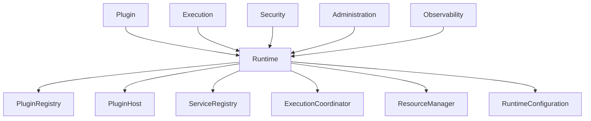

# DM-300 Runtime Domain

---

# Overview

The Runtime Domain is the execution platform responsible for hosting, managing and coordinating plugins throughout their lifecycle.

The Runtime provides a controlled, secure and isolated environment in which plugins are discovered, validated, loaded, executed and unloaded.

The Runtime is the orchestration layer of the platform and coordinates interactions between all other domains.

---

# Purpose

The Runtime Domain provides:

- Plugin hosting
- Plugin lifecycle management
- Execution orchestration
- Resource coordination
- Dependency coordination
- Runtime isolation
- Service composition
- Operational governance

---

# Responsibilities

The Runtime Domain is responsible for:

- Discovering plugins
- Loading plugins
- Initializing plugins
- Activating plugins
- Stopping plugins
- Unloading plugins
- Coordinating execution
- Managing plugin isolation
- Managing shared services
- Publishing runtime events

The Runtime Domain is NOT responsible for:

- Business logic implementation
- Manifest authoring
- Security policy definition
- Plugin development
- Audit persistence

---

# Business Concept

The Runtime is the trusted execution environment of the platform.

Plugins never communicate directly with infrastructure.

All interactions occur through the Runtime.

The Runtime coordinates every stage of the plugin lifecycle while enforcing platform governance.

---

# Aggregate

Aggregate Root

Runtime

The Runtime Aggregate owns:

- Plugin Registry
- Plugin Host
- Service Registry
- Execution Coordinator
- Resource Manager
- Runtime Configuration

---

# Business Identity

Every Runtime instance is uniquely identified by:

- Runtime Identifier
- Runtime Version

---

# Business Attributes

| Attribute | Description |
|-----------|-------------|
| Runtime Identifier | Runtime identity |
| Runtime Version | Platform version |
| Status | Runtime state |
| Configuration | Runtime configuration |
| Installed Plugins | Registered plugins |
| Active Plugins | Running plugins |
| Service Registry | Shared services |
| Resource Limits | Runtime resource policies |

---

# Owned Business Objects

| Business Object | Purpose |
|-----------------|---------|
| Plugin Registry | Tracks installed plugins |
| Plugin Host | Hosts plugin instances |
| Execution Coordinator | Coordinates execution |
| Resource Manager | Allocates resources |
| Service Registry | Shared services |
| Runtime Configuration | Platform configuration |

---

# Business Relationships

Runtime hosts:

- Many Plugins

Runtime coordinates:

- Many Executions

Runtime validates:

- Many Manifests

Runtime enforces:

- Security Policies

Runtime produces:

- Runtime Events
- Metrics
- Audit Records

---

# Lifecycle

Runtime lifecycle

```text
Created

↓

Configured

↓

Starting

↓

Running

↓

Maintenance

↓

Recovering

↓

Stopping

↓

Stopped

↓

Archived
```

---

# Business Invariants

The following rules are always true.

- One Runtime hosts many Plugins.
- A Plugin executes in exactly one Runtime.
- Only validated Plugins may be loaded.
- Active Plugins shall execute in isolated contexts.
- Runtime configuration changes shall be auditable.
- Runtime shall maintain service availability during normal operations.

---

# Domain Events

Typical business events include:

- RuntimeCreated
- RuntimeConfigured
- RuntimeStarted
- RuntimeStopped
- RuntimeRecovered
- PluginLoaded
- PluginActivated
- PluginUnloaded
- ServiceRegistered
- ServiceRemoved

---

# Business Rules Mapping

| Rule | Description |
|------|-------------|
| BR-501 | Runtime Initialization |
| BR-502 | Plugin Loading |
| BR-503 | Runtime Isolation |
| BR-504 | Service Registration |
| BR-505 | Resource Allocation |
| BR-506 | Runtime Recovery |

---

# Domain Relationships

The Runtime collaborates with:

- Plugin Domain
- Manifest Domain
- Execution Domain
- Security Domain
- Administration Domain
- Observability Domain

The Runtime acts as the central orchestrator between domains.

---

# Domain Constraints

The Runtime shall:

- Host multiple plugins.
- Isolate plugin execution.
- Coordinate plugin lifecycle.
- Maintain service registry consistency.
- Reject invalid plugins.
- Prevent resource conflicts.
- Publish operational events.

---

# Domain Diagram



---

# Related Documents

- DM-100 Plugin Domain
- DM-200 Manifest Domain
- DM-400 Execution Domain
- DM-500 Security Domain
- FR-500 Runtime
- BR-500 Runtime
- UC-500 Runtime