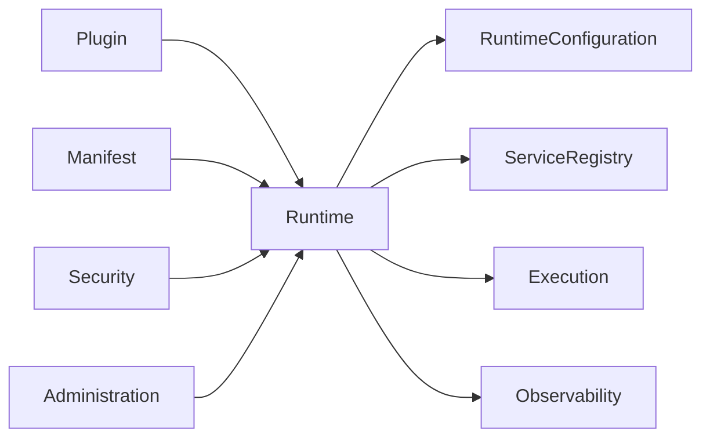

# DM-300 Runtime Domain

---

# Overview

The Runtime Domain defines the trusted execution environment responsible for hosting, coordinating and governing Plugins within the Metadata-Driven Secure Plugin Runtime.

The Runtime acts as the central orchestration domain of the platform. It provides a controlled environment where Plugins are discovered, validated, activated, executed and retired according to platform governance policies.

The Runtime owns the operational lifecycle of deployed Plugins while delegating business functionality to the Plugins themselves.

---

# Purpose

The Runtime Domain exists to:

- Host deployed Plugins.
- Coordinate plugin lifecycle.
- Provide execution environments.
- Manage shared platform services.
- Coordinate interactions between domains.
- Enforce platform governance.
- Maintain runtime stability.

---

# Domain Scope

The Runtime Domain is responsible for:

- Hosting Plugins.
- Coordinating Plugin lifecycle.
- Managing execution environments.
- Managing runtime resources.
- Managing service discovery.
- Coordinating domain interactions.
- Publishing runtime events.

The Runtime Domain is not responsible for:

- Implementing business logic.
- Creating plugin metadata.
- Defining security policies.
- Developing Plugins.
- Persisting audit records.

Those responsibilities belong to their respective domains.

---

# Business Concept

The Runtime is the trusted operational environment of the platform.

Every Plugin operates inside a Runtime.

The Runtime determines:

- when Plugins become active,
- where Plugins execute,
- how Plugins interact,
- when Plugins stop executing.

The Runtime never owns business functionality.

Its responsibility is orchestration rather than business execution.

---

# Bounded Context

The Runtime Domain owns operational orchestration.

It collaborates with:

- Plugin Domain
- Manifest Domain
- Execution Domain
- Security Domain
- Administration Domain
- Observability Domain

The Runtime Domain does not own concepts belonging to those domains.

---

# Aggregate

## Aggregate Root

Runtime

The Runtime Aggregate represents one operational instance of the platform.

---

# Entities

## Runtime

Represents an operational execution environment.

Responsibilities:

- Host Plugins.
- Coordinate lifecycle.
- Allocate runtime resources.
- Coordinate platform services.
- Publish runtime events.

---

## Runtime Configuration

Represents operational configuration governing Runtime behavior.

Responsibilities:

- Configure operational limits.
- Configure execution behavior.
- Configure runtime services.

---

## Service Registry

Represents the catalogue of platform services available to Plugins.

Responsibilities:

- Register services.
- Discover services.
- Maintain service availability.

---

# Value Objects

The Runtime Domain uses the following immutable Value Objects.

| Value Object | Description |
|--------------|-------------|
| RuntimeId | Unique Runtime identifier |
| RuntimeVersion | Platform version |
| RuntimeState | Current operational state |
| ResourceLimit | Resource allocation policy |
| ExecutionEnvironment | Runtime execution environment |
| ServiceReference | Registered platform service |

---

# Relationships

| Related Domain | Relationship |
|----------------|-------------|
| Plugin Domain | Runtime hosts Plugins |
| Manifest Domain | Runtime validates Manifest contracts |
| Execution Domain | Runtime coordinates Executions |
| Security Domain | Runtime enforces security decisions |
| Administration Domain | Runtime is configured and managed |
| Observability Domain | Runtime publishes operational telemetry |

The Runtime Domain coordinates these domains but does not own them.

---

# Business Invariants

The following statements are always true.

- Every Runtime has a unique identity.
- A Runtime may host many Plugins.
- A Plugin executes within exactly one Runtime.
- Only validated Plugins may become active.
- Runtime services shall remain discoverable while active.
- Runtime configuration changes shall be auditable.
- Runtime shall maintain isolation between Plugins.

---

# Lifecycle

A Runtime progresses through the following operational states.

```text
Provisioned
      ↓
Configured
      ↓
Starting
      ↓
Running
      ↓
Maintenance
      ↓
Recovering
      ↓
Stopping
      ↓
Stopped
      ↓
Retired
```

State transitions are governed by Administration policies.

---

# Domain Events

Typical business events include:

- RuntimeProvisioned
- RuntimeConfigured
- RuntimeStarted
- RuntimeReady
- RuntimeEnteredMaintenance
- RuntimeRecovered
- RuntimeStopped
- RuntimeRetired
- ServiceRegistered
- ServiceRemoved

These events may be consumed by Administration, Execution and Observability domains.

---

# Business Rules Mapping

| Business Rule | Description |
|---------------|-------------|
| BR-501 | Runtime Initialization |
| BR-502 | Plugin Hosting |
| BR-503 | Runtime Isolation |
| BR-504 | Service Registry |
| BR-505 | Resource Allocation |
| BR-506 | Runtime Recovery |

---

# Domain Diagram



---

# Related Documents

- DM-000 Domain Overview
- DM-050 Shared Kernel
- DM-100 Plugin Domain
- DM-200 Manifest Domain
- DM-400 Execution Domain
- DM-500 Security Domain
- FR-500 Runtime
- BR-500 Runtime
- UC-500 Runtime
