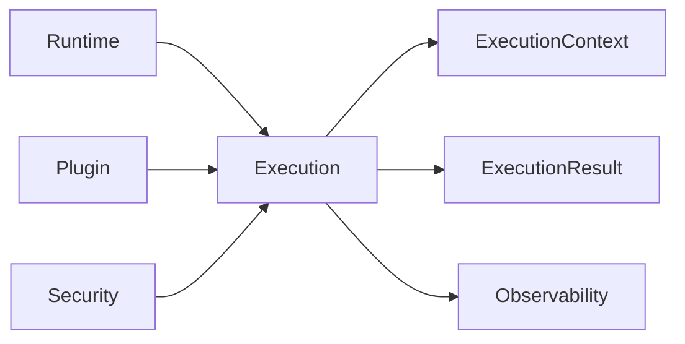

# DM-400 Execution Domain

---

# Overview

The Execution Domain defines how business capabilities provided by Plugins are invoked, coordinated and completed within the Runtime.

An Execution represents a single business operation performed by a Plugin under the governance of the Runtime.

The Execution Domain provides a deterministic, isolated and observable execution model independent of Plugin implementation.

---

# Purpose

The Execution Domain exists to:

- Execute business capabilities.
- Coordinate execution lifecycle.
- Manage execution context.
- Control execution flow.
- Capture execution outcomes.
- Support cancellation and timeout.
- Enable reliable processing.

---

# Domain Scope

The Execution Domain is responsible for:

- Creating execution requests.
- Managing execution context.
- Invoking business capabilities.
- Tracking execution state.
- Returning execution results.
- Managing execution cancellation.
- Managing execution timeout.
- Publishing execution events.

The Execution Domain is not responsible for:

- Hosting Plugins.
- Validating plugin metadata.
- Authorizing execution.
- Managing platform configuration.
- Monitoring infrastructure.

Those responsibilities belong to other domains.

---

# Business Concept

An Execution represents one invocation of a business capability.

Every Execution occurs inside exactly one Runtime.

Every Execution targets exactly one Plugin capability.

Every Execution has a well-defined beginning and end.

Execution shall be deterministic from the perspective of the Runtime.

---

# Bounded Context

The Execution Domain owns the lifecycle of business execution.

It collaborates with:

- Runtime Domain
- Plugin Domain
- Security Domain
- Observability Domain

Execution does not own concepts defined by those domains.

---

# Aggregate

## Aggregate Root

Execution

The Execution Aggregate represents one business invocation.

---

# Entities

## Execution

Represents one business operation.

Responsibilities

- Coordinate execution.
- Maintain execution state.
- Produce execution outcome.

---

## Execution Context

Represents contextual information required during execution.

Responsibilities

- Maintain execution identity.
- Maintain correlation information.
- Provide execution environment.

---

## Execution Result

Represents the outcome of execution.

Responsibilities

- Describe execution status.
- Carry business response.
- Carry execution errors.

---

# Value Objects

The Execution Domain uses the following immutable Value Objects.

| Value Object | Description |
|--------------|-------------|
| ExecutionId | Unique execution identifier |
| CorrelationId | Cross-domain request identifier |
| ExecutionState | Current execution state |
| ExecutionPriority | Execution priority |
| ExecutionTimeout | Maximum execution duration |
| ExecutionDuration | Actual execution time |
| ExecutionOutcome | Business outcome |

---

# Relationships

| Related Domain | Relationship |
|----------------|-------------|
| Runtime Domain | Runtime coordinates Executions |
| Plugin Domain | Plugin provides business capability |
| Security Domain | Security authorizes execution |
| Observability Domain | Execution publishes telemetry |

Execution does not own these domains.

---

# Business Invariants

The following statements are always true.

- Every Execution has one identity.
- Every Execution belongs to one Runtime.
- Every Execution invokes one Plugin capability.
- Every Execution has one Execution Context.
- Every Execution produces one Execution Result.
- Every Execution eventually reaches a terminal state.
- Execution Context is immutable after creation.

---

# Lifecycle

An Execution progresses through the following business states.

```text
Created
    ↓
Accepted
    ↓
Authorized
    ↓
Scheduled
    ↓
Executing
    ↓
Completed
```

Alternative terminal states

```text
Executing
      ↓
Failed

Executing
      ↓
Cancelled

Executing
      ↓
Timed Out

Executing
      ↓
Aborted
```

---

# Domain Events

Typical business events include:

- ExecutionCreated
- ExecutionAccepted
- ExecutionAuthorized
- ExecutionScheduled
- ExecutionStarted
- ExecutionCompleted
- ExecutionFailed
- ExecutionCancelled
- ExecutionTimedOut
- ExecutionAborted

These events may be consumed by Runtime, Administration and Observability.

---

# Business Rules Mapping

| Business Rule | Description |
|---------------|-------------|
| BR-601 | Execution Creation |
| BR-602 | Execution Authorization |
| BR-603 | Execution Scheduling |
| BR-604 | Execution Timeout |
| BR-605 | Execution Cancellation |
| BR-606 | Execution Result |

---

# Domain Diagram



---

# Related Documents

- DM-000 Domain Overview
- DM-050 Shared Kernel
- DM-300 Runtime Domain
- DM-500 Security Domain
- DM-800 Observability Domain
- FR-600 Execution
- BR-600 Execution
- UC-600 Execution