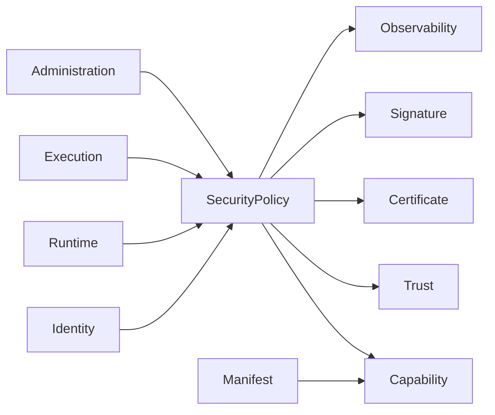

# DM-500 Security Domain

---

# Overview

The Security Domain defines the trust model, identity model and authorization model governing the Metadata-Driven Secure Plugin Runtime.

Security is enforced throughout the entire plugin lifecycle, from package publication to runtime execution.

The platform adopts a Zero-Trust architecture in which no Plugin, Publisher or Runtime interaction is implicitly trusted.

Every request shall be authenticated, authorized and continuously validated.

---

# Purpose

The Security Domain exists to:

- Establish platform trust.
- Authenticate identities.
- Authorize operations.
- Verify software integrity.
- Protect runtime resources.
- Enforce security policies.
- Maintain isolation.
- Support security auditing.

---

# Domain Scope

The Security Domain is responsible for:

- Identity management.
- Authentication.
- Authorization.
- Capability management.
- Policy evaluation.
- Digital signature validation.
- Certificate validation.
- Integrity verification.
- Trust management.
- Security event publication.

The Security Domain is not responsible for:

- Executing Plugins.
- Hosting Plugins.
- Managing Runtime lifecycle.
- Developing Plugins.
- Persisting operational metrics.

---

# Business Concept

Security is a platform-wide governance capability.

Every business operation shall pass through the Security Domain before execution.

Trust is never assumed.

Trust is continuously established through verification.

Authorization decisions are based upon declared capabilities and platform policies.

---

# Security Principles

The platform follows these principles.

## Zero Trust

No Plugin is trusted by default.

Every interaction requires verification.

---

## Least Privilege

Plugins receive only the minimum capabilities required.

---

## Defense in Depth

Security controls are applied throughout the plugin lifecycle.

---

## Immutable Trust

Published security metadata cannot be modified.

---

## Continuous Verification

Security validation occurs throughout execution.

---

# Bounded Context

The Security Domain owns:

- Identity
- Authentication
- Authorization
- Capability
- Policy
- Trust
- Signature
- Certificate
- Integrity

Other domains depend on Security decisions but never implement security policies themselves.

---

# Aggregate

## Aggregate Root

Security Policy

The Security Policy Aggregate represents the authoritative source of runtime authorization.

---

# Entities

## Security Policy

Defines authorization rules governing platform behavior.

Responsibilities

- Govern access decisions.
- Define authorization rules.
- Define resource restrictions.

---

## Identity

Represents a uniquely identifiable security principal.

Possible identities include:

- Publisher
- Plugin
- Runtime
- Administrator
- Service

---

## Capability

Represents an authorized operation.

Capabilities define what actions may be performed.

Examples include:

- File Access
- Network Access
- Configuration Access
- Service Discovery
- Event Publishing

---

## Certificate

Represents trusted publisher identity.

Responsibilities

- Establish publisher trust.
- Verify software origin.

---

# Value Objects

| Value Object | Description |
|--------------|-------------|
| IdentityId | Security identity |
| CapabilityId | Capability identifier |
| PolicyId | Policy identifier |
| Signature | Digital signature |
| CertificateThumbprint | Certificate identity |
| TrustLevel | Degree of trust |
| PermissionScope | Authorization scope |
| SecurityDecision | Authorization result |

All Value Objects are immutable.

---

# Relationships

| Related Domain | Relationship |
|----------------|-------------|
| Manifest Domain | Declares required capabilities |
| Runtime Domain | Enforces security decisions |
| Execution Domain | Requests authorization |
| Administration Domain | Defines policies |
| Observability Domain | Receives security events |

The Security Domain never executes business logic.

---

# Business Invariants

The following statements are always true.

- Every Identity is unique.
- Every Capability is explicitly declared.
- Every authorization decision references a Policy.
- Every production Plugin shall have a valid digital signature.
- Every signature shall be verified before activation.
- Unauthorized execution is prohibited.
- Security policies are immutable after publication.
- Trust shall never be assumed.

---

# Lifecycle

Security validation follows the lifecycle below.

```text
Identity Established
        ↓
Authenticated
        ↓
Authorized
        ↓
Verified
        ↓
Trusted
```

Alternative outcomes

```text
Authenticated
      ↓
Rejected

Authorized
      ↓
Denied

Verified
      ↓
Invalid Signature

Trusted
      ↓
Revoked
```

---

# Domain Events

Typical business events include:

- IdentityAuthenticated
- AuthenticationFailed
- AuthorizationGranted
- AuthorizationDenied
- CapabilityGranted
- CapabilityRevoked
- SignatureVerified
- SignatureRejected
- TrustEstablished
- TrustRevoked

---

# Business Rules Mapping

| Business Rule | Description |
|---------------|-------------|
| BR-701 | Identity Verification |
| BR-702 | Authentication |
| BR-703 | Authorization |
| BR-704 | Capability Enforcement |
| BR-705 | Signature Validation |
| BR-706 | Policy Evaluation |
| BR-707 | Runtime Isolation |

---

# Domain Diagram



---

# Related Documents

- DM-000 Domain Overview
- DM-050 Shared Kernel
- DM-200 Manifest Domain
- DM-300 Runtime Domain
- DM-400 Execution Domain
- DM-600 Administration Domain
- FR-700 Security
- BR-700 Security
- UC-700 Security
