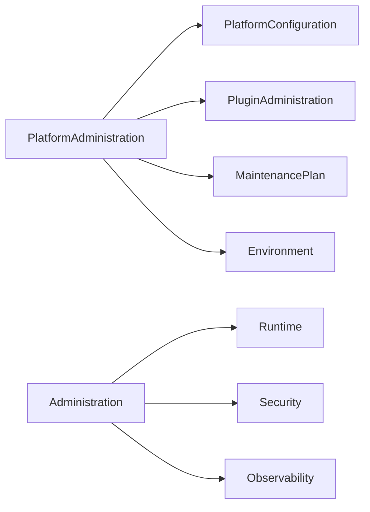

# DM-600 Administration Domain

---

# Overview

The Administration Domain defines the business capabilities required to govern, configure and operate the Metadata-Driven Secure Plugin Runtime.

Administration provides centralized operational governance over platform configuration, plugin management, policy administration and operational maintenance.

This domain ensures that the platform remains secure, stable and manageable throughout its operational lifecycle.

---

# Purpose

The Administration Domain exists to:

- Govern platform operation.
- Manage Runtime configuration.
- Manage Plugin deployment.
- Manage platform policies.
- Coordinate maintenance activities.
- Support operational governance.
- Enable platform administration.

---

# Domain Scope

The Administration Domain is responsible for:

- Platform configuration.
- Runtime administration.
- Plugin administration.
- Policy administration.
- Environment management.
- Configuration versioning.
- Operational maintenance.
- Administrative event publication.

The Administration Domain is not responsible for:

- Executing Plugins.
- Authorizing requests.
- Implementing business logic.
- Publishing plugin packages.
- Monitoring execution.

Those responsibilities belong to other domains.

---

# Business Concept

Administration represents the operational governance layer of the platform.

Administrative activities modify how the platform operates without modifying business functionality.

Every administrative action shall be controlled, traceable and auditable.

---

# Administrative Principles

The platform follows these administrative principles.

## Governance

Operational behavior shall be centrally governed.

---

## Configuration as Metadata

Administrative configuration shall be represented as metadata.

---

## Versioned Configuration

Configuration changes create new configuration versions.

Historical configurations remain traceable.

---

## Controlled Change

Administrative changes shall follow controlled operational procedures.

---

## Auditability

Every administrative operation shall be auditable.

---

# Bounded Context

The Administration Domain owns:

- Platform Configuration
- Runtime Configuration
- Plugin Administration
- Operational Policies
- Maintenance Planning
- Environment Management

---

# Aggregate

## Aggregate Root

Platform Administration

The Platform Administration Aggregate governs operational behavior across the platform.

---

# Entities

## Platform Configuration

Represents global platform configuration.

Responsibilities

- Define platform settings.
- Define operational parameters.
- Maintain configuration versions.

---

## Plugin Administration

Represents administrative management of deployed Plugins.

Responsibilities

- Install Plugins.
- Upgrade Plugins.
- Disable Plugins.
- Remove Plugins.

---

## Maintenance Plan

Represents planned operational activities.

Responsibilities

- Schedule maintenance.
- Coordinate maintenance windows.
- Control operational availability.

---

## Environment

Represents an operational deployment environment.

Examples

- Development
- Test
- Staging
- Production

---

# Value Objects

| Value Object | Description |
|--------------|-------------|
| ConfigurationId | Configuration identity |
| ConfigurationVersion | Configuration version |
| EnvironmentId | Environment identifier |
| MaintenanceWindow | Planned maintenance period |
| AdministrativeAction | Administrative operation |
| ConfigurationState | Current configuration status |

All Value Objects are immutable.

---

# Relationships

| Related Domain | Relationship |
|----------------|-------------|
| Runtime Domain | Configures Runtime behavior |
| Plugin Domain | Manages Plugin lifecycle |
| Security Domain | Defines operational policies |
| Observability Domain | Receives administrative events |

Administration governs platform operation but does not execute business functionality.

---

# Business Invariants

The following statements are always true.

- Every configuration has one version.
- Configuration history is immutable.
- Administrative actions require authorization.
- Configuration changes are auditable.
- Plugins may only be administered through approved administrative operations.
- Maintenance activities shall be planned.

---

# Lifecycle

Platform configuration lifecycle

```text
Draft
      ↓
Reviewed
      ↓
Approved
      ↓
Applied
      ↓
Active
      ↓
Superseded
      ↓
Archived
```

Maintenance lifecycle

```text
Planned
      ↓
Scheduled
      ↓
Executing
      ↓
Completed
```

---

# Domain Events

Typical business events include:

- ConfigurationCreated
- ConfigurationApproved
- ConfigurationApplied
- RuntimeConfigured
- PluginInstalled
- PluginUpgraded
- PluginDisabled
- PluginRemoved
- MaintenanceScheduled
- MaintenanceCompleted

---

# Business Rules Mapping

| Business Rule | Description |
|---------------|-------------|
| BR-801 | Platform Configuration |
| BR-802 | Plugin Administration |
| BR-803 | Configuration Versioning |
| BR-804 | Environment Management |
| BR-805 | Maintenance Management |
| BR-806 | Administrative Governance |

---

# Domain Diagram



---

# Related Documents

- DM-000 Domain Overview
- DM-050 Shared Kernel
- DM-300 Runtime Domain
- DM-500 Security Domain
- DM-700 SDK Domain
- DM-800 Observability Domain
- FR-800 Administration
- BR-800 Administration
- UC-800 Administration
