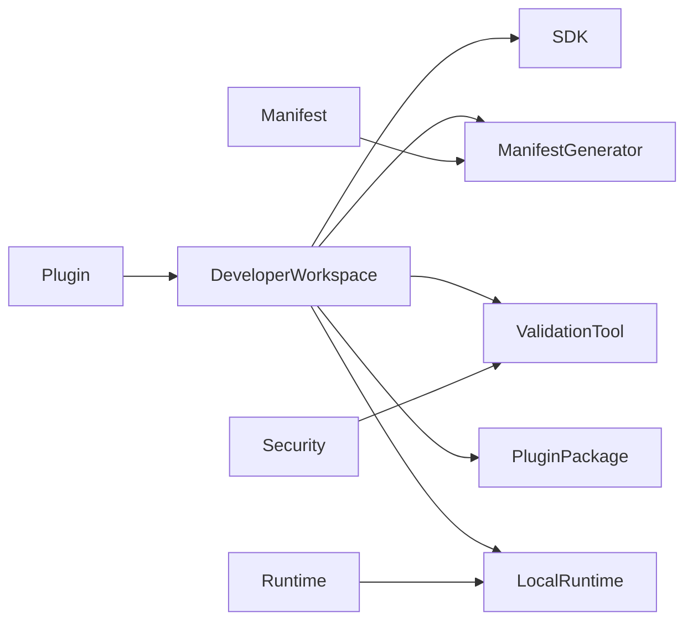

# DM-700 Developer Experience (DX) Domain

---

# Overview

The Developer Experience (DX) Domain defines the business capabilities that enable developers to create, validate, package, test and publish Plugins for the Metadata-Driven Secure Plugin Runtime.

The DX Domain provides a standardized development experience that ensures every Plugin complies with platform standards before deployment.

The objective of the DX Domain is to maximize developer productivity while maintaining platform consistency and security.

---

# Purpose

The Developer Experience Domain exists to:

- Simplify Plugin development.
- Standardize Plugin packaging.
- Validate Plugin metadata.
- Generate compliant Manifests.
- Support local testing.
- Improve developer productivity.
- Ensure platform compliance.

---

# Domain Scope

The Developer Experience Domain is responsible for:

- SDK management.
- Project templates.
- Plugin packaging.
- Manifest generation.
- Manifest validation.
- Local Runtime support.
- Development tooling.
- Testing utilities.
- Documentation generation.
- Developer CLI.

The Developer Experience Domain is not responsible for:

- Executing Plugins.
- Hosting Runtime.
- Managing production configuration.
- Enforcing runtime authorization.
- Monitoring production systems.

Those responsibilities belong to Runtime, Security and Observability.

---

# Business Concept

The Developer Experience Domain provides the official development workflow for Plugin authors.

Every Plugin should be created, validated and packaged using the platform development standards.

The DX Domain reduces development complexity while ensuring Runtime compatibility.

---

# Development Principles

## Convention over Configuration

Default project conventions should minimize manual configuration.

---

## Metadata First

Development tools generate metadata before executable artifacts.

---

## Validation Early

Validation should occur during development rather than deployment.

---

## Repeatable Builds

Plugin packages should be reproducible from source.

---

## Developer Productivity

Tooling should automate repetitive development tasks.

---

# Bounded Context

The Developer Experience Domain owns:

- SDK
- CLI
- Project Templates
- Packaging
- Manifest Generation
- Manifest Validation
- Local Runtime
- Testing Toolkit

---

# Aggregate

## Aggregate Root

Developer Workspace

The Developer Workspace Aggregate represents the environment used to develop Plugins.

---

# Entities

## SDK

Represents the official software development kit.

Responsibilities

- Provide development APIs.
- Define extension contracts.
- Support Plugin development.

---

## Plugin Package

Represents the deployable Plugin artifact.

Responsibilities

- Package binaries.
- Package Manifest.
- Package resources.

---

## Manifest Generator

Automatically generates Manifest metadata.

Responsibilities

- Generate metadata.
- Maintain metadata consistency.

---

## Validation Tool

Validates Plugin packages.

Responsibilities

- Validate Manifest.
- Validate dependencies.
- Validate signatures.

---

## Local Runtime

Represents a development Runtime.

Responsibilities

- Execute Plugins locally.
- Simulate production Runtime.
- Support debugging.

---

# Value Objects

| Value Object | Description |
|--------------|-------------|
| SDKVersion | SDK version |
| PackageVersion | Package version |
| TemplateVersion | Template version |
| BuildProfile | Build configuration |
| ValidationResult | Validation outcome |
| ToolVersion | Tool version |

All Value Objects are immutable.

---

# Relationships

| Related Domain | Relationship |
|----------------|-------------|
| Plugin Domain | Produces Plugins |
| Manifest Domain | Generates and validates Manifests |
| Runtime Domain | Provides Local Runtime |
| Security Domain | Validates signatures and security requirements |
| Administration Domain | Publishes approved packages |

The DX Domain prepares Plugins for deployment but never deploys them.

---

# Business Invariants

The following statements are always true.

- Every Plugin package contains one Manifest.
- Every Plugin package is versioned.
- Validation occurs before publication.
- SDK versions remain backward compatible within supported ranges.
- Package generation is deterministic.
- Local Runtime behavior shall remain consistent with production Runtime.

---

# Lifecycle

Developer workflow

```text
Create Project
      ↓
Implement Plugin
      ↓
Generate Manifest
      ↓
Validate
      ↓
Build
      ↓
Package
      ↓
Sign
      ↓
Publish
```

---

# Domain Events

Typical business events include:

- ProjectCreated
- ManifestGenerated
- ValidationCompleted
- ValidationFailed
- PackageBuilt
- PackageSigned
- PackagePublished

---

# Business Rules Mapping

| Business Rule | Description |
|---------------|-------------|
| BR-901 | SDK Usage |
| BR-902 | Manifest Generation |
| BR-903 | Package Validation |
| BR-904 | Package Signing |
| BR-905 | Plugin Packaging |
| BR-906 | Local Runtime |

---

# Domain Diagram



---

# Related Documents

- DM-000 Domain Overview
- DM-050 Shared Kernel
- DM-100 Plugin Domain
- DM-200 Manifest Domain
- DM-300 Runtime Domain
- DM-500 Security Domain
- DM-600 Administration Domain
- DM-800 Observability Domain
- FR-900 Developer Experience
- BR-900 Developer Experience
- UC-900 Developer Experience
