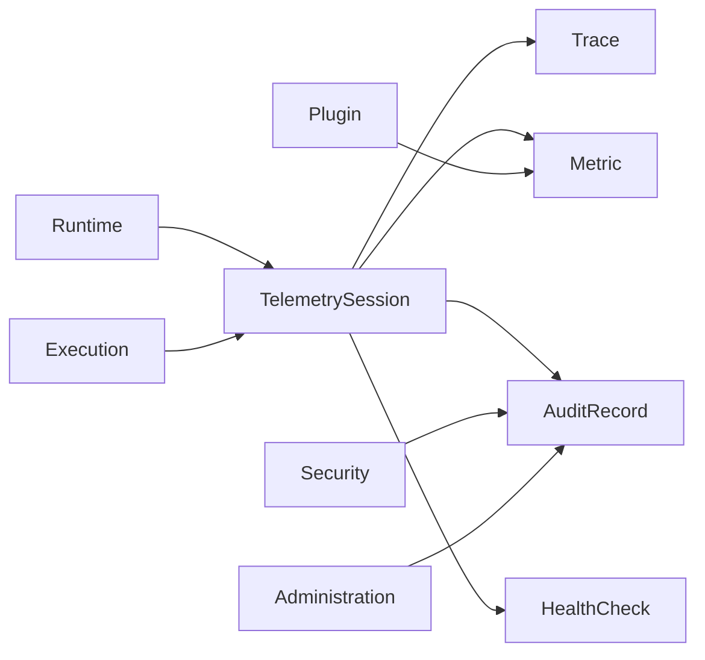

# DM-800 Observability Domain

---

# Overview

The Observability Domain defines the business capabilities required to observe, measure and diagnose the operational behavior of the Metadata-Driven Secure Plugin Runtime.

The Observability Domain provides comprehensive visibility into Runtime operations, Plugin execution and platform health through telemetry, metrics, logs, traces and audit events.

Observability enables operators to understand not only what happened, but also why it happened.

---

# Purpose

The Observability Domain exists to:

- Observe platform behavior.
- Measure system health.
- Diagnose operational issues.
- Trace business executions.
- Collect operational metrics.
- Record audit activities.
- Support performance optimization.
- Enable operational intelligence.

---

# Domain Scope

The Observability Domain is responsible for:

- Telemetry collection.
- Metrics collection.
- Distributed tracing.
- Structured logging.
- Audit event collection.
- Health monitoring.
- Alert generation.
- Operational reporting.

The Observability Domain is not responsible for:

- Executing Plugins.
- Authorizing requests.
- Managing platform configuration.
- Enforcing security policies.
- Hosting Runtime.

Those responsibilities belong to other domains.

---

# Business Concept

Observability provides a unified operational view of the platform.

Every significant business and technical event generated by the platform shall be observable.

Observability shall support both real-time monitoring and historical analysis.

---

# Observability Principles

## Telemetry First

Operational data shall be generated automatically.

---

## End-to-End Traceability

Every business request shall be traceable across all participating domains.

---

## Structured Data

Logs, metrics and events shall follow standardized schemas.

---

## Low Operational Impact

Telemetry collection shall minimize runtime overhead.

---

## Immutable Audit

Audit records shall never be modified after publication.

---

# Bounded Context

The Observability Domain owns:

- Telemetry
- Metrics
- Logging
- Tracing
- Audit
- Health Monitoring
- Alerting
- Reporting

---

# Aggregate

## Aggregate Root

Telemetry Session

The Telemetry Session Aggregate represents all observable information generated during one correlated business operation.

---

# Entities

## Telemetry Record

Represents operational telemetry.

Responsibilities

- Capture operational measurements.
- Associate telemetry with business execution.

---

## Trace

Represents an end-to-end execution flow.

Responsibilities

- Correlate distributed operations.
- Measure execution latency.

---

## Metric

Represents quantitative operational measurements.

Responsibilities

- Measure Runtime health.
- Measure Plugin behavior.
- Measure platform performance.

---

## Audit Record

Represents immutable operational evidence.

Responsibilities

- Record administrative activities.
- Record security activities.
- Record business operations.

---

## Health Check

Represents the operational status of a platform component.

Responsibilities

- Evaluate operational health.
- Publish health status.

---

# Value Objects

| Value Object | Description |
|--------------|-------------|
| TraceId | Distributed trace identifier |
| SpanId | Individual operation identifier |
| MetricName | Metric identifier |
| MetricValue | Measured value |
| LogLevel | Severity classification |
| HealthStatus | Current health state |
| AuditCategory | Audit classification |
| TelemetryTimestamp | Observation time |

All Value Objects are immutable.

---

# Relationships

| Related Domain | Relationship |
|----------------|-------------|
| Runtime Domain | Publishes Runtime telemetry |
| Execution Domain | Publishes execution traces |
| Security Domain | Publishes security audit events |
| Administration Domain | Publishes administrative audit events |
| Plugin Domain | Publishes Plugin operational metrics |

Observability consumes events from all domains but owns none of them.

---

# Business Invariants

The following statements are always true.

- Every Execution has one Trace Identifier.
- Every Trace belongs to one Correlation Identifier.
- Every Audit Record is immutable.
- Metrics shall be timestamped.
- Telemetry shall be correlated.
- Health information shall be continuously updated.
- Operational events shall be retained according to platform policy.

---

# Lifecycle

Telemetry lifecycle

```text
Generated
      ↓
Collected
      ↓
Processed
      ↓
Stored
      ↓
Analyzed
      ↓
Archived
```

Health lifecycle

```text
Unknown
      ↓
Healthy
      ↓
Degraded
      ↓
Unhealthy
      ↓
Recovered
```

---

# Domain Events

Typical business events include:

- TelemetryCollected
- MetricRecorded
- TraceStarted
- TraceCompleted
- AuditRecorded
- HealthChanged
- AlertGenerated
- AlertResolved

---

# Business Rules Mapping

| Business Rule | Description |
|---------------|-------------|
| BR-1001 | Telemetry Collection |
| BR-1002 | Distributed Tracing |
| BR-1003 | Metrics Collection |
| BR-1004 | Audit Recording |
| BR-1005 | Health Monitoring |
| BR-1006 | Alert Management |

---

# Domain Diagram



---

# Related Documents

- DM-000 Domain Overview
- DM-050 Shared Kernel
- DM-300 Runtime Domain
- DM-400 Execution Domain
- DM-500 Security Domain
- DM-600 Administration Domain
- DM-700 Developer Experience Domain
- DM-900 Domain Events
- FR-1000 Observability
- BR-1000 Observability
- UC-1000 Observability