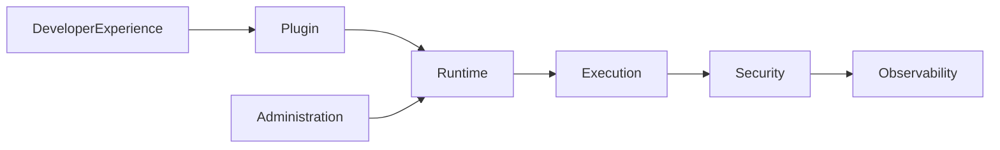

# DM-900 Domain Events

---

# Overview

The Domain Events document defines the canonical event model for the Metadata-Driven Secure Plugin Runtime.

A Domain Event represents an immutable business fact that has occurred within a bounded context.

Domain Events enable loose coupling, observability and asynchronous integration between platform domains.

Every event describes something that has already happened and cannot be changed.

---

# Purpose

The Domain Events model exists to:

- Standardize event publishing.
- Enable domain decoupling.
- Support event-driven architecture.
- Provide immutable business history.
- Enable distributed observability.
- Improve extensibility.
- Simplify system integration.

---

# Scope

This document defines:

- Event taxonomy
- Event naming conventions
- Event metadata
- Event ownership
- Event lifecycle
- Event publication rules
- Event versioning
- Event compatibility

This document does not define:

- Transport protocols
- Message brokers
- Event persistence
- Queue implementation

Those concerns belong to Infrastructure Architecture.

---

# Business Concept

A Domain Event represents a completed business fact.

Events are immutable.

Events cannot be updated.

Events cannot be deleted.

New business facts create new events.

---

# Event Characteristics

Every Domain Event shall be:

- Immutable
- Timestamped
- Versioned
- Correlated
- Traceable
- Serializable
- Observable

---

# Event Ownership

Each Domain owns the events describing its business facts.

| Domain | Owns Events |
|---------|-------------|
| Plugin | Plugin lifecycle |
| Manifest | Manifest lifecycle |
| Runtime | Runtime lifecycle |
| Execution | Execution lifecycle |
| Security | Security lifecycle |
| Administration | Administrative lifecycle |
| Developer Experience | Development lifecycle |
| Observability | Telemetry lifecycle |

---

# Event Taxonomy

## Plugin Events

- PluginCreated
- PluginPackaged
- PluginPublished
- PluginInstalled
- PluginValidated
- PluginActivated
- PluginSuspended
- PluginStopped
- PluginUnloaded
- PluginRetired

---

## Manifest Events

- ManifestCreated
- ManifestValidated
- ManifestSigned
- ManifestPublished
- ManifestInstalled
- ManifestVerified
- ManifestArchived

---

## Runtime Events

- RuntimeProvisioned
- RuntimeConfigured
- RuntimeStarted
- RuntimeReady
- RuntimeStopped
- RuntimeRecovered
- RuntimeRetired

---

## Execution Events

- ExecutionCreated
- ExecutionAccepted
- ExecutionAuthorized
- ExecutionScheduled
- ExecutionStarted
- ExecutionCompleted
- ExecutionFailed
- ExecutionCancelled
- ExecutionTimedOut

---

## Security Events

- IdentityAuthenticated
- AuthenticationFailed
- AuthorizationGranted
- AuthorizationDenied
- SignatureVerified
- SignatureRejected
- TrustEstablished
- TrustRevoked

---

## Administration Events

- ConfigurationCreated
- ConfigurationApplied
- PluginInstalled
- PluginRemoved
- MaintenanceScheduled
- MaintenanceCompleted

---

## Developer Experience Events

- ProjectCreated
- ManifestGenerated
- ValidationCompleted
- PackageBuilt
- PackageSigned
- PackagePublished

---

## Observability Events

- TraceStarted
- TraceCompleted
- MetricRecorded
- AuditRecorded
- HealthChanged
- AlertGenerated

---

# Standard Event Metadata

Every Domain Event shall include the following metadata.

| Metadata | Description |
|-----------|-------------|
| EventId | Unique event identifier |
| EventType | Event name |
| EventVersion | Event schema version |
| AggregateId | Business aggregate identifier |
| AggregateType | Aggregate name |
| CorrelationId | Cross-domain correlation |
| CausationId | Parent event identifier |
| Timestamp | Event occurrence time |
| Publisher | Publishing domain |
| SchemaVersion | Payload schema version |

---

# Event Naming Convention

Event names shall follow the pattern:

```
<Aggregate><PastTenseVerb>
```

Examples:

- PluginInstalled
- RuntimeStarted
- ExecutionCompleted
- SignatureVerified

Commands shall never be used as event names.

Incorrect:

- InstallPlugin
- ExecutePlugin
- VerifySignature

---

# Event Lifecycle

```text
Business Action
        │
        ▼
Business State Changes
        │
        ▼
Domain Event Created
        │
        ▼
Published
        │
        ▼
Consumed
        │
        ▼
Archived
```

---

# Event Versioning

Domain Events are immutable.

Breaking changes require:

- New Event Version

Old versions remain supported according to platform compatibility policy.

---

# Event Publication Rules

A Domain shall publish an event only when:

- Business state has changed.
- Transaction has completed successfully.
- Aggregate invariants remain valid.

Events shall never represent intentions.

Events represent completed facts only.

---

# Event Consumption Rules

Consumers:

- Shall not modify events.
- Shall tolerate unknown fields.
- Shall ignore unsupported event versions.
- Shall process duplicate events safely.
- Shall remain idempotent.

---

# Cross-Domain Event Flow



---

# Event Relationships

| Producer | Consumer |
|-----------|----------|
| Plugin | Runtime |
| Manifest | Runtime |
| Runtime | Execution |
| Execution | Observability |
| Security | Runtime |
| Administration | Runtime |
| Developer Experience | Plugin |
| Runtime | Observability |

---

# Business Rules Mapping

| Rule | Description |
|------|-------------|
| BR-1101 | Event Publication |
| BR-1102 | Event Versioning |
| BR-1103 | Event Compatibility |
| BR-1104 | Event Correlation |
| BR-1105 | Event Consumption |

---

# Related Documents

- DM-000 Domain Overview
- DM-100 Plugin Domain
- DM-200 Manifest Domain
- DM-300 Runtime Domain
- DM-400 Execution Domain
- DM-500 Security Domain
- DM-600 Administration Domain
- DM-700 Developer Experience Domain
- DM-800 Observability Domain