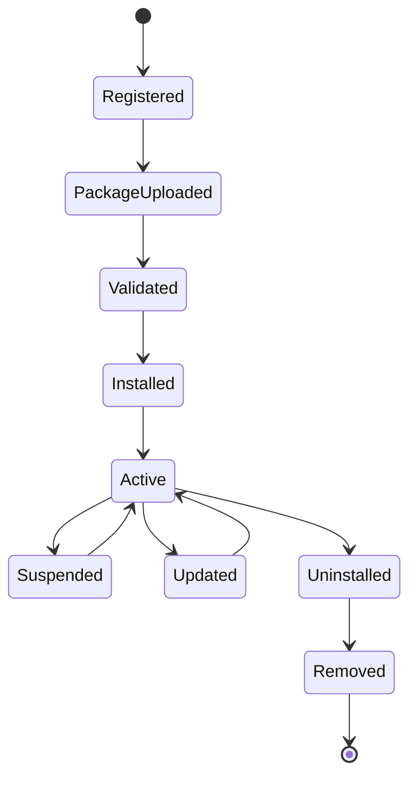

# UC-100 Plugin Lifecycle

## Overview

This document describes the use cases related to the complete lifecycle of a plugin within the Metadata-Driven Secure Plugin Runtime.

The plugin lifecycle begins when a plugin package is created and ends when the plugin is permanently removed from the Runtime.

These use cases ensure that every lifecycle operation complies with the platform's security, governance and operational requirements.

---

# Scope

This document applies to:

- Plugin Registration
- Plugin Upload
- Plugin Validation
- Plugin Installation
- Plugin Activation
- Plugin Suspension
- Plugin Resume
- Plugin Update
- Plugin Uninstallation
- Plugin Removal

---

# Actors

## Primary Actors

- Platform Administrator

## Supporting Actors

- Runtime
- Plugin Manager
- Manifest Validator
- Capability Resolver
- Signature Validator
- Audit Service
- Storage Provider

---

# UC-101 Register Plugin

## Goal

Register a new plugin in the Runtime catalog.

### Primary Actor

Platform Administrator

### Supporting Actors

- Runtime
- Plugin Manager

### Preconditions

- Administrator is authenticated.
- Administrator has Plugin Management permission.

### Trigger

Administrator selects **Register Plugin**.

### Main Flow

1. Administrator provides plugin metadata.
2. Runtime validates required information.
3. Runtime creates a plugin record.
4. Runtime assigns a unique Plugin Identifier.
5. Runtime stores plugin metadata.
6. Runtime writes an audit record.
7. Runtime returns success.

### Alternate Flow

A1. Plugin already registered.

Existing metadata is displayed.

### Exception Flow

E1. Invalid metadata.

E2. Duplicate plugin identifier.

E3. Storage unavailable.

### Postconditions

- Plugin registered.
- Plugin status is Registered.

### Related Functional Requirements

- FR-101
- FR-102

### Related Business Rules

- BR-201

### Related Non-Functional Requirements

- NFR-601
- NFR-801

---

# UC-102 Upload Plugin Package

## Goal

Upload a plugin package for validation and installation.

### Primary Actor

Platform Administrator

### Supporting Actors

- Runtime
- Storage Provider

### Preconditions

- Plugin registered.

### Trigger

Administrator uploads a plugin package.

### Main Flow

1. Administrator selects plugin package.
2. Runtime validates package format.
3. Runtime stores package.
4. Runtime calculates package hash.
5. Runtime records upload event.
6. Runtime returns success.

### Alternate Flow

A1. Package already uploaded.

### Exception Flow

E1. Invalid package.

E2. Upload interrupted.

E3. Storage quota exceeded.

### Postconditions

- Package stored.
- Package ready for validation.

### Related Functional Requirements

- FR-103
- FR-104

### Related Business Rules

- BR-202

### Related Non-Functional Requirements

- NFR-102
- NFR-803

---

# UC-103 Validate Plugin

## Goal

Validate the uploaded plugin before installation.

### Primary Actor

Platform Administrator

### Supporting Actors

- Runtime
- Manifest Validator
- Signature Validator
- Capability Resolver

### Preconditions

- Plugin package uploaded.

### Trigger

Administrator requests validation.

### Main Flow

1. Runtime validates manifest.
2. Runtime validates schema.
3. Runtime verifies signature.
4. Runtime validates capabilities.
5. Runtime resolves dependencies.
6. Runtime reports validation results.

### Alternate Flow

A1. Validation already completed.

### Exception Flow

E1. Invalid manifest.

E2. Invalid signature.

E3. Unsupported Runtime version.

E4. Missing dependency.

### Postconditions

- Plugin validation completed.

### Related Functional Requirements

- FR-205
- FR-305
- FR-405

### Related Business Rules

- BR-301
- BR-401
- BR-501

### Related Non-Functional Requirements

- NFR-103
- NFR-304
---

# UC-104 Install Plugin

## Goal

Install a validated plugin into the Runtime.

### Primary Actor

Platform Administrator

### Supporting Actors

- Runtime
- Plugin Manager
- Manifest Validator
- Signature Validator
- Capability Resolver
- Audit Service

### Preconditions

- Plugin registered.
- Plugin package uploaded.
- Plugin validation completed successfully.

### Trigger

Administrator selects **Install Plugin**.

### Main Flow

1. Administrator requests plugin installation.
2. Runtime verifies validation status.
3. Runtime verifies plugin signature.
4. Runtime resolves dependencies.
5. Runtime allocates installation resources.
6. Runtime installs the plugin.
7. Runtime updates plugin status.
8. Runtime records an audit event.
9. Runtime returns success.

### Alternate Flow

A1. Plugin is already installed.

A2. Required dependencies are already available.

### Exception Flow

E1. Validation failed.

E2. Dependency resolution failed.

E3. Installation storage unavailable.

E4. Installation aborted.

### Postconditions

- Plugin installed.
- Plugin status becomes **Installed**.
- Installation recorded in audit logs.

### Related Functional Requirements

- FR-105
- FR-205
- FR-504
- FR-505

### Related Business Rules

- BR-203
- BR-302
- BR-601

### Related Non-Functional Requirements

- NFR-102
- NFR-201
- NFR-501

---

# UC-105 Activate Plugin

## Goal

Activate an installed plugin and make it available for execution.

### Primary Actor

Platform Administrator

### Supporting Actors

- Runtime
- Plugin Manager
- Capability Resolver
- Audit Service

### Preconditions

- Plugin installed.
- Plugin enabled.
- Required dependencies available.

### Trigger

Administrator selects **Activate Plugin**.

### Main Flow

1. Administrator requests activation.
2. Runtime verifies plugin state.
3. Runtime verifies capabilities.
4. Runtime initializes plugin.
5. Runtime registers extension points.
6. Runtime changes plugin state to Active.
7. Runtime records activation.
8. Runtime returns success.

### Alternate Flow

A1. Plugin already active.

### Exception Flow

E1. Initialization failed.

E2. Capability validation failed.

E3. Runtime initialization failed.

### Postconditions

- Plugin available for execution.
- Runtime updated.

### Related Functional Requirements

- FR-106
- FR-305
- FR-506
- FR-602

### Related Business Rules

- BR-204
- BR-401
- BR-601

### Related Non-Functional Requirements

- NFR-101
- NFR-202
- NFR-501

---

# UC-106 Suspend Plugin

## Goal

Temporarily suspend an active plugin.

### Primary Actor

Platform Administrator

### Supporting Actors

- Runtime
- Plugin Manager
- Audit Service

### Preconditions

- Plugin is active.

### Trigger

Administrator selects **Suspend Plugin**.

### Main Flow

1. Administrator requests suspension.
2. Runtime verifies plugin state.
3. Runtime blocks new executions.
4. Runtime waits for active executions to complete or terminate according to policy.
5. Runtime changes plugin status to Suspended.
6. Runtime records audit information.
7. Runtime returns success.

### Alternate Flow

A1. No active executions exist.

### Exception Flow

E1. Plugin not active.

E2. Suspension timeout exceeded.

E3. Runtime failure.

### Postconditions

- Plugin suspended.
- New executions prevented.

### Related Functional Requirements

- FR-107
- FR-606

### Related Business Rules

- BR-205
- BR-603

### Related Non-Functional Requirements

- NFR-202
- NFR-502
---

# UC-107 Resume Plugin

## Goal

Resume a suspended plugin and restore it to operational status.

### Primary Actor

Platform Administrator

### Supporting Actors

- Runtime
- Plugin Manager
- Capability Resolver
- Audit Service

### Preconditions

- Plugin status is Suspended.
- Runtime is operational.

### Trigger

Administrator selects **Resume Plugin**.

### Main Flow

1. Administrator requests plugin resume.
2. Runtime verifies plugin state.
3. Runtime validates plugin capabilities.
4. Runtime restores plugin execution context.
5. Runtime changes plugin status to Active.
6. Runtime records audit information.
7. Runtime returns success.

### Alternate Flow

A1. Plugin already active.

### Exception Flow

E1. Plugin initialization fails.

E2. Capability validation fails.

E3. Runtime recovery fails.

### Postconditions

- Plugin status becomes Active.
- Plugin accepts new execution requests.

### Related Functional Requirements

- FR-108
- FR-506
- FR-602

### Related Business Rules

- BR-206
- BR-603

### Related Non-Functional Requirements

- NFR-202
- NFR-501

---

# UC-108 Update Plugin

## Goal

Replace an installed plugin with a newer compatible version.

### Primary Actor

Platform Administrator

### Supporting Actors

- Runtime
- Plugin Manager
- Manifest Validator
- Signature Validator
- Audit Service

### Preconditions

- Plugin installed.
- New plugin package uploaded.
- Update package validated.

### Trigger

Administrator selects **Update Plugin**.

### Main Flow

1. Administrator selects updated package.
2. Runtime validates compatibility.
3. Runtime validates manifest.
4. Runtime verifies signature.
5. Runtime preserves configuration.
6. Runtime installs updated version.
7. Runtime updates plugin metadata.
8. Runtime records audit event.
9. Runtime returns success.

### Alternate Flow

A1. No configuration migration required.

### Exception Flow

E1. Version incompatible.

E2. Signature verification fails.

E3. Update fails.

E4. Rollback initiated.

### Postconditions

- Plugin updated.
- Previous version archived or removed according to policy.
- Audit record created.

### Related Functional Requirements

- FR-109
- FR-223
- FR-507

### Related Business Rules

- BR-207
- BR-302
- BR-601

### Related Non-Functional Requirements

- NFR-608
- NFR-702

---

# UC-109 Uninstall Plugin

## Goal

Remove an installed plugin from the Runtime while preserving historical records.

### Primary Actor

Platform Administrator

### Supporting Actors

- Runtime
- Plugin Manager
- Audit Service

### Preconditions

- Plugin installed.
- Plugin not executing.

### Trigger

Administrator selects **Uninstall Plugin**.

### Main Flow

1. Administrator requests uninstall.
2. Runtime verifies plugin state.
3. Runtime unregisters extension points.
4. Runtime unloads assemblies.
5. Runtime removes runtime configuration.
6. Runtime changes plugin status to Uninstalled.
7. Runtime records audit information.
8. Runtime returns success.

### Alternate Flow

A1. Plugin already uninstalled.

### Exception Flow

E1. Active execution detected.

E2. Resource cleanup fails.

E3. Runtime error occurs.

### Postconditions

- Plugin removed from Runtime.
- Historical records retained.

### Related Functional Requirements

- FR-110
- FR-505
- FR-508

### Related Business Rules

- BR-208
- BR-602

### Related Non-Functional Requirements

- NFR-201
- NFR-606

---

# UC-110 Remove Plugin

## Goal

Permanently remove a plugin and all associated artifacts from the platform.

### Primary Actor

Platform Administrator

### Supporting Actors

- Runtime
- Plugin Manager
- Storage Provider
- Audit Service

### Preconditions

- Plugin uninstalled.

### Trigger

Administrator selects **Remove Plugin**.

### Main Flow

1. Administrator confirms removal.
2. Runtime verifies removal policy.
3. Runtime removes plugin metadata.
4. Runtime deletes stored packages.
5. Runtime releases allocated resources.
6. Runtime records audit information.
7. Runtime returns success.

### Alternate Flow

A1. Retention policy requires package archival.

### Exception Flow

E1. Plugin still installed.

E2. Storage deletion fails.

E3. Removal policy violation.

### Postconditions

- Plugin permanently removed.
- Runtime catalog updated.
- Audit history retained.

### Related Functional Requirements

- FR-111
- FR-509

### Related Business Rules

- BR-209
- BR-602

### Related Non-Functional Requirements

- NFR-804
- NFR-801

---

# Plugin Lifecycle State

---

# Summary

| Use Case | Description |
|-----------|-------------|
| UC-101 | Register Plugin |
| UC-102 | Upload Plugin Package |
| UC-103 | Validate Plugin |
| UC-104 | Install Plugin |
| UC-105 | Activate Plugin |
| UC-106 | Suspend Plugin |
| UC-107 | Resume Plugin |
| UC-108 | Update Plugin |
| UC-109 | Uninstall Plugin |
| UC-110 | Remove Plugin |

---

# Related Documents

- FR-100 Plugin Lifecycle
- BR-200 Plugin Lifecycle
- NFR-100 Performance
- NFR-200 Reliability
- NFR-500 Availability