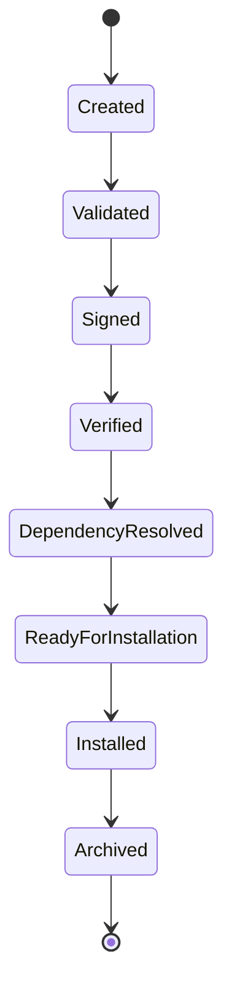

# UC-200 Manifest

## Overview

This document describes the use cases related to plugin manifests within the Metadata-Driven Secure Plugin Runtime.

The manifest is the authoritative metadata contract between a plugin and the Runtime. It defines plugin identity, versioning, capabilities, dependencies, compatibility and security metadata.

Every plugin package shall contain exactly one valid manifest before it can be installed or executed.

---

# Scope

This document applies to:

- Manifest Creation
- Manifest Validation
- Manifest Signing
- Manifest Verification
- Dependency Resolution
- Manifest Schema Upgrade

---

# Actors

## Primary Actors

- Plugin Developer
- Platform Administrator

## Supporting Actors

- Runtime
- Manifest Validator
- Signature Validator
- Capability Resolver
- Plugin Manager

---

# UC-201 Create Manifest

## Goal

Create a valid manifest describing a plugin.

### Primary Actor

Plugin Developer

### Supporting Actors

- SDK

### Preconditions

- Plugin project created.

### Trigger

Developer creates a new manifest.

### Main Flow

1. Developer creates a manifest.
2. SDK generates required metadata.
3. Developer defines plugin identity.
4. Developer defines version.
5. Developer defines dependencies.
6. Developer declares capabilities.
7. SDK validates mandatory fields.
8. Manifest saved.

### Alternate Flow

A1. Manifest generated from template.

### Exception Flow

E1. Missing required metadata.

E2. Invalid manifest structure.

E3. Unsupported schema version.

### Postconditions

- Manifest created.

### Related Functional Requirements

- FR-201
- FR-202
- FR-203

### Related Business Rules

- BR-301

### Related Non-Functional Requirements

- NFR-607
- NFR-702

---

# UC-202 Validate Manifest

## Goal

Validate a manifest before installation.

### Primary Actor

Platform Administrator

### Supporting Actors

- Manifest Validator

### Preconditions

- Manifest exists.

### Trigger

Runtime receives validation request.

### Main Flow

1. Runtime loads manifest.
2. Runtime validates schema.
3. Runtime validates required fields.
4. Runtime validates capabilities.
5. Runtime validates dependencies.
6. Runtime reports validation results.

### Alternate Flow

A1. Cached validation available.

### Exception Flow

E1. Invalid schema.

E2. Missing fields.

E3. Invalid capability declaration.

### Postconditions

- Validation completed.

### Related Functional Requirements

- FR-205
- FR-206
- FR-207

### Related Business Rules

- BR-302

### Related Non-Functional Requirements

- NFR-103
- NFR-605

---

# UC-203 Sign Manifest

## Goal

Digitally sign a manifest.

### Primary Actor

Plugin Developer

### Supporting Actors

- SDK
- Certificate Provider

### Preconditions

- Manifest validated.
- Signing certificate available.

### Trigger

Developer requests signing.

### Main Flow

1. SDK hashes manifest.
2. SDK signs hash.
3. SDK embeds signature.
4. SDK records signing metadata.
5. Signed manifest generated.

### Alternate Flow

A1. Hardware security module used.

### Exception Flow

E1. Certificate unavailable.

E2. Signing failure.

E3. Unsupported algorithm.

### Postconditions

- Manifest signed.

### Related Functional Requirements

- FR-208
- FR-405

### Related Business Rules

- BR-303
- BR-501

### Related Non-Functional Requirements

- NFR-303
- NFR-304
---

# UC-204 Verify Manifest

## Goal

Verify the integrity, authenticity and trustworthiness of a signed manifest before plugin installation.

### Primary Actor

Platform Administrator

### Supporting Actors

- Runtime
- Signature Validator
- Certificate Provider

### Preconditions

- Signed manifest available.
- Trusted certificate chain configured.

### Trigger

Runtime starts manifest verification.

### Main Flow

1. Runtime loads the manifest.
2. Runtime extracts the digital signature.
3. Runtime validates the certificate chain.
4. Runtime verifies signature integrity.
5. Runtime checks certificate validity period.
6. Runtime confirms the manifest has not been modified.
7. Runtime records verification results.
8. Runtime returns success.

### Alternate Flow

A1. Certificate retrieved from trusted cache.

### Exception Flow

E1. Signature verification failed.

E2. Certificate expired.

E3. Certificate revoked.

E4. Trusted issuer not found.

### Postconditions

- Manifest authenticity verified.
- Verification status recorded.

### Related Functional Requirements

- FR-209
- FR-405
- FR-406

### Related Business Rules

- BR-304
- BR-501

### Related Non-Functional Requirements

- NFR-303
- NFR-802

---

# UC-205 Resolve Dependencies

## Goal

Resolve all plugin dependencies defined in the manifest.

### Primary Actor

Platform Administrator

### Supporting Actors

- Runtime
- Dependency Resolver
- Plugin Repository

### Preconditions

- Manifest validated.

### Trigger

Plugin installation begins.

### Main Flow

1. Runtime reads dependency definitions.
2. Runtime checks installed plugins.
3. Runtime validates version constraints.
4. Runtime detects dependency conflicts.
5. Runtime determines installation order.
6. Runtime reports dependency status.

### Alternate Flow

A1. All dependencies already satisfied.

### Exception Flow

E1. Missing dependency.

E2. Version conflict.

E3. Circular dependency detected.

E4. Unsupported dependency.

### Postconditions

- Dependency graph resolved.
- Installation prerequisites determined.

### Related Functional Requirements

- FR-210
- FR-211
- FR-307

### Related Business Rules

- BR-305
- BR-601

### Related Non-Functional Requirements

- NFR-203
- NFR-706

---

# UC-206 Upgrade Manifest Schema

## Goal

Upgrade an existing manifest to a newer supported schema version.

### Primary Actor

Plugin Developer

### Supporting Actors

- SDK
- Manifest Migration Service

### Preconditions

- Existing manifest available.

### Trigger

Developer requests schema upgrade.

### Main Flow

1. SDK identifies current schema version.
2. SDK selects migration path.
3. SDK migrates manifest structure.
4. SDK validates migrated manifest.
5. SDK updates schema version.
6. SDK generates migration report.
7. Updated manifest saved.

### Alternate Flow

A1. Manifest already uses latest schema.

### Exception Flow

E1. Migration rule unavailable.

E2. Migration validation failed.

E3. Unsupported schema version.

### Postconditions

- Manifest upgraded.
- Schema version updated.

### Related Functional Requirements

- FR-223
- FR-224

### Related Business Rules

- BR-306

### Related Non-Functional Requirements

- NFR-702
- NFR-608

---

# Manifest Lifecycle

---

# Summary

| Use Case | Description |
|-----------|-------------|
| UC-201 | Create Manifest |
| UC-202 | Validate Manifest |
| UC-203 | Sign Manifest |
| UC-204 | Verify Manifest |
| UC-205 | Resolve Dependencies |
| UC-206 | Upgrade Manifest Schema |

---

# Related Documents

- FR-200 Manifest
- BR-300 Manifest
- NFR-300 Security
- NFR-700 Compatibility
- UC-100 Plugin Lifecycle