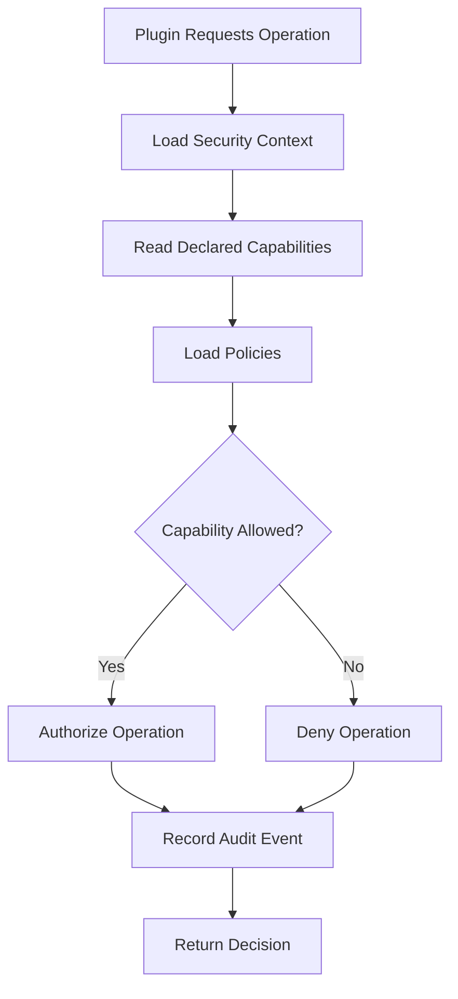

# UC-300 Capability

## Overview

This document describes the use cases related to the capability model of the Metadata-Driven Secure Plugin Runtime.

Capabilities define the operations that a plugin is permitted to perform. Every capability request shall be explicitly declared, validated and enforced by the Runtime before execution.

The capability model follows the Principle of Least Privilege and supports fine-grained authorization.

---

# Scope

This document applies to:

- Capability Declaration
- Capability Validation
- Capability Grant
- Capability Revocation
- Capability Evaluation
- Capability Audit

---

# Actors

## Primary Actors

- Plugin Developer
- Platform Administrator

## Supporting Actors

- Runtime
- Capability Manager
- Policy Engine
- Audit Service

---

# UC-301 Declare Capability

## Goal

Declare the capabilities required by a plugin.

### Primary Actor

Plugin Developer

### Supporting Actors

- SDK

### Preconditions

- Plugin project created.
- Manifest available.

### Business Rules Applied

- BR-401 Capability Declaration
- BR-402 Least Privilege

### Trigger

Developer edits the plugin manifest.

### Main Flow

1. Developer selects required capabilities.
2. SDK validates capability identifiers.
3. SDK checks duplicate declarations.
4. SDK updates the manifest.
5. SDK validates the manifest.
6. Manifest saved successfully.

### Alternate Flow

A1. Capability template imported.

### Exception Flow

E1. Unknown capability.

E2. Duplicate capability.

E3. Invalid capability scope.

### Postconditions

- Capability declarations stored in the manifest.

### Related Functional Requirements

- FR-301
- FR-302

### Related Business Rules

- BR-401
- BR-402

### Related Non-Functional Requirements

- NFR-303
- NFR-607

---

# UC-302 Validate Capability

## Goal

Validate capability declarations before plugin installation.

### Primary Actor

Platform Administrator

### Supporting Actors

- Runtime
- Capability Manager
- Policy Engine

### Preconditions

- Manifest validated.
- Capability declarations available.

### Business Rules Applied

- BR-403 Capability Validation
- BR-404 Capability Scope

### Trigger

Runtime starts plugin validation.

### Main Flow

1. Runtime loads capability declarations.
2. Runtime validates capability identifiers.
3. Runtime verifies capability scope.
4. Runtime evaluates security policy.
5. Runtime reports validation results.

### Alternate Flow

A1. Capability validation retrieved from cache.

### Exception Flow

E1. Unknown capability.

E2. Policy violation.

E3. Unsupported capability.

### Postconditions

- Capability validation completed.

### Related Functional Requirements

- FR-303
- FR-304
- FR-305

### Related Business Rules

- BR-403
- BR-404

### Related Non-Functional Requirements

- NFR-303
- NFR-605

---

# UC-303 Grant Capability

## Goal

Grant approved capabilities to an installed plugin.

### Primary Actor

Platform Administrator

### Supporting Actors

- Runtime
- Capability Manager
- Policy Engine

### Preconditions

- Plugin installed.
- Capability validation completed.

### Business Rules Applied

- BR-405 Capability Approval
- BR-406 Capability Assignment

### Trigger

Administrator approves plugin activation.

### Main Flow

1. Runtime loads approved capabilities.
2. Runtime evaluates security policy.
3. Runtime assigns capabilities.
4. Runtime updates plugin security context.
5. Runtime records audit information.
6. Runtime returns success.

### Alternate Flow

A1. Capabilities already assigned.

### Exception Flow

E1. Policy evaluation failed.

E2. Capability assignment failed.

E3. Runtime initialization failed.

### Postconditions

- Plugin security context updated.
- Approved capabilities activated.

### Related Functional Requirements

- FR-306
- FR-307
- FR-308

### Related Business Rules

- BR-405
- BR-406

### Related Non-Functional Requirements

- NFR-303
- NFR-501
---

# UC-304 Revoke Capability

## Goal

Revoke one or more capabilities previously granted to a plugin.

### Primary Actor

Platform Administrator

### Supporting Actors

- Runtime
- Capability Manager
- Policy Engine
- Audit Service

### Preconditions

- Plugin installed.
- Plugin has active capabilities.

### Business Rules Applied

- BR-407 Capability Revocation
- BR-408 Least Privilege Enforcement

### Trigger

Administrator requests capability revocation.

### Main Flow

1. Administrator selects capabilities to revoke.
2. Runtime validates the request.
3. Policy Engine verifies revocation policy.
4. Runtime removes selected capabilities.
5. Runtime updates the plugin security context.
6. Runtime records an audit event.
7. Runtime returns success.

### Alternate Flow

A1. Capability already revoked.

### Exception Flow

E1. Capability not assigned.

E2. Plugin currently executing a restricted operation.

E3. Runtime update fails.

### Postconditions

- Selected capabilities revoked.
- Security context updated.
- Audit record created.

### Related Functional Requirements

- FR-309
- FR-310

### Related Business Rules

- BR-407
- BR-408

### Related Non-Functional Requirements

- NFR-303
- NFR-501

---

# UC-305 Evaluate Capability

## Goal

Evaluate whether a plugin is authorized to perform a requested operation.

### Primary Actor

Runtime

### Supporting Actors

- Capability Manager
- Policy Engine

### Preconditions

- Plugin active.
- Execution request received.

### Business Rules Applied

- BR-409 Capability Evaluation
- BR-410 Authorization Decision

### Trigger

Plugin requests a protected operation.

### Main Flow

1. Runtime identifies the requested operation.
2. Runtime retrieves the plugin security context.
3. Runtime loads applicable policies.
4. Policy Engine evaluates the request.
5. Runtime determines the authorization decision.
6. Runtime either allows or denies execution.
7. Runtime records the decision.

### Alternate Flow

A1. Cached authorization decision available.

### Exception Flow

E1. Security context unavailable.

E2. Policy evaluation failed.

E3. Required capability missing.

### Postconditions

- Authorization decision completed.
- Decision recorded for auditing.

### Related Functional Requirements

- FR-311
- FR-312
- FR-313

### Related Business Rules

- BR-409
- BR-410

### Related Non-Functional Requirements

- NFR-101
- NFR-303
- NFR-606

---

# UC-306 Audit Capability

## Goal

Record and review capability-related security events.

### Primary Actor

Security Administrator

### Supporting Actors

- Runtime
- Audit Service

### Preconditions

- Audit logging enabled.

### Business Rules Applied

- BR-411 Audit Logging
- BR-412 Security Monitoring

### Trigger

Capability-related event occurs.

### Main Flow

1. Runtime detects a capability event.
2. Runtime collects event metadata.
3. Runtime records the audit event.
4. Runtime classifies event severity.
5. Security Administrator reviews audit records.
6. Administrator exports audit report if required.

### Alternate Flow

A1. Event forwarded to external SIEM.

### Exception Flow

E1. Audit storage unavailable.

E2. Audit write failure.

E3. Export operation failed.

### Postconditions

- Capability event recorded.
- Audit history preserved.

### Related Functional Requirements

- FR-314
- FR-315
- FR-316

### Related Business Rules

- BR-411
- BR-412

### Related Non-Functional Requirements

- NFR-802
- NFR-804

---

# Capability Authorization Flow

---

# Summary

| Use Case | Description |
|-----------|-------------|
| UC-301 | Declare Capability |
| UC-302 | Validate Capability |
| UC-303 | Grant Capability |
| UC-304 | Revoke Capability |
| UC-305 | Evaluate Capability |
| UC-306 | Audit Capability |

---

# Related Documents

- FR-300 Capability
- BR-400 Capability
- NFR-300 Security
- NFR-800 Compliance
- UC-200 Manifest
- UC-600 Execution