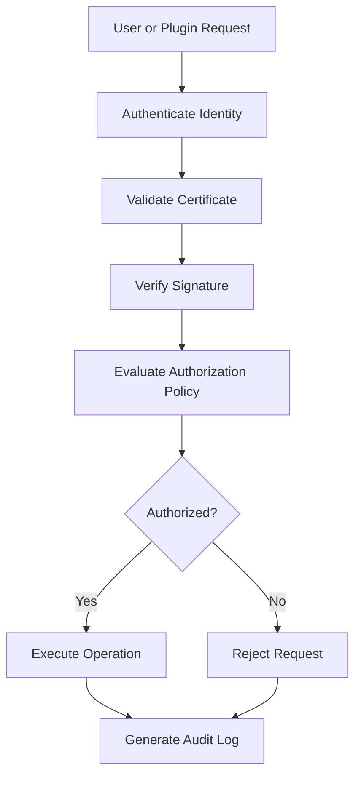

# UC-400 Security

## Overview

This document describes the security-related use cases for the Metadata-Driven Secure Plugin Runtime.

The Runtime follows a Zero-Trust security model where every identity, plugin, request and operation must be authenticated, authorized and validated before execution.

No component is implicitly trusted.

---

# Scope

This document applies to:

- Authentication
- Authorization
- Signature Verification
- Secret Management
- Certificate Validation
- Secret Rotation
- Certificate Revocation

---

# Actors

## Primary Actors

- Platform Administrator
- Security Administrator
- Plugin

## Supporting Actors

- Runtime
- Identity Provider
- Policy Engine
- Certificate Authority
- Secret Store
- Audit Service

---

# UC-401 Authenticate User

## Goal

Authenticate an administrator before allowing access to Runtime resources.

### Primary Actor

Platform Administrator

### Supporting Actors

- Identity Provider
- Runtime

### Preconditions

- Administrator account exists.
- Identity Provider available.

### Business Rules Applied

- BR-501 Authentication
- BR-502 Identity Verification

### Trigger

Administrator signs in.

### Main Flow

1. Administrator submits credentials.
2. Runtime forwards authentication request.
3. Identity Provider validates credentials.
4. Runtime establishes authenticated session.
5. Runtime records authentication event.
6. Access granted.

### Alternate Flow

A1. Existing authenticated session reused.

### Exception Flow

E1. Invalid credentials.

E2. Identity Provider unavailable.

E3. Account locked.

### Postconditions

- Authenticated session established.

### Related Functional Requirements

- FR-401
- FR-402

### Related Business Rules

- BR-501
- BR-502

### Related Non-Functional Requirements

- NFR-301
- NFR-302

---

# UC-402 Authorize Request

## Goal

Determine whether an authenticated identity is authorized to perform a requested operation.

### Primary Actor

Plugin

### Supporting Actors

- Runtime
- Policy Engine

### Preconditions

- Identity authenticated.

### Business Rules Applied

- BR-503 Authorization
- BR-504 Least Privilege

### Trigger

Protected operation requested.

### Main Flow

1. Runtime identifies requested operation.
2. Runtime loads security context.
3. Policy Engine evaluates permissions.
4. Runtime determines authorization decision.
5. Runtime records authorization event.
6. Runtime returns decision.

### Alternate Flow

A1. Cached authorization decision available.

### Exception Flow

E1. Authorization denied.

E2. Security policy unavailable.

E3. Invalid security context.

### Postconditions

- Authorization decision completed.

### Related Functional Requirements

- FR-403
- FR-404

### Related Business Rules

- BR-503
- BR-504

### Related Non-Functional Requirements

- NFR-303
- NFR-802

---

# UC-403 Verify Signature

## Goal

Verify the integrity and authenticity of a signed plugin package.

### Primary Actor

Platform Administrator

### Supporting Actors

- Runtime
- Signature Validator
- Certificate Authority

### Preconditions

- Signed package uploaded.

### Business Rules Applied

- BR-505 Digital Signature
- BR-506 Trust Chain

### Trigger

Plugin validation starts.

### Main Flow

1. Runtime extracts signature.
2. Runtime validates certificate.
3. Runtime verifies trust chain.
4. Runtime verifies package hash.
5. Runtime confirms package integrity.
6. Runtime records verification results.

### Alternate Flow

A1. Trusted certificate retrieved from cache.

### Exception Flow

E1. Signature mismatch.

E2. Certificate expired.

E3. Certificate revoked.

E4. Trusted issuer unavailable.

### Postconditions

- Package authenticity confirmed.

### Related Functional Requirements

- FR-405
- FR-406
- FR-407

### Related Business Rules

- BR-505
- BR-506

### Related Non-Functional Requirements

- NFR-303
- NFR-802
---

# UC-404 Encrypt Secret

## Goal

Encrypt and securely store sensitive secrets used by the Runtime and plugins.

### Primary Actor

Platform Administrator

### Supporting Actors

- Runtime
- Secret Store
- Key Management Service (KMS)

### Preconditions

- Secret value available.
- Encryption key accessible.

### Business Rules Applied

- BR-507 Secret Protection
- BR-508 Encryption Policy

### Trigger

Administrator creates or updates a secret.

### Main Flow

1. Administrator submits the secret.
2. Runtime requests an encryption key.
3. Runtime encrypts the secret.
4. Runtime stores the encrypted secret.
5. Runtime records an audit event.
6. Runtime returns success.

### Alternate Flow

A1. Existing secret replaced.

### Exception Flow

E1. Encryption key unavailable.

E2. Encryption failed.

E3. Secret Store unavailable.

### Postconditions

- Secret securely stored.
- Plain-text secret discarded.

### Related Functional Requirements

- FR-408
- FR-409

### Related Business Rules

- BR-507
- BR-508

### Related Non-Functional Requirements

- NFR-303
- NFR-803

---

# UC-405 Validate Certificate

## Goal

Validate certificates used to establish trust between plugins and the Runtime.

### Primary Actor

Platform Administrator

### Supporting Actors

- Runtime
- Certificate Authority

### Preconditions

- Certificate available.

### Business Rules Applied

- BR-509 Certificate Validation
- BR-510 Trust Chain Validation

### Trigger

Runtime receives a signed request.

### Main Flow

1. Runtime loads the certificate.
2. Runtime validates certificate format.
3. Runtime validates the trust chain.
4. Runtime verifies validity period.
5. Runtime checks revocation status.
6. Runtime accepts or rejects the certificate.
7. Runtime records the validation result.

### Alternate Flow

A1. Certificate retrieved from trusted cache.

### Exception Flow

E1. Certificate expired.

E2. Certificate revoked.

E3. Unknown issuer.

E4. Invalid certificate.

### Postconditions

- Certificate validation completed.

### Related Functional Requirements

- FR-410
- FR-411

### Related Business Rules

- BR-509
- BR-510

### Related Non-Functional Requirements

- NFR-303
- NFR-802

---

# UC-406 Rotate Secret

## Goal

Rotate encryption keys or application secrets without interrupting Runtime operations.

### Primary Actor

Security Administrator

### Supporting Actors

- Runtime
- Secret Store
- Key Management Service

### Preconditions

- Existing secret available.

### Business Rules Applied

- BR-511 Secret Rotation
- BR-512 Key Lifecycle

### Trigger

Administrator initiates secret rotation.

### Main Flow

1. Administrator requests secret rotation.
2. Runtime generates or retrieves a new secret.
3. Runtime securely updates dependent services.
4. Runtime verifies successful propagation.
5. Runtime retires the previous secret according to policy.
6. Runtime records an audit event.
7. Runtime returns success.

### Alternate Flow

A1. Automatic rotation executed according to policy.

### Exception Flow

E1. Secret generation failed.

E2. Service update failed.

E3. Validation failed.

### Postconditions

- New secret activated.
- Previous secret retired.

### Related Functional Requirements

- FR-412
- FR-413

### Related Business Rules

- BR-511
- BR-512

### Related Non-Functional Requirements

- NFR-303
- NFR-501

---

# UC-407 Revoke Certificate

## Goal

Revoke a certificate that is no longer trusted.

### Primary Actor

Security Administrator

### Supporting Actors

- Runtime
- Certificate Authority
- Audit Service

### Preconditions

- Certificate exists.

### Business Rules Applied

- BR-513 Certificate Revocation
- BR-514 Trust Revocation

### Trigger

Administrator revokes a certificate.

### Main Flow

1. Administrator selects a certificate.
2. Runtime validates the revocation request.
3. Runtime updates trust configuration.
4. Runtime rejects future requests using the revoked certificate.
5. Runtime records an audit event.
6. Runtime returns success.

### Alternate Flow

A1. Certificate already revoked.

### Exception Flow

E1. Certificate not found.

E2. Revocation service unavailable.

E3. Audit logging failure.

### Postconditions

- Certificate revoked.
- Trust configuration updated.

### Related Functional Requirements

- FR-414
- FR-415

### Related Business Rules

- BR-513
- BR-514

### Related Non-Functional Requirements

- NFR-303
- NFR-802

---

# Zero Trust Authentication Flow

---

# Summary

| Use Case | Description |
|-----------|-------------|
| UC-401 | Authenticate User |
| UC-402 | Authorize Request |
| UC-403 | Verify Signature |
| UC-404 | Encrypt Secret |
| UC-405 | Validate Certificate |
| UC-406 | Rotate Secret |
| UC-407 | Revoke Certificate |

---

# Related Documents

- FR-400 Security
- BR-500 Security
- NFR-300 Security
- NFR-800 Compliance
- UC-200 Manifest
- UC-300 Capability