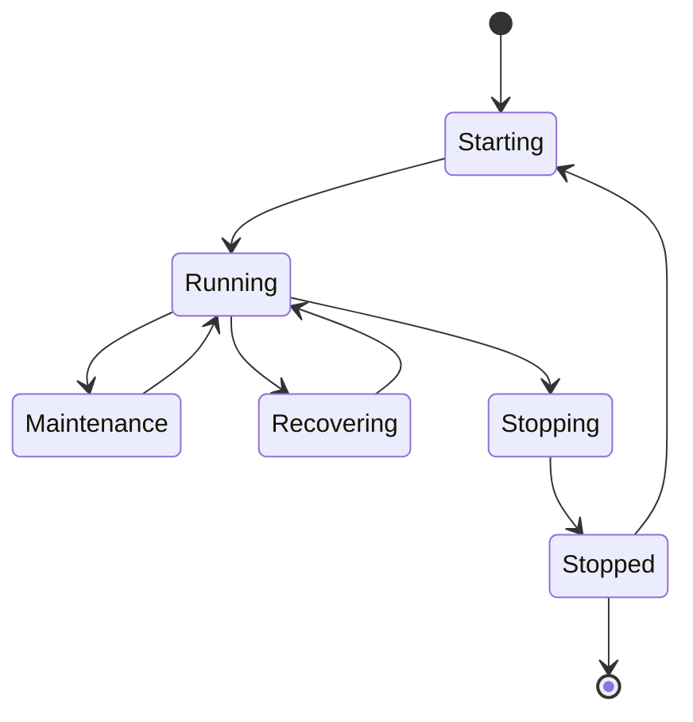
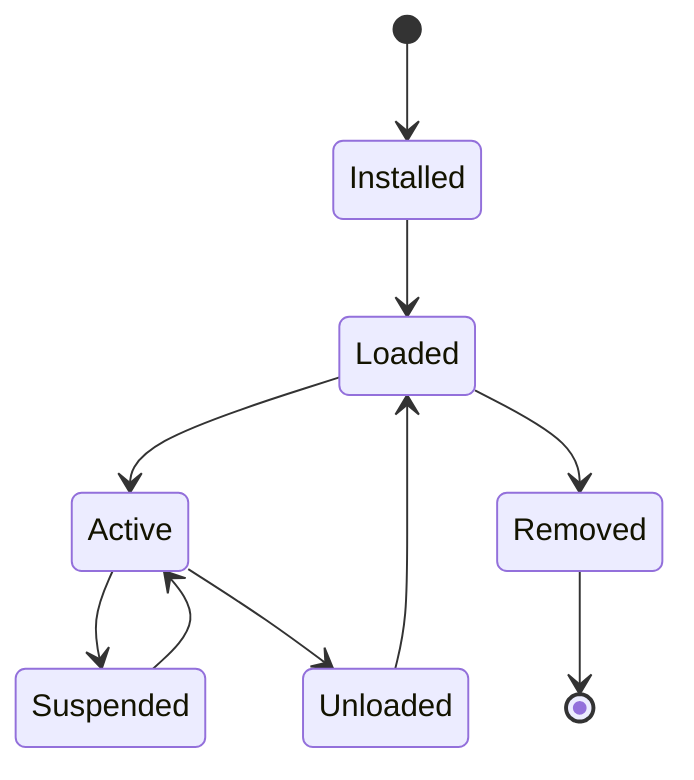

# UC-500 Runtime

## Overview

This document describes the Runtime operation use cases of the Metadata-Driven Secure Plugin Runtime.

The Runtime is responsible for managing plugin execution, lifecycle, resource allocation, dependency resolution, service registration and recovery.

It acts as the trusted execution environment for all plugins while enforcing platform security, governance and operational policies.

---

# Scope

This document applies to:

- Runtime Startup
- Runtime Shutdown
- Runtime Restart
- Plugin Loading
- Plugin Unloading
- Runtime Recovery
- Runtime Configuration

---

# Actors

## Primary Actors

- Platform Administrator

## Supporting Actors

- Runtime
- Plugin Manager
- Configuration Provider
- Capability Manager
- Audit Service
- Storage Provider

---

# UC-501 Start Runtime

## Goal

Start the Runtime and initialize all core services.

### Primary Actor

Platform Administrator

### Supporting Actors

- Runtime
- Configuration Provider

### Preconditions

- Runtime installed.
- Configuration available.

### Business Rules Applied

- BR-601 Runtime Initialization
- BR-602 Startup Validation

### Trigger

Administrator starts Runtime.

### Main Flow

1. Runtime loads configuration.
2. Runtime initializes logging.
3. Runtime initializes dependency injection.
4. Runtime loads core services.
5. Runtime initializes security services.
6. Runtime initializes plugin manager.
7. Runtime performs health verification.
8. Runtime becomes operational.
9. Runtime records startup event.

### Alternate Flow

A1. Runtime automatically starts after host startup.

### Exception Flow

E1. Configuration invalid.

E2. Core service initialization failed.

E3. Startup validation failed.

### Postconditions

- Runtime operational.

### Related Functional Requirements

- FR-501
- FR-502
- FR-503

### Related Business Rules

- BR-601
- BR-602

### Related Non-Functional Requirements

- NFR-101
- NFR-501
- NFR-601

---

# UC-502 Stop Runtime

## Goal

Gracefully stop the Runtime.

### Primary Actor

Platform Administrator

### Supporting Actors

- Runtime
- Plugin Manager

### Preconditions

- Runtime operational.

### Business Rules Applied

- BR-603 Graceful Shutdown

### Trigger

Administrator stops Runtime.

### Main Flow

1. Runtime blocks new requests.
2. Runtime waits for active operations.
3. Runtime stops plugins.
4. Runtime flushes telemetry.
5. Runtime writes audit records.
6. Runtime releases resources.
7. Runtime shuts down.

### Alternate Flow

A1. Immediate shutdown configured.

### Exception Flow

E1. Shutdown timeout exceeded.

E2. Resource cleanup failed.

### Postconditions

- Runtime stopped.

### Related Functional Requirements

- FR-504
- FR-505

### Related Business Rules

- BR-603

### Related Non-Functional Requirements

- NFR-201
- NFR-501
---

# UC-503 Restart Runtime

## Goal

Restart the Runtime while minimizing service disruption.

### Primary Actor

Platform Administrator

### Supporting Actors

- Runtime
- Plugin Manager
- Configuration Provider
- Audit Service

### Preconditions

- Runtime operational.
- Restart permitted by operational policy.

### Business Rules Applied

- BR-604 Runtime Restart
- BR-605 Service Continuity

### Trigger

Administrator requests Runtime restart.

### Main Flow

1. Runtime enters maintenance mode.
2. Runtime blocks new requests.
3. Runtime gracefully stops active services.
4. Runtime persists operational state.
5. Runtime shuts down.
6. Runtime starts using the latest configuration.
7. Runtime restores services.
8. Runtime verifies health status.
9. Runtime records restart event.

### Alternate Flow

A1. Automatic restart after configuration change.

### Exception Flow

E1. Shutdown failed.

E2. Startup failed.

E3. Health verification failed.

### Postconditions

- Runtime restarted successfully.
- Services restored.

### Related Functional Requirements

- FR-506
- FR-507

### Related Business Rules

- BR-604
- BR-605

### Related Non-Functional Requirements

- NFR-202
- NFR-501
- NFR-608

---

# UC-504 Load Plugin

## Goal

Load an installed plugin into the Runtime.

### Primary Actor

Platform Administrator

### Supporting Actors

- Runtime
- Plugin Manager
- Manifest Validator
- Capability Manager

### Preconditions

- Plugin installed.
- Plugin enabled.

### Business Rules Applied

- BR-606 Plugin Loading
- BR-607 Runtime Isolation

### Trigger

Administrator requests plugin loading.

### Main Flow

1. Runtime locates the plugin package.
2. Runtime loads plugin metadata.
3. Runtime validates Runtime compatibility.
4. Runtime loads plugin assemblies.
5. Runtime initializes plugin services.
6. Runtime registers extension points.
7. Runtime creates the execution context.
8. Runtime marks the plugin as Loaded.
9. Runtime records an audit event.

### Alternate Flow

A1. Plugin already loaded.

### Exception Flow

E1. Assembly loading failed.

E2. Dependency missing.

E3. Plugin initialization failed.

E4. Runtime compatibility check failed.

### Postconditions

- Plugin loaded.
- Plugin ready for activation.

### Related Functional Requirements

- FR-508
- FR-509
- FR-510

### Related Business Rules

- BR-606
- BR-607

### Related Non-Functional Requirements

- NFR-201
- NFR-501
- NFR-701

---

# UC-505 Unload Plugin

## Goal

Unload a plugin from the Runtime without affecting other plugins.

### Primary Actor

Platform Administrator

### Supporting Actors

- Runtime
- Plugin Manager

### Preconditions

- Plugin loaded.
- Plugin not executing.

### Business Rules Applied

- BR-608 Plugin Unloading
- BR-609 Resource Cleanup

### Trigger

Administrator requests plugin unloading.

### Main Flow

1. Runtime blocks new executions.
2. Runtime waits for active executions to complete.
3. Runtime unregisters extension points.
4. Runtime disposes plugin services.
5. Runtime releases allocated resources.
6. Runtime unloads plugin assemblies.
7. Runtime updates plugin state.
8. Runtime records audit information.

### Alternate Flow

A1. Plugin already unloaded.

### Exception Flow

E1. Active execution detected.

E2. Resource disposal failed.

E3. Assembly unloading failed.

### Postconditions

- Plugin unloaded.
- Resources released.

### Related Functional Requirements

- FR-511
- FR-512

### Related Business Rules

- BR-608
- BR-609

### Related Non-Functional Requirements

- NFR-201
- NFR-606
---

# UC-506 Recover Runtime

## Goal

Recover the Runtime after an unexpected failure while preserving platform integrity and minimizing service interruption.

### Primary Actor

Platform Administrator

### Supporting Actors

- Runtime
- Plugin Manager
- Recovery Manager
- Configuration Provider
- Audit Service

### Preconditions

- Runtime failure detected.
- Recovery configuration available.

### Business Rules Applied

- BR-610 Runtime Recovery
- BR-611 Failure Handling
- BR-612 State Restoration

### Trigger

Runtime detects a critical failure or restart after an abnormal shutdown.

### Main Flow

1. Runtime detects abnormal termination.
2. Runtime enters recovery mode.
3. Runtime restores configuration.
4. Runtime restores Runtime state.
5. Runtime reloads installed plugins.
6. Runtime validates plugin integrity.
7. Runtime restores plugin execution contexts where supported.
8. Runtime performs health verification.
9. Runtime exits recovery mode.
10. Runtime records recovery information.

### Alternate Flow

A1. Clean shutdown detected.

Recovery mode is skipped.

A2. Partial recovery performed.

Non-critical plugins remain disabled.

### Exception Flow

E1. Recovery configuration unavailable.

E2. Plugin recovery failed.

E3. Runtime health verification failed.

E4. Recovery timeout exceeded.

### Postconditions

- Runtime operational.
- Recoverable plugins restored.
- Recovery audit recorded.

### Related Functional Requirements

- FR-513
- FR-514
- FR-515

### Related Business Rules

- BR-610
- BR-611
- BR-612

### Related Non-Functional Requirements

- NFR-202
- NFR-501
- NFR-602

---

# UC-507 Configure Runtime

## Goal

Configure Runtime operational settings.

### Primary Actor

Platform Administrator

### Supporting Actors

- Runtime
- Configuration Provider
- Audit Service

### Preconditions

- Runtime installed.

### Business Rules Applied

- BR-613 Configuration Management
- BR-614 Configuration Validation

### Trigger

Administrator modifies Runtime configuration.

### Main Flow

1. Administrator opens Runtime configuration.
2. Administrator updates configuration values.
3. Runtime validates configuration.
4. Runtime persists configuration.
5. Runtime determines whether restart is required.
6. Runtime records configuration changes.
7. Runtime confirms successful update.

### Alternate Flow

A1. Configuration applied dynamically.

Restart not required.

### Exception Flow

E1. Invalid configuration.

E2. Configuration persistence failed.

E3. Validation failed.

### Postconditions

- Runtime configuration updated.

### Related Functional Requirements

- FR-516
- FR-517
- FR-518

### Related Business Rules

- BR-613
- BR-614

### Related Non-Functional Requirements

- NFR-601
- NFR-607

---

# Runtime Lifecycle

---

# Plugin Runtime Lifecycle

---

# Summary

| Use Case | Description |
|-----------|-------------|
| UC-501 | Start Runtime |
| UC-502 | Stop Runtime |
| UC-503 | Restart Runtime |
| UC-504 | Load Plugin |
| UC-505 | Unload Plugin |
| UC-506 | Recover Runtime |
| UC-507 | Configure Runtime |

---

# Related Documents

- FR-500 Runtime
- BR-600 Runtime
- NFR-100 Performance
- NFR-200 Reliability
- NFR-500 Availability
- UC-100 Plugin Lifecycle
- UC-200 Manifest
- UC-300 Capability
- UC-400 Security