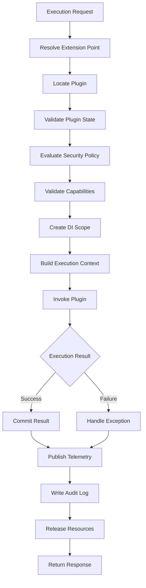

# UC-600 Execution

## Overview

This document describes the plugin execution workflow of the Metadata-Driven Secure Plugin Runtime.

Execution is the core responsibility of the Runtime. Every execution request passes through a controlled pipeline that validates identity, resolves metadata, evaluates capabilities, constructs the execution context and invokes the plugin.

The Runtime guarantees that every execution is deterministic, auditable, isolated and policy-compliant.

---

# Scope

This document applies to:

- Plugin Execution
- Extension Point Execution
- Execution Cancellation
- Execution Retry
- Execution Failure Handling
- Execution Completion

---

# Actors

## Primary Actors

- Plugin
- External System

## Supporting Actors

- Runtime
- Plugin Manager
- Extension Point Resolver
- Capability Manager
- Policy Engine
- Dependency Injection Container
- Audit Service
- Telemetry Service

---

# UC-601 Execute Plugin

## Goal

Execute a plugin in response to an execution request.

### Primary Actor

Plugin

### Supporting Actors

- Runtime
- Plugin Manager
- Capability Manager
- Policy Engine

### Preconditions

- Runtime operational.
- Plugin active.
- Plugin loaded.
- Plugin capabilities granted.

### Business Rules Applied

- BR-701 Execution Authorization
- BR-702 Execution Isolation
- BR-703 Policy Enforcement

### Trigger

Runtime receives an execution request.

### Main Flow

1. Runtime receives the execution request.
2. Runtime identifies the target plugin.
3. Runtime validates plugin status.
4. Runtime validates execution context.
5. Runtime evaluates execution policies.
6. Runtime validates plugin capabilities.
7. Runtime creates a dependency injection scope.
8. Runtime constructs the execution context.
9. Runtime invokes the plugin.
10. Runtime captures execution result.
11. Runtime records telemetry.
12. Runtime records an audit event.
13. Runtime returns the execution result.

### Alternate Flow

A1. Cached execution context reused.

### Exception Flow

E1. Plugin inactive.

E2. Capability denied.

E3. Policy evaluation failed.

E4. Plugin execution exception.

E5. Runtime execution timeout.

### Postconditions

- Execution completed.
- Audit recorded.
- Metrics updated.

### Related Functional Requirements

- FR-601
- FR-602
- FR-603
- FR-604

### Related Business Rules

- BR-701
- BR-702
- BR-703

### Related Non-Functional Requirements

- NFR-101
- NFR-202
- NFR-303
- NFR-401

---

# UC-602 Execute Extension Point

## Goal

Execute one or more plugins registered for an Extension Point.

### Primary Actor

External System

### Supporting Actors

- Runtime
- Extension Point Resolver
- Plugin Manager

### Preconditions

- Extension Point registered.
- At least one active plugin available.

### Business Rules Applied

- BR-704 Extension Resolution
- BR-705 Execution Ordering

### Trigger

Runtime receives an Extension Point invocation.

### Main Flow

1. Runtime resolves the Extension Point.
2. Runtime discovers registered plugins.
3. Runtime applies execution ordering.
4. Runtime validates each plugin.
5. Runtime executes plugins sequentially or according to the configured execution strategy.
6. Runtime aggregates execution results.
7. Runtime returns the final result.

### Alternate Flow

A1. Only one plugin registered.

### Exception Flow

E1. Extension Point not found.

E2. No eligible plugin available.

E3. Plugin execution failed.

### Postconditions

- Extension Point executed.
- Results aggregated.

### Related Functional Requirements

- FR-605
- FR-606
- FR-607

### Related Business Rules

- BR-704
- BR-705

### Related Non-Functional Requirements

- NFR-101
- NFR-401
---

# UC-603 Cancel Execution

## Goal

Cancel an active plugin execution safely while maintaining Runtime consistency.

### Primary Actor

Platform Administrator

### Supporting Actors

- Runtime
- Execution Manager
- Plugin Manager
- Audit Service

### Preconditions

- Execution is active.
- Cancellation is permitted by policy.

### Business Rules Applied

- BR-706 Execution Cancellation
- BR-707 Graceful Termination

### Trigger

Administrator requests execution cancellation.

### Main Flow

1. Administrator selects the running execution.
2. Runtime validates the cancellation request.
3. Runtime marks the execution as Cancelling.
4. Runtime notifies the executing plugin.
5. Runtime waits for graceful termination.
6. Runtime releases allocated resources.
7. Runtime records cancellation details.
8. Runtime returns success.

### Alternate Flow

A1. Execution already completed.

Cancellation request ignored.

### Exception Flow

E1. Execution not found.

E2. Plugin ignores cancellation request.

E3. Forced termination required.

### Postconditions

- Execution terminated.
- Resources released.
- Audit log created.

### Related Functional Requirements

- FR-608
- FR-609

### Related Business Rules

- BR-706
- BR-707

### Related Non-Functional Requirements

- NFR-202
- NFR-501

---

# UC-604 Retry Execution

## Goal

Retry a failed execution according to the configured retry policy.

### Primary Actor

External System

### Supporting Actors

- Runtime
- Retry Manager
- Policy Engine

### Preconditions

- Previous execution failed.
- Retry policy allows another attempt.

### Business Rules Applied

- BR-708 Retry Policy
- BR-709 Failure Classification

### Trigger

Retry requested automatically or manually.

### Main Flow

1. Runtime loads failed execution.
2. Runtime evaluates retry policy.
3. Runtime determines retry eligibility.
4. Runtime rebuilds execution context.
5. Runtime invokes the plugin again.
6. Runtime captures retry result.
7. Runtime updates execution history.

### Alternate Flow

A1. Retry delayed according to backoff policy.

### Exception Flow

E1. Retry limit exceeded.

E2. Plugin unavailable.

E3. Runtime unable to recreate execution context.

### Postconditions

- Retry completed.
- Execution history updated.

### Related Functional Requirements

- FR-610
- FR-611

### Related Business Rules

- BR-708
- BR-709

### Related Non-Functional Requirements

- NFR-202
- NFR-402

---

# UC-605 Handle Execution Failure

## Goal

Handle plugin execution failures without affecting Runtime stability.

### Primary Actor

Plugin

### Supporting Actors

- Runtime
- Exception Manager
- Audit Service
- Telemetry Service

### Preconditions

- Plugin execution failed.

### Business Rules Applied

- BR-710 Exception Handling
- BR-711 Failure Isolation

### Trigger

Unhandled exception occurs during execution.

### Main Flow

1. Runtime captures the exception.
2. Runtime isolates the failed execution.
3. Runtime records diagnostic information.
4. Runtime determines failure severity.
5. Runtime applies recovery policy.
6. Runtime records telemetry.
7. Runtime writes an audit event.
8. Runtime returns an appropriate error response.

### Alternate Flow

A1. Failure automatically recovered.

### Exception Flow

E1. Recovery failed.

E2. Runtime enters degraded mode.

### Postconditions

- Failure isolated.
- Runtime remains operational.

### Related Functional Requirements

- FR-612
- FR-613
- FR-614

### Related Business Rules

- BR-710
- BR-711

### Related Non-Functional Requirements

- NFR-201
- NFR-202
- NFR-401

---

# UC-606 Complete Execution

## Goal

Finalize plugin execution and persist execution results.

### Primary Actor

Plugin

### Supporting Actors

- Runtime
- Audit Service
- Telemetry Service

### Preconditions

- Plugin execution completed.

### Business Rules Applied

- BR-712 Execution Completion
- BR-713 Audit Recording

### Trigger

Plugin returns control to Runtime.

### Main Flow

1. Runtime receives execution result.
2. Runtime validates execution outcome.
3. Runtime commits transactional changes if applicable.
4. Runtime updates execution status.
5. Runtime publishes telemetry.
6. Runtime records audit information.
7. Runtime releases execution resources.
8. Runtime returns final response.

### Alternate Flow

A1. Transaction rollback required.

### Exception Flow

E1. Result persistence failed.

E2. Audit recording failed.

E3. Telemetry export failed.

### Postconditions

- Execution finalized.
- Resources released.
- Execution history stored.

### Related Functional Requirements

- FR-615
- FR-616
- FR-617

### Related Business Rules

- BR-712
- BR-713

### Related Non-Functional Requirements

- NFR-401
- NFR-802

---

# Execution Pipeline

---

# Summary

| Use Case | Description |
|-----------|-------------|
| UC-601 | Execute Plugin |
| UC-602 | Execute Extension Point |
| UC-603 | Cancel Execution |
| UC-604 | Retry Execution |
| UC-605 | Handle Execution Failure |
| UC-606 | Complete Execution |

---

# Related Documents

- FR-600 Execution
- BR-700 Execution
- NFR-100 Performance
- NFR-200 Reliability
- NFR-400 Scalability
- UC-300 Capability
- UC-400 Security
- UC-500 Runtime