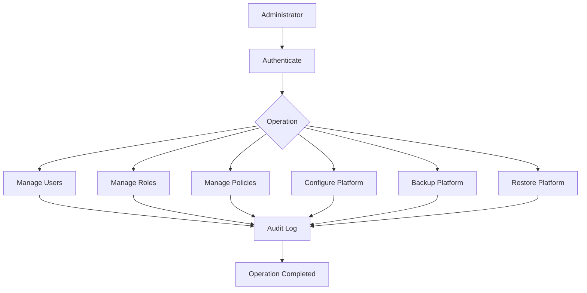

# UC-700 Administration

## Overview

This document describes the administrative use cases of the Metadata-Driven Secure Plugin Runtime.

The Administration module enables platform administrators to manage users, roles, security policies, platform configuration and operational maintenance while maintaining governance, auditability and compliance.

---

# Scope

This document applies to:

- User Management
- Role Management
- Policy Management
- Platform Configuration
- Backup
- Restore

---

# Actors

## Primary Actors

- Platform Administrator
- Security Administrator

## Supporting Actors

- Runtime
- Identity Provider
- Policy Engine
- Backup Service
- Audit Service

---

# UC-701 Manage Users

## Goal

Create, update, disable and remove platform users.

### Primary Actor

Platform Administrator

### Supporting Actors

- Runtime
- Identity Provider

### Preconditions

- Administrator authenticated.
- Administrator has User Management permission.

### Business Rules Applied

- BR-801 User Administration
- BR-802 Identity Governance

### Trigger

Administrator selects **User Management**.

### Main Flow

1. Administrator opens the user management console.
2. Runtime retrieves existing users.
3. Administrator creates, edits or disables a user.
4. Runtime validates user information.
5. Runtime synchronizes with the Identity Provider.
6. Runtime records an audit event.
7. Runtime confirms the operation.

### Alternate Flow

A1. User imported from an external identity provider.

### Exception Flow

E1. Duplicate user identifier.

E2. Invalid user information.

E3. Identity Provider unavailable.

### Postconditions

- User directory updated.
- Audit trail recorded.

### Related Functional Requirements

- FR-701
- FR-702
- FR-703

### Related Business Rules

- BR-801
- BR-802

### Related Non-Functional Requirements

- NFR-301
- NFR-801

---

# UC-702 Manage Roles

## Goal

Create and maintain platform roles.

### Primary Actor

Security Administrator

### Supporting Actors

- Runtime
- Policy Engine

### Preconditions

- Administrator authenticated.

### Business Rules Applied

- BR-803 Role Governance
- BR-804 Separation of Duties

### Trigger

Administrator selects **Role Management**.

### Main Flow

1. Administrator creates or edits a role.
2. Runtime validates role definition.
3. Runtime validates permission assignments.
4. Runtime stores role configuration.
5. Runtime updates authorization policies.
6. Runtime records audit information.

### Alternate Flow

A1. Role cloned from an existing template.

### Exception Flow

E1. Duplicate role.

E2. Invalid permission assignment.

E3. Role dependency conflict.

### Postconditions

- Role catalog updated.

### Related Functional Requirements

- FR-704
- FR-705

### Related Business Rules

- BR-803
- BR-804

### Related Non-Functional Requirements

- NFR-303
- NFR-802

---

# UC-703 Manage Policies

## Goal

Create, modify and publish Runtime security policies.

### Primary Actor

Security Administrator

### Supporting Actors

- Runtime
- Policy Engine

### Preconditions

- Policy repository available.

### Business Rules Applied

- BR-805 Policy Governance
- BR-806 Policy Versioning

### Trigger

Administrator edits a policy.

### Main Flow

1. Administrator creates or updates a policy.
2. Runtime validates policy syntax.
3. Runtime validates policy conflicts.
4. Runtime publishes the policy.
5. Runtime activates the policy.
6. Runtime records an audit event.

### Alternate Flow

A1. Policy scheduled for future activation.

### Exception Flow

E1. Invalid policy syntax.

E2. Policy conflict detected.

E3. Publication failed.

### Postconditions

- Policy activated.
- Policy version recorded.

### Related Functional Requirements

- FR-706
- FR-707
- FR-708

### Related Business Rules

- BR-805
- BR-806

### Related Non-Functional Requirements

- NFR-303
- NFR-607
---

# UC-704 Configure Platform

## Goal

Configure global Runtime platform settings.

### Primary Actor

Platform Administrator

### Supporting Actors

- Runtime
- Configuration Provider
- Audit Service

### Preconditions

- Administrator authenticated.
- Configuration service available.

### Business Rules Applied

- BR-807 Configuration Governance
- BR-808 Configuration Validation

### Trigger

Administrator selects **Platform Configuration**.

### Main Flow

1. Administrator opens platform configuration.
2. Runtime loads current configuration.
3. Administrator updates configuration values.
4. Runtime validates configuration.
5. Runtime persists configuration.
6. Runtime determines whether restart is required.
7. Runtime records configuration changes.
8. Runtime confirms successful update.

### Alternate Flow

A1. Configuration applied dynamically without restart.

### Exception Flow

E1. Invalid configuration.

E2. Configuration persistence failed.

E3. Configuration conflict detected.

### Postconditions

- Platform configuration updated.
- Configuration audit recorded.

### Related Functional Requirements

- FR-709
- FR-710

### Related Business Rules

- BR-807
- BR-808

### Related Non-Functional Requirements

- NFR-601
- NFR-607

---

# UC-705 Backup Platform

## Goal

Create a consistent backup of the Runtime platform.

### Primary Actor

Platform Administrator

### Supporting Actors

- Runtime
- Backup Service
- Storage Provider

### Preconditions

- Backup storage available.

### Business Rules Applied

- BR-809 Backup Policy
- BR-810 Data Retention

### Trigger

Administrator initiates backup or scheduled backup starts.

### Main Flow

1. Runtime prepares backup operation.
2. Runtime validates storage availability.
3. Runtime exports configuration.
4. Runtime exports metadata.
5. Runtime exports audit configuration.
6. Runtime packages backup artifacts.
7. Runtime verifies backup integrity.
8. Runtime stores backup.
9. Runtime records audit information.

### Alternate Flow

A1. Incremental backup performed.

### Exception Flow

E1. Storage unavailable.

E2. Backup interrupted.

E3. Integrity verification failed.

### Postconditions

- Backup successfully created.
- Backup catalog updated.

### Related Functional Requirements

- FR-711
- FR-712
- FR-713

### Related Business Rules

- BR-809
- BR-810

### Related Non-Functional Requirements

- NFR-501
- NFR-602
- NFR-803

---

# UC-706 Restore Platform

## Goal

Restore the Runtime platform from a valid backup.

### Primary Actor

Platform Administrator

### Supporting Actors

- Runtime
- Backup Service
- Storage Provider

### Preconditions

- Valid backup available.

### Business Rules Applied

- BR-811 Restore Validation
- BR-812 Recovery Governance

### Trigger

Administrator starts platform restoration.

### Main Flow

1. Administrator selects a backup.
2. Runtime validates backup integrity.
3. Runtime restores configuration.
4. Runtime restores metadata.
5. Runtime restores plugin catalog.
6. Runtime validates restored data.
7. Runtime restarts required services.
8. Runtime verifies platform health.
9. Runtime records audit information.

### Alternate Flow

A1. Partial restore requested.

### Exception Flow

E1. Backup corrupted.

E2. Restore operation failed.

E3. Health validation failed.

### Postconditions

- Platform restored.
- Runtime operational.
- Recovery audit completed.

### Related Functional Requirements

- FR-714
- FR-715
- FR-716

### Related Business Rules

- BR-811
- BR-812

### Related Non-Functional Requirements

- NFR-202
- NFR-501
- NFR-602

---

# Administration Workflow

---

# Summary

| Use Case | Description |
|-----------|-------------|
| UC-701 | Manage Users |
| UC-702 | Manage Roles |
| UC-703 | Manage Policies |
| UC-704 | Configure Platform |
| UC-705 | Backup Platform |
| UC-706 | Restore Platform |

---

# Related Documents

- FR-700 Administration
- BR-800 Administration
- NFR-500 Availability
- NFR-600 Maintainability
- NFR-800 Compliance
- UC-400 Security
- UC-500 Runtime