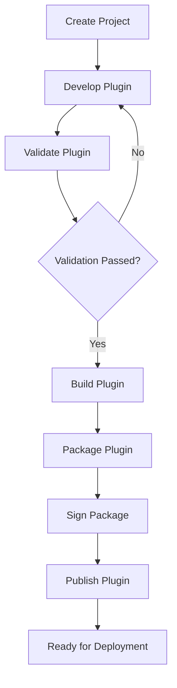

# UC-800 SDK

## Overview

This document describes the Software Development Kit (SDK) use cases for the Metadata-Driven Secure Plugin Runtime.

The SDK provides tools, templates, validators and packaging utilities that enable developers to build secure, compatible and production-ready plugins.

The SDK ensures every plugin complies with the Runtime contract before deployment.

---

# Scope

This document applies to:

- Create Plugin Project
- Develop Plugin
- Validate Plugin
- Build Plugin
- Package Plugin
- Publish Plugin

---

# Actors

## Primary Actors

- Plugin Developer

## Supporting Actors

- SDK
- Build System
- Manifest Validator
- Package Builder
- Plugin Repository

---

# UC-801 Create Plugin Project

## Goal

Create a new plugin project using the SDK.

### Primary Actor

Plugin Developer

### Supporting Actors

- SDK

### Preconditions

- SDK installed.

### Business Rules Applied

- BR-901 Project Template
- BR-902 SDK Compatibility

### Trigger

Developer executes the SDK project creation command.

### Main Flow

1. Developer selects a project template.
2. SDK generates the project structure.
3. SDK generates the manifest template.
4. SDK generates configuration files.
5. SDK restores project dependencies.
6. SDK reports successful project creation.

### Alternate Flow

A1. Custom project template selected.

### Exception Flow

E1. Invalid template.

E2. SDK version unsupported.

E3. Dependency restore failed.

### Postconditions

- Plugin project created.

### Related Functional Requirements

- FR-801
- FR-802
- FR-803

### Related Business Rules

- BR-901
- BR-902

### Related Non-Functional Requirements

- NFR-601
- NFR-607

---

# UC-802 Develop Plugin

## Goal

Develop a Runtime-compatible plugin.

### Primary Actor

Plugin Developer

### Supporting Actors

- SDK
- IDE

### Preconditions

- Plugin project created.

### Business Rules Applied

- BR-903 Coding Standards
- BR-904 Manifest Compliance

### Trigger

Developer modifies plugin source code.

### Main Flow

1. Developer implements plugin logic.
2. Developer implements Extension Points.
3. Developer updates the Manifest.
4. SDK validates project structure.
5. SDK performs static validation.
6. SDK reports development issues.

### Alternate Flow

A1. Generated code templates used.

### Exception Flow

E1. Invalid project structure.

E2. Manifest inconsistent.

E3. Compilation dependency missing.

### Postconditions

- Plugin source updated.

### Related Functional Requirements

- FR-804
- FR-805

### Related Business Rules

- BR-903
- BR-904

### Related Non-Functional Requirements

- NFR-603
- NFR-607

---

# UC-803 Validate Plugin

## Goal

Validate the plugin before build and packaging.

### Primary Actor

Plugin Developer

### Supporting Actors

- SDK
- Manifest Validator

### Preconditions

- Plugin project completed.

### Business Rules Applied

- BR-905 Plugin Validation
- BR-906 Capability Validation

### Trigger

Developer starts validation.

### Main Flow

1. SDK validates project structure.
2. SDK validates Manifest.
3. SDK validates capabilities.
4. SDK validates dependencies.
5. SDK validates Runtime compatibility.
6. SDK generates a validation report.

### Alternate Flow

A1. Incremental validation executed.

### Exception Flow

E1. Validation failed.

E2. Capability conflict.

E3. Runtime compatibility failed.

### Postconditions

- Validation completed.

### Related Functional Requirements

- FR-806
- FR-807
- FR-808

### Related Business Rules

- BR-905
- BR-906

### Related Non-Functional Requirements

- NFR-303
- NFR-607
---

# UC-804 Build Plugin

## Goal

Compile the plugin into a Runtime-compatible binary package.

### Primary Actor

Plugin Developer

### Supporting Actors

- SDK
- Build System

### Preconditions

- Plugin validation completed successfully.

### Business Rules Applied

- BR-907 Build Validation
- BR-908 Build Reproducibility

### Trigger

Developer starts the build process.

### Main Flow

1. SDK restores dependencies.
2. SDK compiles the plugin.
3. SDK validates compilation results.
4. SDK generates assemblies.
5. SDK generates build artifacts.
6. SDK records build metadata.
7. SDK reports successful build.

### Alternate Flow

A1. Incremental build executed.

### Exception Flow

E1. Compilation failed.

E2. Dependency restore failed.

E3. Build configuration invalid.

### Postconditions

- Build artifacts generated.
- Plugin ready for packaging.

### Related Functional Requirements

- FR-809
- FR-810

### Related Business Rules

- BR-907
- BR-908

### Related Non-Functional Requirements

- NFR-601
- NFR-607

---

# UC-805 Package Plugin

## Goal

Create a deployable plugin package.

### Primary Actor

Plugin Developer

### Supporting Actors

- SDK
- Package Builder
- Manifest Validator

### Preconditions

- Plugin build completed.

### Business Rules Applied

- BR-909 Package Format
- BR-910 Manifest Integrity

### Trigger

Developer requests package creation.

### Main Flow

1. SDK collects build artifacts.
2. SDK validates Manifest.
3. SDK validates package contents.
4. SDK calculates package hash.
5. SDK signs the package if configured.
6. SDK creates the deployment package.
7. SDK generates package metadata.
8. SDK reports successful packaging.

### Alternate Flow

A1. Unsigned package generated for development.

### Exception Flow

E1. Manifest missing.

E2. Packaging failed.

E3. Package signing failed.

### Postconditions

- Deployable package generated.

### Related Functional Requirements

- FR-811
- FR-812
- FR-813

### Related Business Rules

- BR-909
- BR-910

### Related Non-Functional Requirements

- NFR-303
- NFR-607

---

# UC-806 Publish Plugin

## Goal

Publish a validated plugin package to a Plugin Repository.

### Primary Actor

Plugin Developer

### Supporting Actors

- SDK
- Plugin Repository
- Package Builder

### Preconditions

- Package created.
- Package validated.

### Business Rules Applied

- BR-911 Package Publication
- BR-912 Version Governance

### Trigger

Developer publishes the package.

### Main Flow

1. Developer selects a target repository.
2. SDK validates publication settings.
3. SDK uploads the package.
4. Repository validates package integrity.
5. Repository indexes package metadata.
6. Repository publishes the plugin.
7. SDK reports successful publication.

### Alternate Flow

A1. Package published to a local repository.

### Exception Flow

E1. Repository unavailable.

E2. Duplicate package version.

E3. Upload failed.

### Postconditions

- Plugin available in the repository.
- Package metadata indexed.

### Related Functional Requirements

- FR-814
- FR-815
- FR-816

### Related Business Rules

- BR-911
- BR-912

### Related Non-Functional Requirements

- NFR-501
- NFR-607

---

# Plugin Development Lifecycle

---

# Summary

| Use Case | Description |
|-----------|-------------|
| UC-801 | Create Plugin Project |
| UC-802 | Develop Plugin |
| UC-803 | Validate Plugin |
| UC-804 | Build Plugin |
| UC-805 | Package Plugin |
| UC-806 | Publish Plugin |

---

# Related Documents

- FR-800 SDK
- BR-900 SDK
- NFR-600 Maintainability
- NFR-700 Compatibility
- UC-200 Manifest
- UC-300 Capability
- UC-500 Runtime