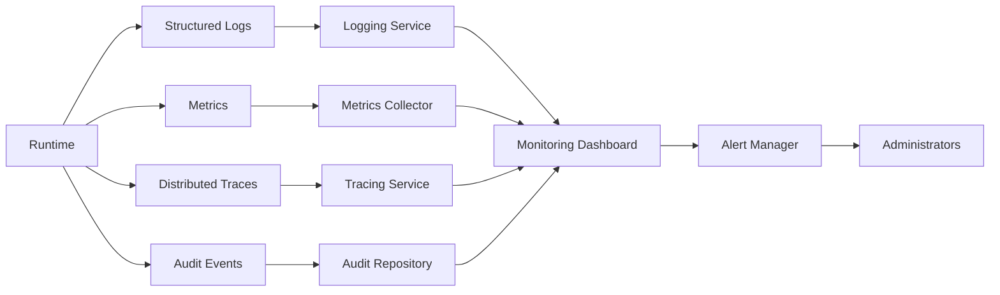

# UC-900 Observability

## Overview

This document describes the observability use cases for the Metadata-Driven Secure Plugin Runtime.

Observability enables operators and administrators to understand the internal state of the Runtime through logs, metrics, traces and audit events. It provides operational visibility, diagnostics, performance monitoring and compliance reporting.

---

# Scope

This document applies to:

- Logging
- Metrics Collection
- Distributed Tracing
- Monitoring
- Alerting
- Audit Export

---

# Actors

## Primary Actors

- Platform Administrator
- Security Administrator
- Monitoring System

## Supporting Actors

- Runtime
- Logging Service
- Metrics Collector
- Tracing Service
- Alert Manager
- Audit Service

---

# UC-901 Collect Logs

## Goal

Collect structured logs generated by the Runtime and plugins.

### Primary Actor

Monitoring System

### Supporting Actors

- Runtime
- Logging Service

### Preconditions

- Logging enabled.

### Business Rules Applied

- BR-1001 Structured Logging
- BR-1002 Log Retention

### Trigger

Runtime or plugin generates a log event.

### Main Flow

1. Runtime creates a structured log entry.
2. Runtime enriches log metadata.
3. Runtime assigns severity level.
4. Runtime forwards the log to the Logging Service.
5. Logging Service stores the log.
6. Runtime confirms successful logging.

### Alternate Flow

A1. Log streamed to an external logging platform.

### Exception Flow

E1. Logging Service unavailable.

E2. Log serialization failed.

E3. Storage quota exceeded.

### Postconditions

- Log stored successfully.

### Related Functional Requirements

- FR-901
- FR-902
- FR-903

### Related Business Rules

- BR-1001
- BR-1002

### Related Non-Functional Requirements

- NFR-801
- NFR-802

---

# UC-902 Collect Metrics

## Goal

Collect Runtime and plugin performance metrics.

### Primary Actor

Monitoring System

### Supporting Actors

- Runtime
- Metrics Collector

### Preconditions

- Metrics enabled.

### Business Rules Applied

- BR-1003 Metrics Collection
- BR-1004 Metric Aggregation

### Trigger

Metric collection interval elapsed.

### Main Flow

1. Runtime gathers performance counters.
2. Runtime collects plugin metrics.
3. Runtime aggregates measurements.
4. Runtime exports metrics.
5. Metrics Collector stores time-series data.
6. Runtime confirms successful collection.

### Alternate Flow

A1. Metrics pushed immediately after execution.

### Exception Flow

E1. Metrics export failed.

E2. Collector unavailable.

E3. Invalid metric value.

### Postconditions

- Metrics available for monitoring.

### Related Functional Requirements

- FR-904
- FR-905

### Related Business Rules

- BR-1003
- BR-1004

### Related Non-Functional Requirements

- NFR-101
- NFR-401
- NFR-801

---

# UC-903 Collect Trace

## Goal

Capture distributed traces for Runtime execution requests.

### Primary Actor

Monitoring System

### Supporting Actors

- Runtime
- Tracing Service

### Preconditions

- Distributed tracing enabled.

### Business Rules Applied

- BR-1005 Trace Correlation
- BR-1006 Trace Sampling

### Trigger

Execution request received.

### Main Flow

1. Runtime creates a trace.
2. Runtime generates or propagates a correlation ID.
3. Runtime records execution spans.
4. Runtime closes the trace.
5. Runtime exports trace data.
6. Tracing Service stores the trace.

### Alternate Flow

A1. Trace sampled according to policy.

### Exception Flow

E1. Trace export failed.

E2. Trace service unavailable.

E3. Invalid trace context.

### Postconditions

- Trace stored successfully.

### Related Functional Requirements

- FR-906
- FR-907

### Related Business Rules

- BR-1005
- BR-1006

### Related Non-Functional Requirements

- NFR-401
- NFR-801
---

# UC-904 Monitor Runtime

## Goal

Continuously monitor the health, performance and operational status of the Runtime and installed plugins.

### Primary Actor

Monitoring System

### Supporting Actors

- Runtime
- Metrics Collector
- Health Check Service
- Alert Manager

### Preconditions

- Runtime operational.
- Monitoring enabled.

### Business Rules Applied

- BR-1007 Health Monitoring
- BR-1008 Service Availability

### Trigger

Scheduled monitoring interval or health probe.

### Main Flow

1. Monitoring System requests Runtime health.
2. Runtime executes health checks.
3. Runtime evaluates plugin status.
4. Runtime evaluates resource utilization.
5. Runtime generates health status.
6. Runtime publishes monitoring data.
7. Monitoring System updates dashboards.

### Alternate Flow

A1. Monitoring initiated manually.

### Exception Flow

E1. Health check timeout.

E2. Monitoring endpoint unavailable.

E3. Plugin health check failed.

### Postconditions

- Current Runtime health available.
- Monitoring dashboards updated.

### Related Functional Requirements

- FR-908
- FR-909
- FR-910

### Related Business Rules

- BR-1007
- BR-1008

### Related Non-Functional Requirements

- NFR-101
- NFR-501
- NFR-801

---

# UC-905 Generate Alerts

## Goal

Generate alerts when Runtime or plugin conditions violate operational thresholds.

### Primary Actor

Monitoring System

### Supporting Actors

- Runtime
- Alert Manager
- Notification Service

### Preconditions

- Alert rules configured.

### Business Rules Applied

- BR-1009 Alert Policy
- BR-1010 Alert Escalation

### Trigger

Monitoring rule evaluates to TRUE.

### Main Flow

1. Monitoring System detects a threshold violation.
2. Runtime collects diagnostic information.
3. Alert Manager evaluates alert rules.
4. Alert severity is determined.
5. Notification is sent to administrators.
6. Alert is recorded for auditing.
7. Alert lifecycle begins.

### Alternate Flow

A1. Duplicate alert suppressed.

### Exception Flow

E1. Notification delivery failed.

E2. Alert configuration invalid.

E3. Alert Manager unavailable.

### Postconditions

- Alert generated.
- Notification delivered or queued.

### Related Functional Requirements

- FR-911
- FR-912

### Related Business Rules

- BR-1009
- BR-1010

### Related Non-Functional Requirements

- NFR-501
- NFR-801
- NFR-802

---

# UC-906 Export Audit

## Goal

Export audit records for compliance, governance and forensic analysis.

### Primary Actor

Security Administrator

### Supporting Actors

- Runtime
- Audit Service

### Preconditions

- Audit records available.

### Business Rules Applied

- BR-1011 Audit Export
- BR-1012 Compliance Reporting

### Trigger

Administrator requests audit export.

### Main Flow

1. Administrator selects export criteria.
2. Runtime validates permissions.
3. Runtime retrieves audit records.
4. Runtime filters audit entries.
5. Runtime generates export package.
6. Runtime signs the exported report if required.
7. Runtime delivers the export package.
8. Runtime records the export activity.

### Alternate Flow

A1. Scheduled audit export executed.

### Exception Flow

E1. Export permission denied.

E2. Audit repository unavailable.

E3. Export generation failed.

### Postconditions

- Audit package exported.
- Export operation audited.

### Related Functional Requirements

- FR-913
- FR-914
- FR-915

### Related Business Rules

- BR-1011
- BR-1012

### Related Non-Functional Requirements

- NFR-802
- NFR-803

---

# Observability Architecture

---

# Summary

| Use Case | Description |
|-----------|-------------|
| UC-901 | Collect Logs |
| UC-902 | Collect Metrics |
| UC-903 | Collect Trace |
| UC-904 | Monitor Runtime |
| UC-905 | Generate Alerts |
| UC-906 | Export Audit |

---

# Related Documents

- FR-900 Observability
- BR-1000 Observability
- NFR-100 Performance
- NFR-500 Availability
- NFR-800 Compliance
- UC-500 Runtime
- UC-600 Execution
- UC-700 Administration